# 🎯 Shocker (htb)

> **Enhanced Attack Chain Dashboard**

---

## 📊 Chain Metrics Dashboard

| Metric | Value |
|--------|-------|
| **Chain Status** | ⚠️ **UNVERIFIED** |
| **Total Steps** | `4` |
| **Execution Time** | ~1-2 hours |
| **Skill Level** | 🟢 Beginner-Intermediate |
| **Complexity** | Medium |
| **Impact Level** | 🟡 **MEDIUM** |

---

## 🎭 Attack Flow Visualization

```mermaid
graph TD
    A[🎯 Initial Access]
    B[🔓 Exploitation]
    C[📊 Post-Exploitation]
    D[👑 Objective Complete]
    A --> B
    B --> C
    C --> D
    
    style A fill:#4a90e2,stroke:#2e5c8a,stroke-width:3px,color:#fff
    style B fill:#e25555,stroke:#8a2e2e,stroke-width:3px,color:#fff
    style C fill:#9b59b6,stroke:#6c3483,stroke-width:3px,color:#fff
    style D fill:#27ae60,stroke:#1e8449,stroke-width:3px,color:#fff
```



---

## 🛠️ Prerequisites & Requirements

### Required Tools
```bash path=null start=null
# Tools will be listed here based on procedures
```

### Target Environment
- ✅ Network connectivity to target

### Initial Access Requirements
- 🔓 Requirements based on first step of chain
- 🔓 See detailed procedures below

---

## 🔬 Detailed Attack Procedures

### **[Step 1]** Basic Port Scan with Service Enumeration

**Progress:** `██░░░░░░░░` 25% | **Risk:** 🟢 Low

**Procedure:** [[Basic Port Scan with Service Enumeration]]

> 📝 **Objective:** Perform an Nmap port scan on a target and enumerate banners of ports 1-1024, as well as popular services (a full list can be found in /usr/share/nmap/nmap-services).

**Expected Output:**
- Refer to procedure documentation for details

**Success Indicators:** ✅ Objective achieved

---

### **[Step 2]** Directory Brute Force a Web App with Extensions (GoBuster)

**Progress:** `█████░░░░░` 50% | **Risk:** 🟢 Low

**Procedure:** [[Directory Brute Force a Web App with Extensions (GoBuster)]]

> 📝 **Objective:** Perform a directory brute force while specifying extensions. Choose file extensions to brute force based on initial recon of  files on the webserver (.php, .asp, .js, etc), directories (cgi-bin suggests .sh scripts), underlying technology disclosed in headers (Python, PHP, Ruby), etc. For example,

**Expected Output:**
- Refer to procedure documentation for details

**Success Indicators:** ✅ Objective achieved

---

### **[Step 3]** Exploit Shellshock on a Vulnerable Web App

**Progress:** `███████░░░` 75% | **Risk:** 🔴 High

**Procedure:** [[Exploit Shellshock on a Vulnerable Web App]]

> 📝 **Objective:** Shellshock is a family of security bugs in the Bash shell (pre 43-027), which allows attackers to remotely execute arbitrary commands on a vulnerable system. Web servers can be exploited by identifying a vulnerable script in the /cgi-bin directory, then using fields in the header to specify command

**Expected Output:**
- Refer to procedure documentation for details

**Success Indicators:** ✅ Objective achieved

---

### **[Step 4]** Spawn a Root Shell using Sudo and Perl

**Progress:** `██████████` 100% | **Risk:** 🔴 High

**Procedure:** [[Spawn a Root Shell using Sudo and Perl]]

> 📝 **Objective:** In some instances, a user may need to run Perl commands as root. This is often implemented by giving the user permission to use sudo to execute Perl, or Perl itself may be configured with SUID rights. Both situations introduce a privilege escalation vulnerability,  as attackers can use it to spawn

**Expected Output:**
- Refer to procedure documentation for details

**Success Indicators:** ✅ Objective achieved

---

## 🎯 Attack Chain Summary

### Key Achievements
- ✅ Exploit Shellshock on a Vulnerable Web App
- ✅ Directory Brute Force a Web App with Extensions (GoBuster)
- ✅ Basic Port Scan with Service Enumeration
- ✅ Spawn a Root Shell using Sudo and Perl

---

## 📈 Technique & Tactic Coverage

---

**Last Updated:** 2023-05-29T16:48:53.162677+00:00 | **Chain Version:** 2.0 Enhanced | **Status:** ⚠️ Draft
