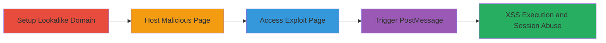

---
tags:
  - xss
  - postmessage
  - origin-spoofing
  - shopify
  - dom-based-xss
type: attack_chain
tools:
  - '[[tools/ssl-server-py]]'
  - '[[tools/exploit-admin-bar-html]]'
tactics:
  - '[[Initial Access]]'
  - '[[Execution]]'
  - '[[Collection]]'
commands:
  - '[[commands/add-hosts-entry]]'
  - '[[commands/start-ssl-server]]'
platforms:
  - Web
complexity: medium
procedures:
  - '[[procedures/Download-Exploit-Tools]]'
  - '[[procedures/Configure-Local-Lookalike-Domain]]'
  - '[[procedures/Start-SSL-Server]]'
  - '[[procedures/Access-Malicious-Exploit-Page]]'
  - '[[procedures/Trigger-PostMessage-XSS-Exploit]]'
step_count: 5
techniques:
  - '[[JavaScript]]'
  - '[[Drive-by Compromise]]'
description: >-
  Exploits incomplete origin validation in Shopify's admin bar injector to spoof
  postMessage from a lookalike domain, enabling DOM-based XSS for admin session
  abuse.
skill_level: intermediate
impact_level: high
id: 6c2804eb-68d3-4a84-9dea-f484d3d7ab08
created_at: '2025-12-14T17:29:36.458Z'
updated_at: '2025-12-14T17:29:36.458Z'
verified: false
validated: true
submitted: true
mitre_tactics:
  - '[[Initial Access]]'
  - '[[Execution]]'
  - '[[Collection]]'
mitre_techniques:
  - '[[JavaScript]]'
  - '[[Drive-by Compromise]]'
---
# Shopify Admin Bar XSS via PostMessage Origin Spoofing with Lookalike Domain

The vulnerability stems from Shopify's admin bar injector JavaScript, which fails to properly validate the origin of postMessage events. An attacker can use a lookalike domain like 'foo.myshopify.co' to partially match the legitimate 'foo.myshopify.com', bypassing the check in the event listener that uses a simple indexOf on the iframe src without prefix or trailing slash validation. By hosting a malicious page on this domain and sending a crafted postMessage with a 'redirect_to_url' action pointing to a javascript: URL, the attacker injects script into the shop's admin context, enabling DOM-based XSS. This can lead to admin session hijacking, data extraction (e.g., CSRF tokens, configurations), or full account takeover if pop-up blockers are disabled.

## Chain Metrics Dashboard

| Metric | Value |
|--------|-------|
| Chain Status | Unverified |
| Total Steps | 5 |
| Execution Time | ~10 minutes |
| Skill Level | Intermediate |
| Complexity | Medium |
| Impact Level | High |

## Attack Flow Visualization



## Prerequisites & Requirements

### Required Tools

- [[tools/ssl-server-py]]
- [[tools/exploit-admin-bar-html]]

### Target Environment

- Web browser with JavaScript enabled
- Access to a Shopify shop admin page (e.g., https://foo.myshopify.com/admin)
- Local machine with Python 3 for hosting

### Initial Access Requirements

- No prior credentials needed for setup, but target must visit the malicious page or have it open alongside the admin tab
- Administrator privileges on the local machine for port binding and hosts file edits
- In a real attack, control over a lookalike domain with valid SSL certificate

## Detailed Attack Procedures

### Step 1: Download Exploit Tools
procedure: [[procedures/Download-Exploit-Tools]]

**Objective**: Obtain the necessary scripts to host the malicious exploit page.

**Instructions**: Download ssl_server.py and exploit_admin_bar.html to the same working directory. These files provide the SSL server and the HTML page that crafts the postMessage exploit.

**Expected Output**: Files downloaded and ready in the directory.

**Success Indicators**:
- ssl_server.py and exploit_admin_bar.html present in the current directory
- No errors during download

### Step 2: Configure Local Lookalike Domain
procedure: [[procedures/Configure-Local-Lookalike-Domain]]

**Objective**: Map a lookalike domain to localhost to simulate the attacker's controlled domain that partially matches the Shopify origin.

**Instructions**: Edit the hosts file to add an entry for 'foo.myshopify.co' pointing to 127.0.0.1. Use the [[commands/add-hosts-entry]] command:

```bash
echo '127.0.0.1 foo.myshopify.co' >> /etc/hosts
```

On Windows, use: `echo 127.0.0.1 foo.myshopify.co >> %Windir%\Sysnative\drivers\etc\hosts`.

**Expected Output**: No output; the hosts file is updated.

**Success Indicators**:
- Ping foo.myshopify.co resolves to 127.0.0.1
- Domain ends with '.co' to spoof '.com'

### Step 3: Start SSL Server
procedure: [[procedures/Start-SSL-Server]]

**Objective**: Host the exploit page over HTTPS on the lookalike domain using a local SSL server.

**Instructions**: Run the [[tools/ssl-server-py]] script with admin privileges using the [[commands/start-ssl-server]] command:

```bash
sudo python3 ssl_server.py
```

This starts a server on port 443 with a self-signed certificate.

**Expected Output**: Server startup message indicating it's listening on HTTPS port 443.

**Success Indicators**:
- Server logs show it's running
- https://foo.myshopify.co is accessible locally

### Step 4: Access Malicious Exploit Page
procedure: [[procedures/Access-Malicious-Exploit-Page]]

**Objective**: Load the exploit page in a browser, simulating the victim accessing the attacker's site.

**Instructions**: Open https://foo.myshopify.co/exploit_admin_bar.html in a browser and accept the invalid self-signed certificate warning.

**Expected Output**: The exploit page loads, displaying a link to trigger the attack.

**Success Indicators**:
- Page loads without errors (after accepting cert)
- In a real attack, a valid cert would avoid warnings

### Step 5: Trigger PostMessage XSS Exploit
procedure: [[procedures/Trigger-PostMessage-XSS-Exploit]]

**Objective**: Send the crafted postMessage to the Shopify admin bar iframe, injecting the javascript: URL for XSS.

**Instructions**: With the Shopify admin page (e.g., https://foo.myshopify.com/admin) open in another tab, click the link on the exploit page. This opens the shop in a new tab and sends the postMessage with 'redirect_to_url' action to a javascript:alert('XSS') URL. Allow any pop-ups if prompted.

**Expected Output**: Alert or script execution showing 'Hi, script running on foo.myshopify.com here!', confirming XSS in the shop context.

**Success Indicators**:
- Script injects and executes in the admin iframe
- Potential for data extraction or session abuse

## Attack Chain Summary

### Key Achievements

1. Bypassed postMessage origin validation using partial domain match
2. Injected javascript: URL via 'redirect_to_url' action for DOM-based XSS
3. Enabled admin session abuse for data theft or takeover

## Technique & Tactic Coverage

### MITRE ATT&CK Techniques

- [[JavaScript]]
- [[Drive-by Compromise]]

### MITRE ATT&CK Tactics

- [[Initial Access]]
- [[Execution]]
- [[Collection]]

---
*Last updated: 2023-10-01*
