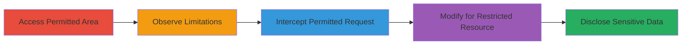

# Shopify Admin Comment Reference Bypass for Sensitive Order and Customer Disclosure

Multi-stage attack chain demonstrating a complete attack workflow exploiting improper access controls in Shopify's admin timeline comments to disclose sensitive order and customer information.

## Chain Metrics Dashboard

| Metric | Value |
|--------|-------|
| Chain Status | Unverified |
| Total Steps | 4 |
| Execution Time | ~5 minutes |
| Skill Level | Intermediate |
| Complexity | Medium |
| Impact Level | High |

## Attack Flow Visualization

## Prerequisites & Requirements

### Required Tools

- [[tools/Burp-Suite]]

### Target Environment

- Shopify Admin platform
- Access to admin interface with limited staff permissions (e.g., product access but not orders/customers)
- Network access to the Shopify store admin URL

### Initial Access Requirements

- Valid staff account with partial permissions
- No elevated privileges needed beyond basic login
- Burp Suite proxy configured for request interception

## Detailed Attack Procedures

### Step 1: Access the Comment Section in a Permitted Area
procedure: [[procedures/Observe-Reference-Limitations-in-Shopify-Admin-Comments]]

**Objective**: Gain access to the timeline comments section in a permitted admin area to prepare for reference testing.

**Instructions**: Log in to the Shopify admin dashboard with a limited staff account. Navigate to the product transfers menu and open any existing transfer to access the timeline comments section. Look for the comment editor with the # reference sign.

**Expected Output**: Timeline comments interface visible, with # sign available in the editor.

**Success Indicators**:
- Admin dashboard accessible
- Transfer timeline comments section loaded

### Step 2: Observe the Reference Dropdown Limitations
procedure: [[procedures/Observe-Reference-Limitations-in-Shopify-Admin-Comments]]

**Objective**: Verify that the UI enforces permission-based restrictions on referenceable resources.

**Instructions**: In the comment editor, click the # sign to open the reference dropdown. Attempt to search or select resources like orders or customers.

**Expected Output**: Dropdown only shows permitted resources (e.g., products), with no options for restricted ones like orders or customers.

**Success Indicators**:
- Limited dropdown confirmed (e.g., products visible, orders hidden)
- Permission enforcement observed in UI

### Step 3: Post a Comment with a Permitted Reference and Intercept the Request
procedure: [[procedures/Bypass-Access-Controls-via-Crafted-Comment-References]]

**Objective**: Establish a baseline request for a permitted reference to enable modification.

**Instructions**: Configure Burp Suite to intercept requests to the admin domain. In the comment editor, add a reference to a permitted resource (e.g., [#P<product_ID>|Product Name]) and save the comment. Intercept the outgoing POST request to /admin/transfers/<ID>/timeline_comments.

**Expected Output**: Intercepted POST request with timeline_comment[body] containing the permitted reference.

**Success Indicators**:
- Request intercepted successfully
- Permitted reference renders correctly in the comment

### Step 4: Modify the Request to Reference a Restricted Resource
procedure: [[procedures/Bypass-Access-Controls-via-Crafted-Comment-References]]

**Objective**: Bypass access controls by crafting a reference to a restricted resource and observe disclosure.

**Instructions**: In the intercepted request, edit the timeline_comment[body] parameter to use a restricted ID, such as [#O<order_ID>|Order Text] for orders or [#C<customer_ID>|Customer Text] for customers. Forward the modified request and view the updated comment.

**Expected Output**: Restricted resource details (e.g., order summary, customer name/email/photo) rendered in the comment despite permissions.

**Success Indicators**:
- Sensitive data displayed in comment
- No errors on request forwarding

## Attack Chain Summary

### Key Achievements

1. Confirmed UI-level permission enforcement in reference dropdown
2. Intercepted and modified HTTP requests to bypass backend validation
3. Disclosed unauthorized order and customer details via comment rendering

## Technique & Tactic Coverage

### MITRE ATT&CK Techniques

- [[Exploit Public-Facing Application]]
- [[Account Discovery]]

### MITRE ATT&CK Tactics

- [[Discovery]]
- [[Collection]]

---
*Last updated: 2023-10-01T00:00:00Z*
