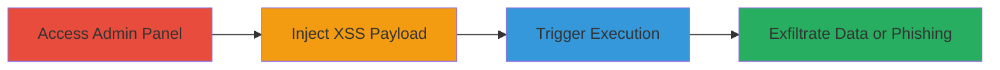

# Shopify Admin XSS via Malicious URL Redirect Injection

Multi-stage attack chain demonstrating exploitation of a Cross-Site Scripting (XSS) vulnerability in Shopify's admin URL redirects feature. An attacker with store administrator privileges can inject javascript: or data: URI schemes into the redirect URL field, leading to arbitrary JavaScript execution when the redirect link is accessed. This enables cookie theft, session hijacking, or phishing redirects in the admin browser context.

## Chain Metrics Dashboard

| Metric | Value |
|--------|-------|
| Chain Status | Unverified |
| Total Steps | 3 |
| Execution Time | ~5 minutes |
| Skill Level | Intermediate |
| Complexity | Medium |
| Impact Level | High |

## Attack Flow Visualization

## Prerequisites & Requirements

### Required Tools

- None (manual browser-based exploitation)

### Target Environment

- Shopify admin panel
- Required services/ports: HTTPS (443)
- Network access requirements: Valid admin credentials for the target store

### Initial Access Requirements

- Administrator privileges on the Shopify store
- Direct access to the admin interface at https://[shop-name].myshopify.com/admin
- No prior network position needed beyond authenticated session

## Detailed Attack Procedures

### Step 1: Access Admin Redirects Page
procedure: [[procedures/Access-Shopify-Admin-Redirects]]

**Objective**: Gain entry to the URL redirects management interface to prepare for payload injection.

**Instructions**: Log in to the Shopify admin panel and navigate to the redirects section. Ensure you have the necessary permissions to manage URL redirects.

**Expected Output**: The redirects admin page loads, displaying existing redirects and an option to add new ones.

**Success Indicators**:
- Page loads without errors
- 'Add URL Redirect' button is visible and clickable

### Step 2: Inject XSS Payload into Redirect
procedure: [[procedures/Inject-XSS-Payload-into-Redirect]]

**Objective**: Create a new redirect entry with an injected malicious payload using javascript: or data: schemes to bypass validation.

**Instructions**: Click 'Add URL Redirect', specify an old path (e.g., /malicious), and enter the payload in the redirect URL field, such as `javascript:alert(document.domain)` for testing or a base64-encoded data: URI for advanced exploitation like `data:text/html;base64,PHNjcmlwdD5hbGVydCgiY29va2llIHN0ZWFsOiAiK2RvY3VtZW50LmNvb2tpZSk7d2luZG93LmxvY2F0aW9uLmhyZWY9J2h0dHA6Ly93d3cuZ29vZ2xlLmNvbSc7PC9zY3JpcHQ+`. Save the redirect to generate the link.

**Expected Output**: Redirect is saved successfully, and a new entry appears in the list with the generated redirect URL.

**Success Indicators**:
- No validation errors on save
- Redirect link is generated and visible

### Step 3: Trigger XSS Execution
procedure: [[procedures/Trigger-XSS-via-Redirect-Link]]

**Objective**: Activate the injected payload by accessing the malicious redirect, leading to JavaScript execution in the admin context.

**Instructions**: Click the generated redirect link in the admin panel. The browser will execute the payload, such as displaying an alert with the domain or stealing cookies via the data: URI script.

**Expected Output**: JavaScript executes, e.g., an alert pops up showing document.domain or cookies, followed by a redirect if scripted.

**Success Indicators**:
- Alert or script action triggers
- Cookies or session data can be exfiltrated (e.g., via network requests in advanced payloads)

## Attack Chain Summary

### Key Achievements

1. Bypassed redirect URL validation to inject executable schemes
2. Achieved XSS in the high-privilege admin context
3. Enabled data theft or phishing without external tools

## Technique & Tactic Coverage

### MITRE ATT&CK Techniques

- [[JavaScript]]
- [[Drive-by Compromise]]

### MITRE ATT&CK Tactics

- [[Execution]]
- [[Collection]]

---
*Last updated: 2023-10-01T00:00:00Z*
