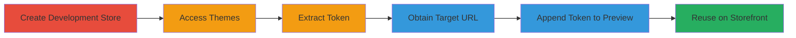

# Shopify Authentication Bypass via Reusable Preview Tokens in Development Stores

Multi-stage attack chain demonstrating a complete attack workflow for bypassing password protection on Shopify development stores using unscoped preview tokens introduced after the August 17, 2020 update.

## Chain Metrics Dashboard

| Metric | Value |
|--------|-------|
| Chain Status | Unverified |
| Total Steps | 6 |
| Execution Time | ~10 minutes |
| Skill Level | Intermediate |
| Complexity | Medium |
| Impact Level | High |

## Attack Flow Visualization

## Prerequisites & Requirements

### Required Tools

- Shopify Partner Account (for creating development stores)
- Web browser (e.g., Chrome) for URL manipulation

### Target Environment

- Shopify platform (development stores post-August 17, 2020)
- Password-protected development stores
- No specific ports or services beyond standard HTTPS (443)

### Initial Access Requirements

- Valid Shopify Partner credentials to create stores
- Network access to Shopify admin dashboard and storefronts
- No prior access to target store needed; tokens are generated on-the-fly

## Detailed Attack Procedures

### Step 1: Create New Development Store
procedure: [[procedures/Create-New-Shopify-Development-Store]]

**Objective**: Establish a source development store to generate a reusable preview token.

**Instructions**: Log in to the Shopify Partner Dashboard and create a new development store that complies with the post-August 17, 2020 password requirements. This store will automatically have password protection enabled.

**Expected Output**: Confirmation of new store creation with admin access URL.

**Success Indicators**:
- New store listed in Partner Dashboard
- Store admin accessible without errors

### Step 2: Access Themes Section
procedure: [[procedures/Access-Shopify-Themes-Section]]

**Objective**: Navigate to the area where preview links are generated.

**Instructions**: In the store admin dashboard, go to Sales channels > Online Store > Themes to prepare for token extraction.

**Expected Output**: Themes management page loaded.

**Success Indicators**:
- Themes section visible
- No access restrictions encountered

### Step 3: Extract Preview Token
procedure: [[procedures/Extract-Preview-Token-from-View-Store-Link]]

**Objective**: Obtain a temporary preview token (?_bt=) from the source store's 'View your store' link.

**Instructions**: Click the 'View your store' button under the Themes title. Copy the ?_bt=<long-token> query parameter from the generated URL.

**Expected Output**: URL with ?_bt= parameter, e.g., https://source-store.myshopify.com/?_bt=abc123def...

**Success Indicators**:
- Token extracted (typically a long alphanumeric string)
- Preview access granted without password on source store

### Step 4: Obtain Target Preview URL
procedure: [[procedures/Obtain-Target-Development-Store-Preview-URL]]

**Objective**: Identify a target password-protected development store's preview URL.

**Instructions**: Create or obtain a preview link from another development store, such as https://p5bz3eh5unc3i111-46236205210.shopifypreview.com, which prompts for a password.

**Expected Output**: Target URL that requires password authentication.

**Success Indicators**:
- URL accessed and password prompt appears
- Confirmation it's a different store from the source

### Step 5: Append Token to Target Preview for Bypass
procedure: [[procedures/Append-Token-to-Target-Preview-URL-for-Bypass]]

**Objective**: Reuse the extracted token to bypass authentication on the target preview URL.

**Instructions**: Modify the target URL by appending the copied ?_bt=<token>, e.g., https://target-preview.shopifypreview.com/?_bt=<token-from-source-store>. Load the modified URL in a browser.

**Expected Output**: Direct access to the storefront without password prompt.

**Success Indicators**:
- Password page skipped
- Store content (e.g., themes, products) visible

### Step 6: Reuse Token on Regular Storefront URLs
procedure: [[procedures/Reuse-Token-on-Regular-Storefront-URLs]]

**Objective**: Extend the bypass to non-preview paths on the target store.

**Instructions**: Append the same ?_bt=<token> to regular paths like https://yourshop.myshopify.com/collections/all and access them.

**Expected Output**: Unauthorized access to protected collections or pages.

**Success Indicators**:
- Access to /collections/all or similar without authentication
- Full information disclosure of store content

## Attack Chain Summary

### Key Achievements

1. Successful creation and token extraction from source store
2. Bypass of password protection on target preview and storefront URLs
3. Information disclosure of sensitive development store content

## Technique & Tactic Coverage

### MITRE ATT&CK Techniques

- [[Valid Accounts]] Valid Accounts
- [[Exploit Public-Facing Application]] Exploit Public-Facing Application

### MITRE ATT&CK Tactics

- [[Initial Access]] Initial Access

---
*Last updated: 2023-10-01T00:00:00Z*
