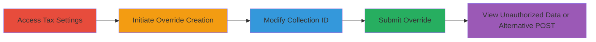

---
tags:
  - authorization-bypass
  - idor
  - shopify
  - collection-discovery
type: attack_chain
tools:
  - '[[tools/Browser-Developer-Tools]]'
tactics:
  - '[[Initial Access]]'
  - '[[Discovery]]'
verified: false
platforms:
  - Web
submitted: true
complexity: medium
created_at: '2023-10-01T00:00:00Z'
procedures:
  - '[[procedures/Access-Shopify-Tax-Settings]]'
  - '[[procedures/Initiate-Tax-Override-Creation]]'
  - '[[procedures/Modify-Collection-ID-via-Inspect-Element]]'
  - '[[procedures/Submit-Tax-Override]]'
  - '[[procedures/Alternative-POST-Request-for-Tax-Override]]'
step_count: 5
techniques:
  - '[[Valid Accounts]]'
  - '[[Account Discovery]]'
updated_at: '2025-12-14T17:28:44.297Z'
description: >-
  An authorization bypass in Shopify's admin panel tax override feature allows
  unauthorized access to collection names from other shops by manipulating the
  collection_id parameter without ShopID validation.
skill_level: intermediate
impact_level: high
id: b825f493-12f5-4204-aa1c-e7e1db8df962
validated: true
mitre_tactics:
  - '[[Initial Access]]'
  - '[[Discovery]]'
mitre_techniques:
  - '[[Valid Accounts]]'
  - '[[Account Discovery]]'
---
# Shopify Authorization Bypass via Tax Override Collection ID Manipulation

Multi-stage attack chain demonstrating an authorization bypass in Shopify's admin panel, allowing unauthorized access to collection names from other shops, including hidden ones, through manipulation of the tax override feature.

## Chain Metrics Dashboard

| Metric | Value |
|--------|-------|
| Chain Status | Unverified |
| Total Steps | 5 |
| Execution Time | ~5 minutes |
| Skill Level | Intermediate |
| Complexity | Medium |
| Impact Level | High |

## Attack Flow Visualization

## Prerequisites & Requirements

### Required Tools

- [[tools/Browser-Developer-Tools]]

### Target Environment

- Shopify admin panel (web-based SaaS platform)
- Required services/ports: HTTPS (443)
- Network access requirements: Valid authenticated session to a Shopify shop admin

### Initial Access Requirements

- Valid Shopify admin credentials for any shop
- Ability to access the admin panel URL (e.g., https://shop.myshopify.com/admin)
- No prior access to target collections needed; bypasses ownership checks

## Detailed Attack Procedures

### Step 1: Access Tax Settings
procedure: [[procedures/Access-Shopify-Tax-Settings]]

**Objective**: Navigate to the taxes settings page to begin the override process.

**Instructions**: Log in to the Shopify admin panel and directly access the taxes settings URL.

**Expected Output**: The taxes settings page loads, showing existing tax configurations.

**Success Indicators**:
- Page loads without errors
- Tax overrides section is visible

### Step 2: Initiate Tax Override Creation
procedure: [[procedures/Initiate-Tax-Override-Creation]]

**Objective**: Start the process of adding a new tax override by selecting a collection.

**Instructions**: Click on 'Add a tax override' and select one of your own collections to populate the form fields.

**Expected Output**: The tax override form appears with pre-filled collection details.

**Success Indicators**:
- Form is populated with a valid collection
- Hidden fields like collection_id are present in the HTML

### Step 3: Modify Collection ID
procedure: [[procedures/Modify-Collection-ID-via-Inspect-Element]]

**Objective**: Bypass authorization by altering the collection_id to reference a foreign shop's collection.

**Instructions**: Use browser developer tools to inspect and change the hidden input value for tax_override[collection_id] to a known foreign ID, such as 137861635.

**Expected Output**: The form now references the foreign collection_id.

**Success Indicators**:
- Input value updated successfully
- No immediate validation errors

### Step 4: Submit Tax Override
procedure: [[procedures/Submit-Tax-Override]]

**Objective**: Add the tax override for the foreign collection and observe the unauthorized data exposure.

**Instructions**: Click the save button to submit the form.

**Expected Output**: The tax override is added, and the foreign collection name appears in the 'Tax overrides' table.

**Success Indicators**:
- Foreign collection name visible in the table
- Even hidden collections from other shops are displayed

### Step 5: Alternative POST Request
procedure: [[procedures/Alternative-POST-Request-for-Tax-Override]]

**Objective**: Use a direct HTTP POST to create the override without UI interaction, confirming the bypass.

**Instructions**: Send a POST request to the override endpoint with manipulated parameters.

**Expected Output**: Server accepts the request and adds the override for the foreign collection.

**Success Indicators**:
- HTTP 200 or redirect response
- Override listed with foreign collection details

## Attack Chain Summary

### Key Achievements

1. Bypassed ShopID validation in tax override feature
2. Accessed names of collections from arbitrary shops, including hidden ones
3. Demonstrated impact through UI manipulation and direct API calls

## Technique & Tactic Coverage

### MITRE ATT&CK Techniques

- [[Valid Accounts]] Valid Accounts
- [[Account Discovery]] Account Discovery

### MITRE ATT&CK Tactics

- [[Initial Access]] Initial Access
- [[Discovery]] Discovery

---
*Last updated: 2023-10-01T00:00:00Z*
