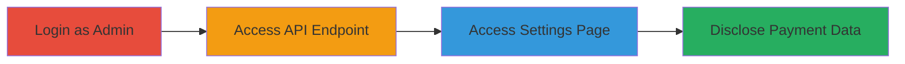

# Shopify Broken Access Control Allowing Unauthorized Payment Gateway Disclosure

Multi-stage attack chain demonstrating a complete attack workflow exploiting improper authorization checks in Shopify's admin panel.

## Chain Metrics Dashboard

| Metric | Value |
|--------|-------|
| Chain Status | Unverified |
| Total Steps | 3 |
| Execution Time | ~2 minutes |
| Skill Level | Intermediate |
| Complexity | Low |
| Impact Level | High |

## Attack Flow Visualization

## Prerequisites & Requirements

### Required Tools

- Web browser (e.g., Chrome)
- API client (e.g., curl or Postman)

### Target Environment

- Shopify admin panel (web application)
- Required services: Admin authentication and payment gateways
- Network access: Internal admin access (valid session)

### Initial Access Requirements

- Valid administrator credentials without 'Settings' permission (e.g., with 'Orders' permission only)
- Active Shopify store session
- No prior elevated access needed

## Detailed Attack Procedures

### Step 1: Initial Access
procedure: [[procedures/Login-as-Admin-Without-Settings-Permission]]

**Objective**: Authenticate to the Shopify admin panel using an administrator account lacking 'Settings' permission to establish a valid session.

**Instructions**: Navigate to the Shopify admin login page and enter credentials for an admin user with limited permissions, such as 'Orders' access but no 'Settings'.

**Expected Output**: Successful login redirecting to the admin dashboard, with restricted UI elements (e.g., no visible Settings menu).

**Success Indicators**:
- Admin dashboard loads without errors
- User permissions confirm no 'Settings' access in profile

### Step 2: Access API Endpoint
procedure: [[procedures/Access-Payment-Gateways-API-Endpoint]]

**Objective**: Directly query the payment gateways API to retrieve sensitive configuration data, bypassing UI restrictions.

**Instructions**: With an active session, use a browser developer tools or API client to request the endpoint `https://shop.myshopify.com/admin/payment_gateways.json`. Include session cookies or auth headers from the login.

**Expected Output**: JSON response containing payment gateway details, including names, statuses, and partial credentials.

**Success Indicators**:
- API returns 200 OK with gateway data
- Data includes sensitive fields like API keys or merchant IDs

### Step 3: Direct Page Navigation
procedure: [[procedures/Direct-Navigation-to-Payments-Settings-Page]]

**Objective**: Bypass UI permission checks by directly accessing the payments settings page to view gateway configurations.

**Instructions**: In the browser, manually enter the URL `https://shop.myshopify.com/admin/settings/payments` and load the page using the established session.

**Expected Output**: Page renders displaying payment gateways, including configuration details normally hidden from non-Settings users.

**Success Indicators**:
- Page loads without permission errors
- Visible list of active payment providers with partial credential info

## Attack Chain Summary

### Key Achievements

1. Established a valid but limited-privilege session in Shopify admin
2. Retrieved payment gateway data via unprotected API endpoint
3. Viewed sensitive financial configurations through direct URL access

## Technique & Tactic Coverage

### MITRE ATT&CK Techniques

- [[Valid Accounts]]

### MITRE ATT&CK Tactics

- [[Initial Access]]

---
*Last updated: 2024-10-01T12:00:00Z*
