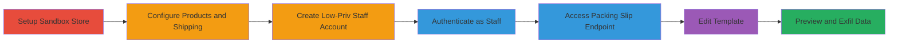

---
tags:
  - broken-access-control
  - authorization-bypass
  - shopify
  - web-vulnerability
type: attack_chain
tools: []
tactics:
  - '[[Initial Access]]'
verified: false
platforms:
  - Web
submitted: true
complexity: medium
created_at: '2024-10-01T00:00:00Z'
procedures:
  - '[[procedures/Create-Shopify-Sandbox-Store-and-Setup]]'
  - '[[procedures/Create-Zero-Permission-Staff-Account]]'
  - '[[procedures/Access-and-Edit-Packing-Slip-Template]]'
step_count: 7
techniques:
  - '[[Valid Accounts]]'
  - '[[Exploit Public-Facing Application]]'
updated_at: '2025-12-14T17:29:09.450Z'
description: >-
  A multi-stage attack exploiting broken access control in Shopify's admin
  panel, allowing a zero-permission staff user in a sandbox store to edit
  packing slip templates and preview sensitive store data including products and
  shipping information.
skill_level: intermediate
impact_level: high
id: d1b52ae2-a4d8-4fc8-9015-6bbfe0c60ed8
validated: true
mitre_tactics:
  - '[[Initial Access]]'
mitre_techniques:
  - '[[Valid Accounts]]'
  - '[[Exploit Public-Facing Application]]'
---
# Shopify Broken Access Control: Low-Privileged Staff Accesses and Edits Packing Slip Templates to View Sensitive Product and Shipping Data

Multi-stage attack chain demonstrating a complete attack workflow exploiting broken access control in Shopify's admin panel.

## Chain Metrics Dashboard

| Metric | Value |
|--------|-------|
| Chain Status | Unverified |
| Total Steps | 7 |
| Execution Time | ~15 minutes |
| Skill Level | Intermediate |
| Complexity | Medium |
| Impact Level | High |

## Attack Flow Visualization

## Prerequisites & Requirements

### Required Tools

- Web browser (e.g., Chrome or Firefox with developer tools)
- Access to Shopify account for creating sandbox stores

### Target Environment

- Shopify admin panel (web application)
- Sandbox store environment
- No specific ports or services beyond standard HTTPS (443)

### Initial Access Requirements

- Valid Shopify admin credentials for initial setup
- Ability to create staff accounts
- Network access to myshopify.com domains

## Detailed Attack Procedures

### Step 1: Create Sandbox Store and Log In as Admin
procedure: [[procedures/Create-Shopify-Sandbox-Store-and-Setup]]

**Objective**: Establish a test environment by creating a sandbox store and authenticating as an admin to prepare for vulnerability exploitation.

**Instructions**: Access the Shopify admin panel and create a new sandbox store. Log in using admin credentials to gain full control for setup.

**Expected Output**: Successful login to the sandbox store admin dashboard.

**Success Indicators**:
- Sandbox store created and accessible at https://<store>.myshopify.com/admin
- Admin dashboard loads without errors

### Step 2: Create Products
procedure: [[procedures/Create-Shopify-Sandbox-Store-and-Setup]]

**Objective**: Populate the store with products to use as sensitive data in later previews.

**Instructions**: Navigate to the products section in the admin panel and add multiple products with details like names, prices, and descriptions.

**Expected Output**: Products listed in the admin inventory.

**Success Indicators**:
- At least 2-3 products added successfully
- Product details visible in admin view

### Step 3: Set Up Shipping Information
procedure: [[procedures/Create-Shopify-Sandbox-Store-and-Setup]]

**Objective**: Configure shipping details to include as sensitive data exposed in template previews.

**Instructions**: Go to the settings section and input shipping rates, zones, and other logistics information.

**Expected Output**: Shipping configuration saved and active.

**Success Indicators**:
- Shipping settings updated without errors
- Test orders can be simulated with shipping applied

### Step 4: Add a Staff Member with No Permissions
procedure: [[procedures/Create-Zero-Permission-Staff-Account]]

**Objective**: Create a low-privileged staff account with zero assigned permissions to test access controls.

**Instructions**: In the admin settings, navigate to account management and add a new staff user without selecting any permission roles.

**Expected Output**: Staff account created and email confirmation sent.

**Success Indicators**:
- Staff account appears in the users list
- No permissions assigned upon creation

### Step 5: Authenticate as the Staff User and Confirm Restricted Access
procedure: [[procedures/Create-Zero-Permission-Staff-Account]]

**Objective**: Verify that the staff account has limited access, setting up the contrast for the vulnerability.

**Instructions**: Log in to the sandbox store using the staff credentials in a separate browser session and attempt to access admin functions.

**Expected Output**: Login successful, but admin areas like products or settings are inaccessible or show permission errors.

**Success Indicators**:
- Staff dashboard loads with restricted views only
- Attempts to access protected endpoints fail as expected

### Step 6: Navigate to Packing Slip Template Endpoint as Staff
procedure: [[procedures/Access-and-Edit-Packing-Slip-Template]]

**Objective**: Exploit the broken access control by directly accessing the vulnerable endpoint.

**Instructions**: As the staff user, enter the URL https://<store>.myshopify.com/admin/settings/packing_slip_template in the browser and attempt to load the page.

**Expected Output**: The template editor loads, allowing edits despite no permissions.

**Success Indicators**:
- Page loads without authorization error
- Edit fields for the template are interactive

### Step 7: Preview the Template to View Sensitive Information
procedure: [[procedures/Access-and-Edit-Packing-Slip-Template]]

**Objective**: Generate a preview to exfiltrate and view unauthorized sensitive data.

**Instructions**: Modify the template if needed, then use the preview function to generate a PDF output.

**Expected Output**: PDF preview displays product details, shipping info, and other store data.

**Success Indicators**:
- Preview PDF contains sensitive information like product names and shipping addresses
- Data can be downloaded or screenshot for proof

## Attack Chain Summary

### Key Achievements

1. Successful creation of a controlled sandbox environment with sensitive data.
2. Bypassing access controls using a zero-permission staff account to reach admin endpoints.
3. Unauthorized editing and previewing of packing slip templates, exposing product and shipping data.

## Technique & Tactic Coverage

### MITRE ATT&CK Techniques

- [[Valid Accounts]]
- [[Exploit Public-Facing Application]]

### MITRE ATT&CK Tactics

- [[Initial Access]]

---
*Last updated: 2024-10-01T00:00:00Z*
