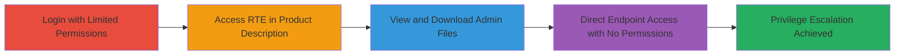

# Shopify Broken Access Control: Unauthorized Access to Admin-Uploaded Files via RTE

Multi-stage attack chain demonstrating a complete attack workflow exploiting missing permission checks in Shopify's admin panel to allow unauthorized access to admin-uploaded files.

## Chain Metrics Dashboard

| Metric | Value |
|--------|-------|
| Chain Status | Unverified |
| Total Steps | 3 |
| Execution Time | ~5 minutes |
| Skill Level | Beginner |
| Complexity | Low |
| Impact Level | Medium |

## Attack Flow Visualization

## Prerequisites & Requirements

### Required Tools

- Web browser (e.g., Chrome)

### Target Environment

- Shopify admin panel (web-based SaaS)
- Access to staff account with limited or no permissions
- Admin-uploaded files via RTE (e.g., images in product descriptions)

### Initial Access Requirements

- Valid Shopify staff credentials (low-privilege or none)
- Network access to the Shopify store admin URL (https://*.myshopify.com/admin)
- Prior knowledge of admin-uploaded files existence

## Detailed Attack Procedures

### Step 1: Login and Test RTE Access with Limited Permissions
procedure: [[procedures/Access-RTE-Files-with-Limited-Product-Permissions]]

**Objective**: Verify if a staff member with only 'Products, Inventory, & Collections' permissions can access admin-uploaded files via the RTE in product descriptions.

**Instructions**: Log in to the Shopify admin panel using a staff account limited to 'Products, Inventory, & Collections' permissions. Navigate to Products > Select a Product > Description tab. Click 'Add Image' in the RTE and check the 'Uploaded images' section for admin-uploaded files.

**Expected Output**: The 'Uploaded images' section displays all admin-uploaded files, allowing selection or download despite limited permissions.

**Success Indicators**:
- Admin-uploaded images visible in RTE asset listing
- Ability to add or download files without 'Settings' access

### Step 2: Verify File Accessibility Without Settings Permissions
procedure: [[procedures/Verify-File-Access-Without-Settings-Permissions]]

**Objective**: Confirm that files normally restricted to Settings > Files are accessible via RTE despite lacking permissions.

**Instructions**: With the same limited permissions account, attempt to access Settings > Files (should be denied). Then return to the product description RTE and observe that the same files are listed and downloadable.

**Expected Output**: Access denied in Settings > Files, but full file listing and download capability in RTE.

**Success Indicators**:
- Denied access to direct file management section
- Successful file viewing/download via indirect RTE path

### Step 3: Direct Endpoint Access with No Permissions
procedure: [[procedures/Direct-Access-to-RTE-Assets-Endpoint-with-No-Permissions]]

**Objective**: Demonstrate that even staff with no permissions can directly access the RTE assets endpoint to list and download all admin files.

**Instructions**: Log in with a staff account having no permissions. Directly navigate to https://*.myshopify.com/admin/rte/assets in the browser. Observe the listing of all uploaded files with download links.

**Expected Output**: Full list of admin-uploaded files displayed, including direct download URLs (e.g., to CDN).

**Success Indicators**:
- Endpoint loads without permission errors
- All files, including sensitive ones, are viewable and downloadable

## Attack Chain Summary

### Key Achievements

1. Privilege escalation from limited staff permissions to admin file access
2. Bypassing permission checks in RTE asset listing
3. Direct unauthorized access to sensitive uploaded files via admin endpoint

## Technique & Tactic Coverage

### MITRE ATT&CK Techniques

- [[Exploitation for Privilege Escalation]] Exploitation for Privilege Escalation
- [[Exploit Public-Facing Application]] Exploit Public-Facing Application

### MITRE ATT&CK Tactics

- [[Privilege Escalation]] Privilege Escalation

---
*Last updated: 2023-10-01T00:00:00Z*
