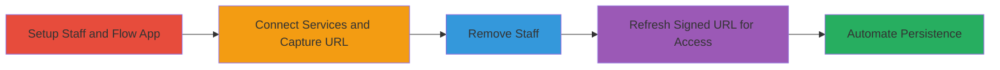

---
tags:
  - auth-bypass
  - shopify
  - flow-app
  - signed-url
  - persistence
type: attack_chain
tools:
  - '[[tools/iMacros-for-Firefox]]'
  - '[[tools/Telegra-ph-API]]'
tactics:
  - '[[Initial Access]]'
  - '[[Persistence]]'
verified: false
platforms:
  - Web
  - Shopify
submitted: true
complexity: medium
created_at: '2023-10-01T00:00:00Z'
procedures:
  - '[[procedures/Create-Staff-Account-and-Install-Flow-App]]'
  - '[[procedures/Connect-External-Services-and-Capture-Signed-URL]]'
  - '[[procedures/Remove-Staff-Account]]'
  - '[[procedures/Exploit-Signed-URL-Refresh-for-Access-Extension]]'
  - '[[procedures/Automate-Persistent-Access-with-iMacros]]'
step_count: 5
techniques:
  - '[[Valid Accounts]]'
  - '[[T1078.004]]'
updated_at: '2025-12-14T17:29:44.812Z'
description: >-
  Multi-stage attack exploiting improper authorization in Shopify's Flow app,
  allowing removed staff with prior 'Apps' permission to indefinitely access and
  modify connectors by refreshing signed URL parameters, enabling persistent
  data exfiltration through redirected workflows.
skill_level: intermediate
impact_level: high
id: 61f700cd-e6b1-4eb4-afff-ae5365dd9cf1
validated: true
mitre_tactics:
  - '[[Initial Access]]'
  - '[[Persistence]]'
mitre_techniques:
  - '[[Valid Accounts]]'
  - '[[T1078.004]]'
---
# Shopify Flow App Authorization Bypass via Signed URL Refresh for Persistent Ex-Staff Access

Multi-stage attack chain demonstrating a complete attack workflow exploiting Shopify's Flow app authorization flaw.

## Chain Metrics Dashboard

| Metric | Value |
|--------|-------|
| Chain Status | Unverified |
| Total Steps | 5 |
| Execution Time | ~45 minutes initial + indefinite with automation |
| Skill Level | Intermediate |
| Complexity | Medium |
| Impact Level | High |

## Attack Flow Visualization

## Prerequisites & Requirements

### Required Tools

- [[tools/iMacros-for-Firefox]]
- [[tools/Telegra-ph-API]]

### Target Environment

- Shopify admin panel and Flow app
- Required services: Google Sheets, Trello, Asana connectors
- Network access: Internet access to Shopify domains

### Initial Access Requirements

- Valid Shopify shop owner credentials
- Ability to create and manage staff accounts
- No prior ex-staff access needed; attack creates it

## Detailed Attack Procedures

### Step 1: Setup Staff and Install Flow App
procedure: [[procedures/Create-Staff-Account-and-Install-Flow-App]]

**Objective**: Establish a staff account with 'Apps' permission and install the Flow app to prepare for connector interactions.

**Instructions**: Log in as shop owner, create staff with 'Apps' permission, then install Flow app and access connectors as staff.

**Expected Output**: Staff account created, Flow app installed, connectors accessible.

**Success Indicators**:
- Staff login successful
- Flow app visible in admin

### Step 2: Connect Services and Capture Signed URL
procedure: [[procedures/Connect-External-Services-and-Capture-Signed-URL]]

**Objective**: Connect external services like Google Sheets and capture the signed URL containing timestamp and path_hmac for later exploitation.

**Instructions**: As staff, connect Google Sheets, Trello, Asana; during Google Sheets connection, save the full redirected URL with parameters.

**Expected Output**: Services connected, signed URL captured (e.g., https://flow-connectors.shopifycloud.com/gsheet/connect?shop_domain=...&timestamp=...&path_hmac=...).

**Success Indicators**:
- Connections established
- URL parameters visible and saved

### Step 3: Remove Staff Account
procedure: [[procedures/Remove-Staff-Account]]

**Objective**: Revoke staff permissions to simulate ex-employee scenario, testing if prior access persists.

**Instructions**: Log in as shop owner and remove the staff account from the admin panel.

**Expected Output**: Staff account deleted, no active permissions.

**Success Indicators**:
- Account removal confirmed in admin
- Login with staff credentials fails

### Step 4: Exploit Signed URL Refresh
procedure: [[procedures/Exploit-Signed-URL-Refresh-for-Access-Extension]]

**Objective**: Use the captured signed URL to access connectors post-removal and refresh parameters by disconnecting/reconnecting to extend validity.

**Instructions**: Visit saved URL within 60 minutes; disconnect a service to generate new timestamp/path_hmac, then reconnect with attacker-controlled account.

**Expected Output**: Access granted, new parameters generated, workflows redirected to attacker accounts.

**Success Indicators**:
- Connector modification possible
- New URL parameters valid for another hour

### Step 5: Automate Persistent Access
procedure: [[procedures/Automate-Persistent-Access-with-iMacros]]

**Objective**: Automate the disconnect/reconnect cycle to maintain indefinite access without manual intervention.

**Instructions**: Use [[commands/imacros-refresh-flow-url]] script in iMacros to loop actions and update a Telegra.ph page with fresh URLs.

**Expected Output**: Script runs loops, updating external page with valid URLs for persistent reference.

**Success Indicators**:
- Automation cycles successfully
- Telegra.ph page updated with new URLs

## Attack Chain Summary

### Key Achievements

1. Bypassed authorization for removed staff via uninvalidated signed URLs.
2. Enabled persistent modification of Flow connectors to exfiltrate shop data.
3. Automated refresh for indefinite access, impacting workflow integrity.

## Technique & Tactic Coverage

### MITRE ATT&CK Techniques

- [[Valid Accounts]]
- [[T1078.004]]

### MITRE ATT&CK Tactics

- [[Initial Access]]
- [[Persistence]]

---
*Last updated: 2023-10-01T00:00:00Z*
