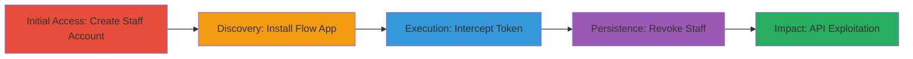

# Shopify Flow App Token Leak Enabling Persistent Unauthorized Store Access

Multi-stage attack chain demonstrating a complete attack workflow exploiting a vulnerability in the Shopify Flow app, where a sensitive access token is exposed in a GraphQL response, enabling interception and persistent unauthorized access to the store's REST API endpoints.

## Chain Metrics Dashboard

| Metric | Value |
|--------|-------|
| Chain Status | Unverified |
| Total Steps | 5 |
| Execution Time | ~10 minutes |
| Skill Level | Intermediate |
| Complexity | Medium |
| Impact Level | High |

## Attack Flow Visualization

## Prerequisites & Requirements

### Required Tools

- [[tools/Browser-Developer-Tools]]

### Target Environment

- Shopify store with admin access
- Web browser (e.g., Chrome)
- Required services: Shopify API, Flow App
- Network access: Internet connectivity to Shopify domains

### Initial Access Requirements

- Owner credentials for the target Shopify store
- Ability to create staff accounts
- No prior network position needed beyond standard internet access

## Detailed Attack Procedures

### Step 1: Create Staff Account
procedure: [[procedures/Create-Minimal-Permission-Staff-Account]]

**Objective**: Establish initial access by creating a staff member with minimal 'Apps' permissions to simulate an insider or ex-employee scenario.

**Instructions**: Log in as the store owner and create a new staff account via the Shopify admin panel, assigning only 'Apps' permission.

**Expected Output**: Confirmation of staff account creation with limited access.

**Success Indicators**:
- Staff account listed in admin with 'Apps' permission only
- Ability to log in as staff without full admin rights

### Step 2: Install and Access Flow App
procedure: [[procedures/Install-and-Access-Flow-App]]

**Objective**: Install the Shopify Flow app and authenticate as the staff user to prepare for token interception.

**Instructions**: As owner, install the Flow app from the Shopify App Store, then log in as the staff user to access the admin.

**Expected Output**: Flow app installed and staff login successful.

**Success Indicators**:
- Flow app appears in the store's app list
- Staff user can navigate to Flow app interface

### Step 3: Intercept Access Token
procedure: [[procedures/Intercept-Access-Token-via-Developer-Tools]]

**Objective**: Monitor network traffic to capture the leaked access token from the GraphQL response.

**Instructions**: Open browser developer tools, navigate to the Connectors tab in the Flow app, filter for GraphQL requests, and extract the shopifyToken from the shopInfo query response.

**Expected Output**: JSON response containing the 'shopifyToken' field with the access token value.

**Success Indicators**:
- Network request to https://flow.shopifycloud.com/graphql intercepted
- Valid token extracted (starts with 'shpat_' or similar)

### Step 4: Revoke Staff Access
procedure: [[procedures/Revoke-Staff-Access]]

**Objective**: Simulate staff removal to demonstrate token persistence beyond account lifecycle.

**Instructions**: Log in as the shop owner and remove the staff account from the Shopify admin.

**Expected Output**: Staff account deleted or deactivated.

**Success Indicators**:
- Staff user no longer able to log in
- Token remains functional despite revocation

### Step 5: Exploit Leaked Token
procedure: [[procedures/Exploit-Leaked-Token-for-API-Access]]

**Objective**: Use the intercepted token to perform unauthorized read/write operations on store data via REST API.

**Instructions**: Send API requests with the token in the X-Shopify-Access-Token header, such as retrieving orders.

**Expected Output**: Successful API responses with sensitive data like customer orders.

**Success Indicators**:
- API endpoints return store data without authentication
- Ability to read customer PII, orders, and modify inventory

## Attack Chain Summary

### Key Achievements

1. Leaked persistent access token via GraphQL exposure in Flow app
2. Bypassed staff revocation for ongoing unauthorized access
3. Full read/write control over store endpoints, compromising customer data and operations

## Technique & Tactic Coverage

### MITRE ATT&CK Techniques

- [[Unsecured Credentials]] Unsecured Credentials
- [[Valid Accounts]] Valid Accounts

### MITRE ATT&CK Tactics

- [[Initial Access]] Initial Access
- [[Persistence]] Persistence
- [[Collection]] Collection

---
*Last updated: 2023-10-01T00:00:00Z*
