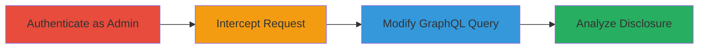

# Shopify GraphQL API Information Disclosure of Private Apps

Multi-stage attack chain demonstrating the exploitation of an information disclosure vulnerability in Shopify's GraphQL API, allowing authenticated Plus admins to access private app details from other stores.

## Chain Metrics Dashboard

| Metric | Value |
|--------|-------|
| Chain Status | Unverified |
| Total Steps | 4 |
| Execution Time | ~5 minutes |
| Skill Level | Intermediate |
| Complexity | Medium |
| Impact Level | High |

## Attack Flow Visualization



## Prerequisites & Requirements

### Required Tools

- [[tools/Burp-Suite]]

### Target Environment

- Shopify Plus platform
- Web-based GraphQL API at /users/api endpoint
- No specific ports; standard HTTPS (443)

### Initial Access Requirements

- Valid Shopify Plus admin credentials
- Network access to the target Shopify organization
- Proxy tool configured for traffic interception

## Detailed Attack Procedures

### Step 1: Authenticate as Admin
procedure: [[procedures/Authenticate-as-Shopify-Plus-Admin]]

**Objective**: Gain authenticated access to the Shopify Plus admin interface to enable request interception.

**Instructions**: Log in to the Shopify Plus account using admin privileges. Ensure the session is active and navigate to the users section to trigger the initial API request.

**Expected Output**: Successful login and access to the admin dashboard.

**Success Indicators**:
- Admin dashboard loaded
- Session cookies established

### Step 2: Intercept Request to GraphQL Endpoint
procedure: [[procedures/Intercept-and-Modify-GraphQL-Query]]

**Objective**: Monitor and capture the POST request to the /users/api endpoint for modification.

**Instructions**: Configure [[tools/Burp-Suite]] as a proxy. Navigate to the users section in the Shopify interface to trigger the request. Intercept the POST to /{ID}/users/api in Burp Suite.

**Expected Output**: Captured HTTP POST request with original GraphQL body.

**Success Indicators**:
- Request intercepted in Burp Proxy
- Original query visible in Inspector

### Step 3: Modify and Send GraphQL Query
procedure: [[procedures/Intercept-and-Modify-GraphQL-Query]]

**Objective**: Alter the GraphQL query to fetch a large number of apps, including private ones, bypassing access controls.

**Instructions**: Forward the intercepted request to Burp Repeater. Replace the request body with the modified GraphQL query using [[commands/shopify-graphql-shopapps-query]]:

```http
POST /{ID}/users/api HTTP/1.1
Host: example.myshopify.com
Content-Type: application/json

{"query":"query xxx { shopApps(first:10000) { edges { node { id isPrivate handle name title shopifyApiClientId } } } }"}
```

Send the request and observe the response.

**Expected Output**: JSON response with app data.

**Success Indicators**:
- Response status 200
- Large dataset returned

### Step 4: Analyze Response for Private Apps
procedure: [[procedures/Analyze-Response-for-Private-Apps]]

**Objective**: Examine the API response to identify and extract details of private apps from other stores.

**Instructions**: In Burp Repeater, inspect the JSON response. Search for objects where "isPrivate": true to confirm disclosure of unauthorized app information.

**Expected Output**: List of apps including private ones with fields like id, handle, name, title, and shopifyApiClientId.

**Success Indicators**:
- Entries with "isPrivate": true found
- Sensitive details from multiple stores exposed

## Attack Chain Summary

### Key Achievements

1. Authenticated access to Shopify Plus admin
2. Interception and modification of GraphQL API request
3. Disclosure of private app details across stores
4. Potential for further abuse of exposed API client IDs

## Technique & Tactic Coverage

### MITRE ATT&CK Techniques

- [[Valid Accounts]] Valid Accounts
- [[Account Discovery]] Account Discovery

### MITRE ATT&CK Tactics

- [[Initial Access]] Initial Access
- [[Discovery]] Discovery

---

*Last updated: 2023-10-01T00:00:00Z*
