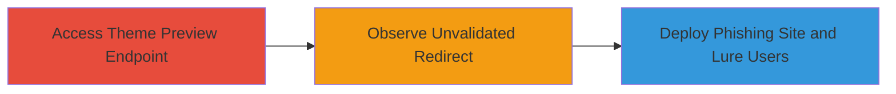

---
tags:
  - open-redirect
  - phishing
  - shopify
type: attack_chain
tools: []
tactics:
  - '[[Initial Access]]'
verified: false
platforms:
  - Web
submitted: true
complexity: medium
created_at: '2023-10-01T00:00:00Z'
procedures:
  - '[[procedures/Exploit-Open-Redirect-in-Shopify-Theme-Preview]]'
step_count: 3
techniques:
  - '[[Phishing]]'
  - '[[Exploit Public-Facing Application]]'
updated_at: '2025-12-14T17:24:31.672Z'
description: >-
  An attack chain exploiting an open redirect vulnerability in Shopify's theme
  preview functionality to enable phishing by redirecting users to arbitrary
  malicious domains mimicking admin pages.
skill_level: intermediate
impact_level: medium
id: d745b88f-2359-466d-b93b-5b35d1975580
validated: true
mitre_tactics:
  - '[[Initial Access]]'
mitre_techniques:
  - '[[Phishing]]'
  - '[[Exploit Public-Facing Application]]'
---
# Shopify Open Redirect in Theme Preview for Phishing Attacks

Multi-stage attack chain demonstrating a complete attack workflow exploiting an open redirect in Shopify's theme preview to facilitate phishing attacks.

## Chain Metrics Dashboard

| Metric | Value |
|--------|-------|
| Chain Status | Unverified |
| Total Steps | 3 |
| Execution Time | ~5 minutes |
| Skill Level | Intermediate |
| Complexity | Medium |
| Impact Level | Medium |

## Attack Flow Visualization



## Prerequisites & Requirements

### Required Tools

- Web browser (e.g., Chrome or Firefox with developer tools)

### Target Environment

- Shopify application (web platform)
- Access to Shopify app URLs
- No specific ports or services beyond standard HTTPS (443)

### Initial Access Requirements

- Valid Shopify account or ability to access the theme preview functionality
- Network access to https://app.shopify.com
- No prior credentials needed beyond basic app access for testing

## Detailed Attack Procedures

### Step 1: Access the Vulnerable Theme Preview Endpoint
procedure: [[procedures/Exploit-Open-Redirect-in-Shopify-Theme-Preview]]

**Objective**: Navigate to the theme preview URL to test the domain_name parameter for redirection behavior.

**Instructions**: Open a web browser and directly access the Shopify theme preview endpoint by constructing the URL with a test domain. For example, use `example.com` as the domain_name parameter.

```url
https://app.shopify.com/services/google/themes/preview/supply--blue?domain_name=example.com
```

Monitor the network tab in developer tools to observe the request and any immediate responses.

**Expected Output**: The page loads the theme preview, and the browser initiates a redirect based on the domain_name.

**Success Indicators**:
- URL loads without errors
- Redirect attempt is visible in browser history or network logs

### Step 2: Observe the Redirection
procedure: [[procedures/Exploit-Open-Redirect-in-Shopify-Theme-Preview]]

**Objective**: Confirm that the application redirects to the specified domain without validation, appending '/admin' to mimic legitimate admin access.

**Instructions**: After accessing the endpoint from Step 1, allow the redirect to proceed and inspect the final URL. Use browser developer tools to capture the full redirect chain.

```url
http://example.com/admin
```

Note that the redirect occurs to the arbitrary domain without checking if it is a trusted Shopify domain.

**Expected Output**: Browser navigates to `http://example.com/admin` or the equivalent malicious domain/admin path.

**Success Indicators**:
- Unvalidated redirect to external domain
- No error or blocking from Shopify's application

### Step 3: Exploit for Phishing
procedure: [[procedures/Exploit-Open-Redirect-in-Shopify-Theme-Preview]]

**Objective**: Leverage the redirect to direct victims to a controlled malicious site designed to phish for credentials or OAuth tokens by impersonating a Shopify admin page.

**Instructions**: Register and host a phishing site on a domain you control (e.g., via a service like Evilginx or a simple web server). Craft lures (e.g., emails or links) that trick users into clicking the vulnerable theme preview URL with your malicious domain_name. For example:

```url
https://app.shopify.com/services/google/themes/preview/supply--blue?domain_name=malicious-phish-site.com
```

The victim will be redirected to `http://malicious-phish-site.com/admin`, where your fake admin page captures inputs like usernames, passwords, or OAuth tokens.

**Expected Output**: Victim's browser redirects to your phishing page, potentially leading to credential harvest.

**Success Indicators**:
- Victim interacts with phishing page
- Captured data (e.g., login attempts) logged on your server
- Potential escalation to OAuth token theft if victim is authenticated

## Attack Chain Summary

### Key Achievements

1. Identified and confirmed open redirect in Shopify theme preview without domain validation
2. Demonstrated redirection to arbitrary external sites appending '/admin' for realistic phishing
3. Enabled medium-impact phishing attacks that could trick users into fake admin interfaces, risking credential or token theft

## Technique & Tactic Coverage

### MITRE ATT&CK Techniques

- [[Phishing]] Phishing
- [[Exploit Public-Facing Application]] Exploit Public-Facing Application

### MITRE ATT&CK Tactics

- [[Initial Access]] Initial Access

---
*Last updated: 2023-10-01T00:00:00Z*
