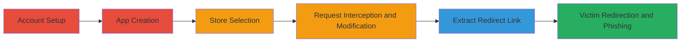

---
tags:
  - open-redirect
  - shopify
  - oauth
  - phishing
  - app-installation
type: attack_chain
tools:
  - '[[tools/Burp-Suite]]'
tactics:
  - '[[Initial Access]]'
verified: false
platforms:
  - Web
submitted: true
complexity: medium
created_at: '2024-10-01T00:00:00Z'
procedures:
  - '[[procedures/Intercept-and-Modify-Shopify-App-Installation-Request]]'
step_count: 6
techniques:
  - '[[Drive-by Compromise]]'
  - '[[Exploit Public-Facing Application]]'
updated_at: '2025-12-14T17:24:35.528Z'
description: >-
  Multi-stage attack exploiting an open redirection vulnerability in Shopify's
  partners application during OAuth app installation on development stores,
  enabling phishing and unauthorized access.
skill_level: intermediate
impact_level: high
id: 2609d2b5-a110-4596-a1e4-3cf217c1e54c
validated: true
mitre_tactics:
  - '[[Initial Access]]'
mitre_techniques:
  - '[[Drive-by Compromise]]'
  - '[[Exploit Public-Facing Application]]'
---
# Shopify Open Redirection in Partners OAuth Leading to Unauthorized App Installations and Phishing

Multi-stage attack chain demonstrating exploitation of an open redirection vulnerability in Shopify's partners dashboard during the OAuth installation process for apps on development stores. By intercepting and modifying installation requests, attackers can craft malicious redirect links to arbitrary stores, tricking victims into unauthorized app installations or phishing for credentials via unintended OAuth flows.

## Chain Metrics Dashboard

| Metric | Value |
|--------|-------|
| Chain Status | Unverified |
| Total Steps | 6 |
| Execution Time | ~10 minutes |
| Skill Level | Intermediate |
| Complexity | Medium |
| Impact Level | High |

## Attack Flow Visualization

## Prerequisites & Requirements

### Required Tools

- [[tools/Burp-Suite]]

### Target Environment

- Shopify Partners dashboard (web application)
- Access to a development store
- Network access to intercept HTTP requests

### Initial Access Requirements

- Valid Shopify partner account credentials
- Ownership of at least one development store
- No prior access to victim stores needed; social engineering for link sharing

## Detailed Attack Procedures

### Step 1: Open a Shopify Partner Account

**Objective**: Gain access to the Shopify Partners dashboard to create and test apps.

**Instructions**: Navigate to the Shopify Partners website and sign up or log in with existing credentials to access the dashboard.

**Expected Output**: Successful login to the partners dashboard.

**Success Indicators**:
- Dashboard accessible at partners.shopify.com
- Ability to create new apps

### Step 2: Create an App and Initiate Testing

**Objective**: Set up a new app in the dashboard to begin the installation process.

**Instructions**: In the Partners dashboard, select "Create app" and provide basic details. Once created, click "Test your app" to start the OAuth installation flow.

**Expected Output**: App created with a unique ID (e.g., /526915/apps/2544979).

**Success Indicators**:
- App listed in dashboard
- Testing interface loads

### Step 3: Select a Development Store

**Objective**: Choose an owned development store to simulate a legitimate installation.

**Instructions**: From the testing interface, select one of your own development stores (e.g., mido-2.myshopify.com) for the app installation.

**Expected Output**: Form submission prepares for the installation request.

**Success Indicators**:
- Store selected without errors
- POST request ready for interception

### Step 4: Intercept and Modify the Installation Request

procedure: [[procedures/Intercept-and-Modify-Shopify-App-Installation-Request]]

**Objective**: Exploit the lack of validation on the store selection parameter to target an arbitrary store.

**Instructions**: Configure [[tools/Burp-Suite]] to intercept the POST request to /526915/apps/2544979/install_on_dev_shop. Modify the 'install_app[Select a store]' parameter from your owned store to an arbitrary one (e.g., victim-store.myshopify.com). Include necessary headers like Host: partners.shopify.com and Content-Type: application/x-www-form-urlencoded, along with body parameters such as utf8, authenticity_token, and the modified install_app value.

**Expected Output**: Modified request forwarded, server accepts without validation.

**Success Indicators**:
- Request intercepted and altered successfully
- No server-side rejection of the arbitrary store domain

### Step 5: Extract the Redirect Link

**Objective**: Capture the crafted redirect URL from the server's response.

**Instructions**: Forward the modified request and observe the HTTP 302 response. Extract the Location header value: https://[arbitrary_store].myshopify.com/admin/oauth/redirect_from_partners_dashboard?client_id=...&signature=.... Alternatively, parse the HTML body for the link within <a> tags.

**Expected Output**: Valid redirect URL pointing to the victim's store OAuth endpoint.

**Success Indicators**:
- 302 redirect with target store domain
- Parameters include client_id and signature

### Step 6: Distribute Link to Victim

**Objective**: Trick the victim into accessing the malicious link, initiating unauthorized OAuth flow.

**Instructions**: Share the extracted redirect link via email, chat, or social engineering. When the victim clicks it, they are redirected to the arbitrary store's OAuth endpoint, potentially installing the app or submitting credentials to a phishing site.

**Expected Output**: Victim redirected to unintended OAuth page.

**Success Indicators**:
- Victim reports unexpected redirect or app installation prompt
- Access logs show traffic to the crafted URL

## Attack Chain Summary

### Key Achievements

1. Bypassed store validation in Shopify's OAuth flow
2. Crafted phishing links for arbitrary development stores
3. Enabled unauthorized app installations or credential theft

## Technique & Tactic Coverage

### MITRE ATT&CK Techniques

- [[Drive-by Compromise]] Drive-by Compromise
- [[Exploit Public-Facing Application]] Exploit Public-Facing Application

### MITRE ATT&CK Tactics

- [[Initial Access]] Initial Access

---

*Last updated: 2024-10-01T00:00:00Z*
