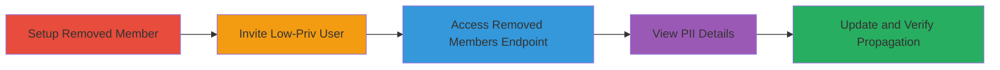

# Shopify Partner Dashboard PII Disclosure of Removed Team Members

Multi-stage attack chain demonstrating unauthorized access to sensitive personal information (PII) of past team members in Shopify's Partner Dashboard, exploiting insufficient permission checks on the removed members endpoint.

## Chain Metrics Dashboard

| Metric | Value |
|--------|-------|
| Chain Status | Unverified |
| Total Steps | 9 |
| Execution Time | ~15 minutes |
| Skill Level | Intermediate |
| Complexity | Medium |
| Impact Level | High |

## Attack Flow Visualization

## Prerequisites & Requirements

### Required Tools

- Web browser (e.g., Chrome)
- Access to Shopify Partner account with owner permissions for setup

### Target Environment

- Shopify Partner Dashboard (https://partners.shopify.com)
- Valid Shopify account for testing
- No specific ports or services beyond standard HTTPS

### Initial Access Requirements

- Owner-level credentials for initial setup
- Ability to invite and manage team members
- Low-privilege team member account for exploitation

## Detailed Attack Procedures

### Step 1: Invite Initial Staff Member
procedure: [[procedures/Setup-Removed-Team-Member-in-Shopify]]

**Objective**: Create a test removed team member by inviting and then removing them from the Partner Team.

**Instructions**: As the team owner, navigate to the Partner Dashboard and send an invitation to a test user (STAFF1) to join the team (Team_ABC), assigning any permissions. Once accepted, remove STAFF1 from the team.

**Expected Output**: STAFF1 is listed as removed in the team management section.

**Success Indicators**:
- Invitation sent and accepted
- Removal confirmed in dashboard

### Step 2: Remove Staff Member
procedure: [[procedures/Setup-Removed-Team-Member-in-Shopify]]

**Objective**: Ensure the test user is properly removed to simulate a past team member.

**Instructions**: In the Partner Dashboard, select the removal action for STAFF1.

**Expected Output**: Confirmation of removal with date recorded.

**Success Indicators**:
- STAFF1 no longer active in current team
- Removal date logged

### Step 3: Invite Low-Privilege Staff Member
procedure: [[procedures/Invite-Low-Privilege-User-and-Access-Removed-Members]]

**Objective**: Add a current team member without explicit permissions to test unauthorized access.

**Instructions**: As owner, invite STAFF2 to Team_ABC without assigning any permissions. Have STAFF2 accept the invitation.

**Expected Output**: STAFF2 joins the team as a member with no permissions.

**Success Indicators**:
- Invitation accepted
- STAFF2 visible in current members list

### Step 4: Join as Low-Privilege User
procedure: [[procedures/Invite-Low-Privilege-User-and-Access-Removed-Members]]

**Objective**: Confirm low-privilege access to the dashboard.

**Instructions**: STAFF2 logs in via email invitation or dashboard.

**Expected Output**: Access to basic dashboard without advanced features.

**Success Indicators**:
- Successful login
- No permission errors on basic navigation

### Step 5: Navigate to Removed Members Endpoint
procedure: [[procedures/Invite-Low-Privilege-User-and-Access-Removed-Members]]

**Objective**: Access the vulnerable endpoint to view past members.

**Instructions**: As STAFF2, navigate to https://partners.shopify.com/{PartnerTeam_ID}/memberships/removed in the browser.

**Expected Output**: Page loads showing list of removed members, including names and removal dates.

**Success Indicators**:
- Page accessible without authorization error
- List of removed members displayed

### Step 6: View Past Member Details
procedure: [[procedures/Invite-Low-Privilege-User-and-Access-Removed-Members]]

**Objective**: Reveal personal email of a removed member.

**Instructions**: Click on a removed member's profile (e.g., STAFF1).

**Expected Output**: Profile details including personal email from Shopify account.

**Success Indicators**:
- Email ID visible
- No access denied message

### Step 7: Update Removed Member's Information
procedure: [[procedures/Verify-PII-Propagation-After-Update]]

**Objective**: Simulate changes to PII by the removed user.

**Instructions**: As STAFF1 (now removed), log into https://accounts.shopify.com/account and update name and email.

**Expected Output**: Changes saved in Shopify account settings.

**Success Indicators**:
- Profile updated successfully
- New details reflected in account

### Step 8: Refresh and View Updated PII
procedure: [[procedures/Verify-PII-Propagation-After-Update]]

**Objective**: Confirm unauthorized propagation of updates to low-priv viewer.

**Instructions**: As STAFF2, refresh the removed members page at https://partners.shopify.com/{PartnerTeam_ID}/memberships/removed.

**Expected Output**: Updated name and email of STAFF1 visible.

**Success Indicators**:
- Changes propagated immediately
- Ongoing PII exposure confirmed

### Step 9: Validate Disclosure Impact
procedure: [[procedures/Verify-PII-Propagation-After-Update]]

**Objective**: Assess the full extent of the information disclosure.

**Instructions**: Document the exposed data (names, emails, dates) and note potential for re-invites or privacy issues.

**Expected Output**: Evidence of PII leakage to unauthorized user.

**Success Indicators**:
- Sensitive data accessible
- No restrictions on view/update visibility

## Attack Chain Summary

### Key Achievements

1. Unauthorized access to removed team members' PII by low-privilege users
2. Real-time propagation of personal updates, enabling persistent leakage
3. Demonstration of privacy violations for ex-staff via endpoint misconfiguration

## Technique & Tactic Coverage

### MITRE ATT&CK Techniques

- [[Account Discovery]] Account Discovery
- [[Data from Cloud Storage]] Data from Cloud Storage (adapted for PII exposure)

### MITRE ATT&CK Tactics

- [[Discovery]] Discovery
- [[Collection]] Collection

---
*Last updated: 2023-10-01T12:00:00Z*
