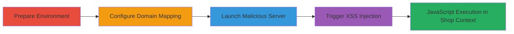

---
tags:
  - xss
  - postmessage
  - origin-bypass
  - shopify
  - javascript-injection
type: attack_chain
tools:
  - '[[tools/ssl-server-py]]'
  - '[[tools/exploit-preview-html]]'
tactics:
  - '[[Execution]]'
  - '[[Initial Access]]'
verified: false
platforms:
  - Web
submitted: true
complexity: medium
created_at: '2024-01-01T00:00:00Z'
procedures:
  - '[[procedures/Prepare-Exploit-Files-and-Tools]]'
  - '[[procedures/Configure-Hosts-File-for-Domain-Mapping]]'
  - '[[procedures/Start-Local-SSL-Server]]'
  - '[[procedures/Trigger-XSS-via-Exploit-Page-Access]]'
step_count: 4
techniques:
  - '[[JavaScript]]'
  - '[[Drive-by Compromise]]'
updated_at: '2025-12-13T23:52:21.056Z'
description: >-
  Exploits incomplete origin validation in Shopify's preview bar postMessage
  handler to inject arbitrary JavaScript into the shop's iframe context during
  theme preview, enabling customer attacks like price manipulation or admin
  account takeover.
skill_level: intermediate
impact_level: high
id: 2737b2bd-9637-4a3e-89d1-0ae3ef6b5a4f
validated: true
mitre_tactics:
  - '[[Execution]]'
  - '[[Initial Access]]'
mitre_techniques:
  - '[[JavaScript]]'
  - '[[Drive-by Compromise]]'
---
# Shopify Preview Bar XSS via Incomplete postMessage Origin Validation

Multi-stage attack chain demonstrating exploitation of Shopify's preview bar JavaScript vulnerability, where incomplete validation of event.origin in postMessage listeners allows substring matches to bypass origin checks, leading to cross-site scripting (XSS) injection into the shop's iframe during theme previews.

## Chain Metrics Dashboard

| Metric | Value |
|--------|-------|
| Chain Status | Unverified |
| Total Steps | 4 |
| Execution Time | ~5 minutes |
| Skill Level | Intermediate |
| Complexity | Medium |
| Impact Level | High |

## Attack Flow Visualization



## Prerequisites & Requirements

### Required Tools

- [[tools/ssl-server-py]]
- [[tools/exploit-preview-html]]

### Target Environment

- Web platform with Shopify store
- Access to a browser for previewing themes
- Local machine with Python 3 for server simulation
- Administrator privileges on Linux/macOS for SSL binding

### Initial Access Requirements

- No prior credentials needed; requires ability to preview a Shopify theme (e.g., as admin or via shared preview link)
- Local network control for hosts file modification
- Target shop example: https://roolee.com with preview_theme_id=31994708068

## Detailed Attack Procedures

### Step 1: Prepare Exploit Files and Tools
procedure: [[procedures/Prepare-Exploit-Files-and-Tools]]

**Objective**: Download and set up the necessary scripts and HTML file to host the malicious postMessage exploit.

**Instructions**: Obtain the ssl_server.py script and exploit_preview.html file, placing them in the same local directory. The HTML file contains the postMessage payload with 'exit_preview' type and a javascript: URL to inject an alert script.

**Expected Output**: Files ready in working directory.

**Success Indicators**:
- ssl_server.py and exploit_preview.html present and readable
- No download errors

### Step 2: Configure Hosts File for Domain Mapping
procedure: [[procedures/Configure-Hosts-File-for-Domain-Mapping]]

**Objective**: Map a controlled malicious domain (e.g., roolee.co) to localhost to simulate a rogue subdomain that bypasses origin checks.

**Instructions**: Edit the system's hosts file to add an entry redirecting roolee.co to 127.0.0.1. On Linux/macOS: sudo nano /etc/hosts; on Windows: edit %Windir%\System32\drivers\etc\hosts as administrator. Add: 127.0.0.1 roolee.co

**Expected Output**: Domain resolves to localhost (verify with ping roolee.co).

**Success Indicators**:
- Ping to roolee.co returns 127.0.0.1
- No permission errors during edit

### Step 3: Start Local SSL Server
procedure: [[procedures/Start-Local-SSL-Server]]

**Objective**: Launch an HTTPS server on port 443 to host the exploit page, mimicking a secure malicious domain.

**Instructions**: Execute the [[commands/python3-ssl-server]] command in the directory containing the files. Run with sudo on Linux/macOS for port 443 binding.

```bash
sudo python3 ssl_server.py
```

**Expected Output**: Server logs indicating HTTPS listening on port 443, serving files like exploit_preview.html.

**Success Indicators**:
- Server starts without errors
- https://roolee.co/exploit_preview.html is accessible (accept self-signed cert)

### Step 4: Trigger XSS via Exploit Page Access
procedure: [[procedures/Trigger-XSS-via-Exploit-Page-Access]]

**Objective**: Load the exploit page in a browser while previewing the target Shopify theme, sending a postMessage that bypasses origin validation and injects JavaScript into the shop's iframe.

**Instructions**: Open https://roolee.co/exploit_preview.html in the browser, accept the invalid SSL certificate. The page frames the target shop (e.g., https://roolee.com/?preview_theme_id=31994708068), triggering postMessage with 'exit_preview' and javascript:alert('Hi, script running on roolee.com here!');

**Expected Output**: Alert box appears in the shop's context, confirming JS injection.

**Success Indicators**:
- Alert 'Hi, script running on roolee.com here!' displays
- No browser errors; iframe loads and executes payload

## Attack Chain Summary

### Key Achievements

1. Bypassed postMessage origin check using substring match on 'roolee.co' against 'roolee.com' due to missing trailing slash.
2. Injected arbitrary JavaScript into Shopify preview iframe, demonstrating potential for price manipulation or admin session abuse.
3. Simulated real-world attack with local HTTPS hosting and domain spoofing.

## Technique & Tactic Coverage

### MITRE ATT&CK Techniques

- [[JavaScript]]
- [[Drive-by Compromise]]

### MITRE ATT&CK Tactics

- [[Execution]]
- [[Initial Access]]

---
*Last updated: 2024-01-01T00:00:00Z*
