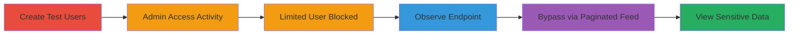

# Shopify Privilege Escalation via Activity Feed Endpoint Bypass

Multi-stage attack chain demonstrating improper access control in Shopify's admin panel, where users with limited 'Overviews' permissions can bypass restrictions to access the full Activity Feed, normally restricted to 'Home' permission holders. This leads to privilege escalation and unauthorized disclosure of sensitive shop events.

## Chain Metrics Dashboard

| Metric | Value |
|--------|-------|
| Chain Status | Unverified |
| Total Steps | 5 |
| Execution Time | ~10 minutes |
| Skill Level | Intermediate |
| Complexity | Medium |
| Impact Level | High |

## Attack Flow Visualization

## Prerequisites & Requirements

### Required Tools

- Web browser (e.g., Chrome)
- Access to a Shopify test shop

### Target Environment

- Shopify admin panel
- Authenticated sessions

### Initial Access Requirements

- Shopify account owner credentials
- Ability to create limited access users

## Detailed Attack Procedures

### Step 1: Create Test Users
procedure: [[procedures/Create-Test-Users-in-Shopify]]

**Objective**: Set up admin and limited users to test permissions.

**Instructions**: Log in as shop owner and create users with specific roles.

**Expected Output**: Two users created: full admin (X) and limited (Y with Overviews only).

**Success Indicators**:
- User X has full permissions
- User Y restricted to Sales Channels Overviews

### Step 2: Access Activity Feed as Admin
procedure: [[procedures/Access-Activity-Feed-as-Admin]]

**Objective**: Verify normal admin access to activity feed.

**Instructions**: Log in as User X and navigate to the activity page.

**Expected Output**: Full activity feed visible at /admin/activity.

**Success Indicators**:
- Activities load without errors
- Pagination options available

### Step 3: Attempt Access as Limited User
procedure: [[procedures/Attempt-Access-as-Limited-User]]

**Objective**: Confirm limited user is blocked from main activity page.

**Instructions**: Log in as User Y and try to access /admin/activity.

**Expected Output**: Access denied due to insufficient permissions.

**Success Indicators**:
- Error message or redirect for insufficient perms

### Step 4: Observe Paginated Endpoint
procedure: [[procedures/Observe-Paginated-Endpoint]]

**Objective**: Identify the backend endpoint used for loading more activities.

**Instructions**: As admin, interact with pagination to capture the endpoint URL.

**Expected Output**: Endpoint /admin/dashboard/activity_feed with parameters noted.

**Success Indicators**:
- Endpoint URL and params (activity_pages, activity_filter) identified

### Step 5: Bypass Access via Paginated Endpoint
procedure: [[procedures/Bypass-Access-via-Paginated-Endpoint]]

**Objective**: Exploit the endpoint to gain unauthorized access as limited user.

**Instructions**: As User Y, directly access the paginated endpoint.

**Expected Output**: Full activity feed data returned, disclosing sensitive events.

**Success Indicators**:
- Limited user views all shop activities
- No permission checks enforced

## Attack Chain Summary

### Key Achievements

1. Demonstrated permission bypass in Shopify admin
2. Achieved privilege escalation for limited users
3. Exposed sensitive shop owner activities

## Technique & Tactic Coverage

### MITRE ATT&CK Techniques

- [[Exploitation for Privilege Escalation]] Exploitation for Privilege Escalation
- [[Valid Accounts]] Valid Accounts

### MITRE ATT&CK Tactics

- [[Privilege Escalation]] Privilege Escalation
- [[Collection]] Collection

---
*Last updated: 2023-10-01T00:00:00Z*
