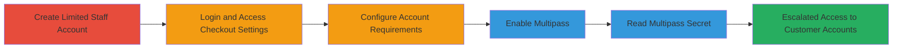

---
tags:
  - privilege-escalation
  - shopify
  - multipass
  - access-control
  - cloud
type: attack_chain
tools: []
tactics:
  - '[[Privilege Escalation]]'
verified: false
platforms:
  - Web
submitted: true
complexity: low
procedures:
  - '[[procedures/Create-Limited-Staff-Account-in-Shopify]]'
  - '[[procedures/Access-Checkout-Settings-as-Staff]]'
  - '[[procedures/Configure-Account-Requirements-in-Checkout]]'
  - '[[procedures/Enable-Multipass-Feature]]'
  - '[[procedures/Extract-Multipass-Secret]]'
step_count: 5
techniques:
  - '[[Exploitation for Privilege Escalation]]'
  - '[[Cloud Instance Metadata API]]'
description: >-
  Privilege escalation in Shopify admin allowing staff with 'Settings'
  permission to access the Multipass secret, enabling unauthorized customer
  account access.
skill_level: intermediate
impact_level: high
id: 7c14c8d3-f1e7-4829-95e5-db4619d0582f
created_at: '2025-12-14T17:29:57.131Z'
updated_at: '2025-12-14T17:29:57.131Z'
validated: true
mitre_tactics:
  - '[[Privilege Escalation]]'
mitre_techniques:
  - '[[Exploitation for Privilege Escalation]]'
  - '[[Cloud Instance Metadata API]]'
---
# Shopify Privilege Escalation via Multipass Secret Access

Multi-stage attack chain demonstrating privilege escalation in Shopify's admin panel, where a staff member with limited 'Settings' permission can access the sensitive Multipass secret, allowing unauthorized login to customer accounts across the store.

## Chain Metrics Dashboard

| Metric | Value |
|--------|-------|
| Chain Status | Unverified |
| Total Steps | 5 |
| Execution Time | ~5 minutes |
| Skill Level | Intermediate |
| Complexity | Low |
| Impact Level | High |

## Attack Flow Visualization

## Prerequisites & Requirements

### Required Tools

- None (manual web interface actions)

### Target Environment

- Shopify Plus platform
- Admin panel access
- No specific ports required (HTTPS web access)

### Initial Access Requirements

- Valid Shopify Plus owner credentials for staff creation
- Network access to the Shopify admin URL (e.g., https://your-shop.myshopify.com/admin)
- No prior elevated access needed beyond owner privileges for setup

## Detailed Attack Procedures

### Step 1: Create Limited Staff Account
procedure: [[procedures/Create-Limited-Staff-Account-in-Shopify]]

**Objective**: Establish a test staff account with minimal 'Settings' permission to simulate limited access.

**Instructions**: As a Shopify Plus owner, navigate to the admin settings and create a new staff member. Configure permissions to include only 'Settings' access, excluding 'Customers' or other elevated roles.

**Expected Output**: Confirmation of staff account creation with a sent email for password setup.

**Success Indicators**:
- Staff account listed in admin with 'Settings' permission only
- Invitation email received

### Step 2: Login and Access Checkout Settings
procedure: [[procedures/Access-Checkout-Settings-as-Staff]]

**Objective**: Authenticate as the limited staff member and reach the checkout configuration area.

**Instructions**: Follow the email link to set a password, then log in to the store admin. Navigate directly to the checkout settings page.

**Expected Output**: Successful login and display of the checkout settings interface.

**Success Indicators**:
- Admin dashboard accessible with limited menu options
- Checkout settings page loads without errors

### Step 3: Configure Account Requirements
procedure: [[procedures/Configure-Account-Requirements-in-Checkout]]

**Objective**: Adjust checkout options to prepare for Multipass activation.

**Instructions**: In the checkout settings, locate the customer accounts section and select the option requiring or allowing accounts optionally.

**Expected Output**: Updated checkout configuration reflecting the account requirement change.

**Success Indicators**:
- Option selected and saved
- No permission errors encountered

### Step 4: Enable Multipass Feature
procedure: [[procedures/Enable-Multipass-Feature]]

**Objective**: Activate the Multipass functionality, which exposes the secret key.

**Instructions**: Within the checkout settings, toggle the Multipass feature to enabled status as per the interface options.

**Expected Output**: Multipass enabled with the secret key becoming visible.

**Success Indicators**:
- Toggle switched on
- Feature activation confirmed in settings

### Step 5: Extract Multipass Secret
procedure: [[procedures/Extract-Multipass-Secret]]

**Objective**: Retrieve the sensitive Multipass secret for potential customer account impersonation.

**Instructions**: Once enabled, view and copy the generated Multipass secret from the settings page.

**Expected Output**: Alphanumeric secret key displayed and copied.

**Success Indicators**:
- Secret key visible without additional permissions
- Key usable for generating Multipass tokens (per Shopify docs)

## Attack Chain Summary

### Key Achievements

1. Created a low-privilege staff account
2. Navigated to sensitive settings without 'Customers' permission
3. Enabled Multipass and accessed its secret
4. Achieved escalation to full customer data access potential

## Technique & Tactic Coverage

### MITRE ATT&CK Techniques

- [[Exploitation for Privilege Escalation]] Exploitation for Privilege Escalation
- [[Cloud Instance Metadata API]] Unsecured Credentials: Cloud Services

### MITRE ATT&CK Tactics

- [[Privilege Escalation]] Privilege Escalation

---
*Last updated: 2023-10-01*
