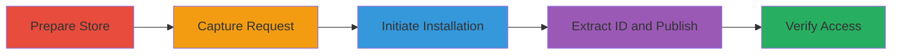

# Shopify Race Condition to Publish Paid Themes Without Purchase

Multi-stage attack chain demonstrating exploitation of a race condition in Shopify's theme installation process to gain unauthorized access to paid themes.

## Chain Metrics Dashboard

| Metric | Value |
|--------|-------|
| Chain Status | Unverified |
| Total Steps | 7 |
| Execution Time | ~5 minutes |
| Skill Level | Intermediate |
| Complexity | Medium |
| Impact Level | High |

## Attack Flow Visualization

## Prerequisites & Requirements

### Required Tools

- [[tools/Google-Chrome]]
- [[tools/Google-Chrome-Developer-Tools]]

### Target Environment

- Shopify merchant admin panel
- Access to themes.shopify.com
- Authenticated Shopify store account

### Initial Access Requirements

- Valid Shopify store credentials
- Browser with developer tools enabled
- No special network access beyond internet

## Detailed Attack Procedures

### Step 1: Prepare Store with Free Theme

procedure: [[procedures/Prepare-Shopify-Store-with-Free-Theme]]

**Objective**: Set up the store with a default published theme to enable theme switching and monitoring.

**Instructions**: Ensure a default theme is installed and published, then install and publish a free theme from the library.

**Expected Output**: Free theme visible and set as published in admin/themes.

**Success Indicators**:
- Default theme confirmed published
- Free theme installed and active

### Step 2: Capture Theme Publish Request

procedure: [[procedures/Capture-Theme-Publish-Request]]

**Objective**: Intercept the GraphQL mutation used for publishing themes to reuse it later.

**Instructions**: Use developer tools to copy the ThemePublishLegacy XHR request as fetch code while publishing the free theme.

**Expected Output**: Fetch code snippet pasted into console for modification.

**Success Indicators**:
- ThemePublishLegacy request captured
- Fetch code available in console

### Step 3: Initiate Paid Theme Installation

procedure: [[procedures/Initiate-Paid-Theme-Installation]]

**Objective**: Start the trial installation of a paid theme to generate a temporary ID during the race window.

**Instructions**: Navigate to a paid theme on themes.shopify.com and click 'Try theme' to begin installation, then switch to admin and refresh to monitor spinner.

**Expected Output**: Installation spinner visible in admin/themes.

**Success Indicators**:
- Paid theme installation started
- Spinner animation observed

### Step 4: Extract Temporary Theme ID and Publish

procedure: [[procedures/Extract-and-Publish-Temporary-Theme-ID]]

**Objective**: Identify the temporary theme ID from GraphQL response and execute the publish mutation before installation completes.

**Instructions**: Filter for ThemesProcessingLegacy request in dev tools, extract ID from response, update and run the saved fetch command with the ID.

**Expected Output**: GraphQL response confirming theme publish without errors.

**Success Indicators**:
- Theme ID extracted (format: gid://shopify/OnlineStoreTheme/[ID])
- Publish mutation succeeds

### Step 5: Verify Unauthorized Access

procedure: [[procedures/Verify-Unauthorized-Paid-Theme-Access]]

**Objective**: Confirm the paid theme is now published and accessible without purchase or trial restrictions.

**Instructions**: Wait for installation to finish, refresh admin/themes, and check for edit/download options without badges.

**Expected Output**: Paid theme listed as published, files editable/downloadable.

**Success Indicators**:
- No trial badge on theme
- Unauthorized editing and downloading possible

## Attack Chain Summary

### Key Achievements

1. Bypassed payment for paid themes via race condition
2. Gained full access to theme files for potential theft
3. Demonstrated improper access control in GraphQL endpoint

## Technique & Tactic Coverage

### MITRE ATT&CK Techniques

- [[Exploit Public-Facing Application]]

### MITRE ATT&CK Tactics

- [[Defense Evasion]]

---

*Last updated: 2024-10-01T00:00:00Z*
