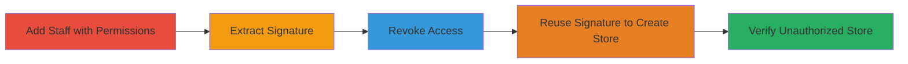

# Shopify Removed Staff Authorization Bypass for Development Store Creation

Multi-stage attack chain demonstrating improper authorization in Shopify Partners, where removed staff can reuse a persistent signature to create development stores linked to the organization.

## Chain Metrics Dashboard

| Metric | Value |
|--------|-------|
| Chain Status | Unverified |
| Total Steps | 5 |
| Execution Time | ~10 minutes |
| Skill Level | Intermediate |
| Complexity | Medium |
| Impact Level | High |

## Attack Flow Visualization



## Prerequisites & Requirements

### Required Tools

- Browser with developer tools (e.g., Chrome DevTools)

### Target Environment

- Shopify Partners dashboard (partners.shopify.com)
- Access to organization owner account
- Valid organization ID (e.g., 641767)

### Initial Access Requirements

- Owner credentials for Shopify organization
- Ability to create and manage staff accounts
- Network access to Shopify services

## Detailed Attack Procedures

### Step 1: Add Staff Member with Manage Shops Permission
procedure: [[procedures/Add-Staff-Member-with-Manage-Shops-Permission]]

**Objective**: Grant a new staff member the 'Manage Shops' permission to access the signature during an authorized session.

**Instructions**: Log in as the organization owner and navigate to the staff management section to create and assign permissions.

**Expected Output**: New staff member added with 'Manage Shops' permission.

**Success Indicators**:
- Staff member appears in the organization settings
- Permission 'Manage Shops' is assigned

### Step 2: Extract Affiliate Shop Signature
procedure: [[procedures/Extract-Affiliate-Shop-Signature]]

**Objective**: Obtain the persistent extra[affiliate_shop] signature from an authorized session.

**Instructions**: Log in as the new staff member, navigate to the development stores creation page, and inspect the page source to extract the signature value.

**Expected Output**: Signature value copied from the HTML source.

**Success Indicators**:
- Signature parameter found in page source
- Value is a non-expiring token shared across staff

### Step 3: Revoke Staff Access to Organization
procedure: [[procedures/Revoke-Staff-Access-to-Organization]]

**Objective**: Remove the staff member's access to simulate revocation while retaining the signature.

**Instructions**: As the owner, go to organization settings and revoke the staff member's access.

**Expected Output**: Staff member removed from the organization.

**Success Indicators**:
- Staff member no longer listed in active members
- Access to partners dashboard denied for the staff account

### Step 4: Create Development Store with Extracted Signature
procedure: [[procedures/Create-Development-Store-with-Extracted-Signature]]

**Objective**: Use the extracted signature in a POST request to create a store despite revoked access.

**Instructions**: Submit a POST request to the signup endpoint using the signature, even after revocation. Use [[commands/shopify-signup-post]] for the request:

```bash
curl -X POST https://app.shopify.com/services/signup/setup \
  -d "signup[shop_name]=testdevstore" \
  -d "signup[email]=test@example.com" \
  -d "signup[password]=password123" \
  -d "signup_types=affiliate_shop" \
  -d "signup_source=development+shop" \
  -d "extra[affiliate_shop]=extracted_signature_here" \
  -d "address[first_name]=Test" \
  -d "address[last_name]=User" \
  -d "address[address1]=123 Test St" \
  -d "address[city]=Test City" \
  -d "address[zip]=12345" \
  -d "address[country]=US"
```

**Expected Output**: HTTP 200 or redirect indicating successful store creation.

**Success Indicators**:
- No authorization error in response
- Store creation confirmed

### Step 5: Verify Unauthorized Store in Organization Dashboard
procedure: [[procedures/Verify-Unauthorized-Store-in-Organization-Dashboard]]

**Objective**: Confirm the new store is linked to the organization despite the staff revocation.

**Instructions**: As the owner, navigate to the development stores list and check for the new store.

**Expected Output**: New store visible in the organization's development stores.

**Success Indicators**:
- Unauthorized store appears in partners dashboard
- Store associated with organization ID

## Attack Chain Summary

### Key Achievements

1. Successful extraction of persistent signature
2. Creation of development store post-revocation
3. Visibility of unauthorized resource in dashboard, enabling potential abuse

## Technique & Tactic Coverage

### MITRE ATT&CK Techniques

- [[Valid Accounts]] Valid Accounts
- [[Exploit Public-Facing Application]] Exploit Public-Facing Application

### MITRE ATT&CK Tactics

- [[Initial Access]] Initial Access

---
*Last updated: 2023-10-01T00:00:00Z*
