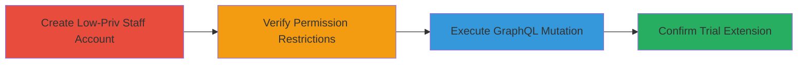

# Shopify Trial Period Extension via Unauthorized Staff Access Control Bypass

Multi-stage attack chain demonstrating exploitation of improper access controls in Shopify's admin panel, allowing staff with only 'report' permissions to extend the 14-day trial by another 14 days using the TrialSelfExtend GraphQL mutation without admin privileges.

## Chain Metrics Dashboard

| Metric | Value |
|--------|-------|
| Chain Status | Unverified |
| Total Steps | 4 |
| Execution Time | ~10 minutes |
| Skill Level | Intermediate |
| Complexity | Medium |
| Impact Level | High |

## Attack Flow Visualization



## Prerequisites & Requirements

### Required Tools

- Web browser for admin panel access
- Tools for sending HTTP requests (e.g., curl or Postman)

### Target Environment

- Shopify admin panel
- Active Shopify store on trial period
- Access to create staff accounts (requires initial admin access)

### Initial Access Requirements

- Admin credentials to create staff account
- Network access to Shopify domain (e.g., store.myshopify.com)
- Staff session cookies and CSRF token for mutation execution

## Detailed Attack Procedures

### Step 1: Create Low-Privilege Staff Account
procedure: [[procedures/Create-Low-Privilege-Staff-Account]]

**Objective**: Establish a staff account with minimal 'report' permissions to test unauthorized access to trial extension features.

**Instructions**: Log in to the Shopify admin panel as an admin and navigate to staff management to create a new user with only 'report' permissions. Assign no billing, subscription, or admin privileges.

**Expected Output**: Confirmation of staff account creation with email and limited permissions.

**Success Indicators**:
- Staff account listed in admin panel with 'report' permission only
- Login successful for new staff user

### Step 2: Verify Permission Restrictions
procedure: [[procedures/Verify-Staff-Permissions-Restrictions]]

**Objective**: Confirm the staff account cannot access subscription or billing features, establishing baseline restrictions before exploitation.

**Instructions**: Log in as the staff user and attempt to navigate to subscription/plan sections in the admin panel. Observe access denial messages.

**Expected Output**: Error messages or redirects denying access to restricted areas like billing settings.

**Success Indicators**:
- Access denied to subscription management
- No visibility into trial or plan details

### Step 3: Execute GraphQL Mutation
procedure: [[procedures/Execute-TrialSelfExtend-GraphQL-Mutation]]

**Objective**: Use the staff session to send the TrialSelfExtend mutation, bypassing expected permission checks.

**Instructions**: Capture the staff's session cookies and CSRF token. Send a POST request to the GraphQL endpoint using [[commands/trial-self-extend-graphql]] with the mutation payload.

```bash
curl -X POST https://store.myshopify.com/admin/internal/web/graphql/core \
  -H "Content-Type: application/json" \
  -H "X-CSRF-Token: <csrf_token>" \
  -H "Cookie: <staff_session_cookies>" \
  -d '{"operationName":"TrialSelfExtend","variables":{},"query":"mutation TrialSelfExtend { trialSelfExtend { message userErrors { field message __typename } __typename } }"}'
```

**Expected Output**: JSON response with success message like {"data":{"trialSelfExtend":{"message":"14 days extension added to your trial period"}}}.

**Success Indicators**:
- No authorization error in response
- Mutation executes without admin privileges

### Step 4: Confirm Trial Extension
procedure: [[procedures/Confirm-Trial-Extension-Success]]

**Objective**: Validate the trial period has been extended by 14 days, confirming the bypass impact.

**Instructions**: Log in as admin or staff and check the store's subscription status or trial end date in the admin panel.

**Expected Output**: Updated trial status showing extended end date (e.g., original +14 days).

**Success Indicators**:
- Trial period prolonged without payment
- No billing prompts triggered

## Attack Chain Summary

### Key Achievements

1. Created minimal-privilege staff account without subscription access
2. Bypassed authorization on GraphQL mutation for trial extension
3. Extended free trial access, enabling prolonged unpaid usage of Shopify services
4. Demonstrated improper access control in admin panel

## Technique & Tactic Coverage

### MITRE ATT&CK Techniques

- [[Valid Accounts]] Valid Accounts
- [[Account Manipulation]] Account Manipulation

### MITRE ATT&CK Tactics

- [[Persistence]] Persistence
- [[Lateral Movement]] Lateral Movement

---
*Last updated: 2023-10-01T00:00:00Z*
