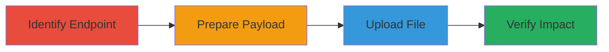

---
tags:
  - authentication-bypass
  - file-upload
  - shopify
  - xss
  - web-vulnerability
type: attack_chain
tools: []
tactics:
  - '[[Initial Access]]'
verified: false
platforms:
  - Web
submitted: true
complexity: medium
created_at: '2023-10-01T00:00:00Z'
procedures:
  - '[[procedures/Identify-Vulnerable-Endpoint-for-Transaction-Signing]]'
  - '[[procedures/Prepare-Payload-for-Signature-File-Upload]]'
  - '[[procedures/Upload-Signature-File-Using-Low-Privilege-User]]'
  - '[[procedures/Verify-Signature-in-Order-or-Transaction-View]]'
step_count: 4
techniques:
  - '[[Exploit Public-Facing Application]]'
  - '[[Valid Accounts]]'
updated_at: '2025-12-14T17:29:20.359Z'
description: >-
  An attack chain exploiting improper authentication in Shopify's secure files
  endpoint to upload malicious signature files to transactions, enabling
  unauthorized order data manipulation.
skill_level: intermediate
impact_level: high
id: 60dbfea8-c360-4a8f-b5eb-5b3c42910bb4
validated: true
mitre_tactics:
  - '[[Initial Access]]'
mitre_techniques:
  - '[[Exploit Public-Facing Application]]'
  - '[[Valid Accounts]]'
---
# Shopify Unauthorized Transaction Signature Upload via Authentication Bypass

Multi-stage attack chain demonstrating exploitation of improper authentication in Shopify's `/admin/secure_files.json` endpoint to upload malicious SVG signature files containing JavaScript, allowing unauthorized association with transactions and potential order data manipulation.

## Chain Metrics Dashboard

| Metric | Value |
|--------|-------|
| Chain Status | Unverified |
| Total Steps | 4 |
| Execution Time | ~5 minutes |
| Skill Level | Intermediate |
| Complexity | Medium |
| Impact Level | High |

## Attack Flow Visualization

## Prerequisites & Requirements

### Required Tools

- None (uses standard HTTP client like curl)

### Target Environment

- Shopify admin interface (web platform)
- Access to a low-privilege user account without transaction or order permissions
- Known transaction ID from a target order

### Initial Access Requirements

- Valid low-privilege Shopify account credentials
- Network access to the Shopify admin API endpoints
- No prior high-privilege access needed

## Detailed Attack Procedures

### Step 1: Identify Vulnerable Endpoint
procedure: [[procedures/Identify-Vulnerable-Endpoint-for-Transaction-Signing]]

**Objective**: Locate the `/admin/secure_files.json` endpoint responsible for handling secure file uploads without proper permission checks.

**Instructions**: Review Shopify's API documentation or use browser developer tools to inspect network requests related to transaction signing features. Test the endpoint manually to confirm lack of authentication enforcement for file uploads.

**Expected Output**: Confirmation that the endpoint accepts requests without requiring transaction or order permissions.

**Success Indicators**:
- Endpoint identified and documented
- Initial test request returns without authentication errors

### Step 2: Prepare Payload
procedure: [[procedures/Prepare-Payload-for-Signature-File-Upload]]

**Objective**: Create a malicious JSON payload containing a base64-encoded SVG file with embedded JavaScript, targeted to a specific transaction ID.

**Instructions**: Generate an SVG file with JavaScript (e.g., alert(document.domain) for proof-of-concept), encode it to base64, and structure the JSON payload with fields for filetype ('svg'), content, type ('signatures'), and order_transaction_id.

**Expected Output**: Valid JSON payload ready for submission.

**Success Indicators**:
- Payload JSON validates without syntax errors
- Base64 content decodes to the intended SVG with JS

### Step 3: Upload Signature File
procedure: [[procedures/Upload-Signature-File-Using-Low-Privilege-User]]

**Objective**: Send the prepared payload to the vulnerable endpoint using a low-privilege account to upload the signature file.

**Instructions**: Authenticate as a low-privilege user and issue a POST request to `/admin/secure_files.json` with the JSON payload. Use tools like curl to simulate the request.

**Expected Output**: HTTP 200 response with a URL to the uploaded file on Shopify's S3 bucket, including AWS access keys, expiration, and signature.

**Success Indicators**:
- File upload succeeds without permission denial
- S3 URL returned and accessible temporarily

### Step 4: Verify Impact
procedure: [[procedures/Verify-Signature-in-Order-or-Transaction-View]]

**Objective**: Confirm the uploaded malicious signature appears in the order or transaction views, demonstrating unauthorized data manipulation.

**Instructions**: Access the target order page in the Shopify admin or query the `/admin/orders/_order_id_/transaction.json` endpoint to check for the new signature file.

**Expected Output**: The signature file (SVG with JS) is listed and potentially executable when viewed (e.g., JS alert triggers).

**Success Indicators**:
- Signature visible in order/transaction details
- JS payload executes on view (client-side confirmation)

## Attack Chain Summary

### Key Achievements

1. Bypassed authentication to upload files to protected transactions
2. Associated malicious SVG (with XSS) to order data
3. Demonstrated potential for unauthorized order modifications visible to users

## Technique & Tactic Coverage

### MITRE ATT&CK Techniques

- [[Exploit Public-Facing Application]]
- [[Valid Accounts]]

### MITRE ATT&CK Tactics

- [[Initial Access]]

---
*Last updated: 2023-10-01T00:00:00Z*
