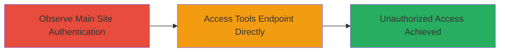

# Shopify Upcoming Tools Authentication Bypass

Multi-stage attack chain demonstrating a complete attack workflow for exploiting an authentication bypass on Shopify's upcoming tools endpoint.

## Chain Metrics Dashboard

| Metric | Value |
|--------|-------|
| Chain Status | Unverified |
| Total Steps | 2 |
| Execution Time | ~1 minutes |
| Skill Level | Beginner |
| Complexity | Low |
| Impact Level | Medium |

## Attack Flow Visualization

## Prerequisites & Requirements

### Required Tools

- Web browser (e.g., Chrome, Firefox)

### Target Environment

- Web platform
- Access to public internet
- No special services or ports required beyond HTTP/HTTPS

### Initial Access Requirements

- No credentials required
- Direct network access to https://upcoming.shopify.com/
- No prior access needed

## Detailed Attack Procedures

### Step 1: Observe Main Site Authentication
procedure: [[procedures/Access-Main-Site-and-Observe-Authentication]]

**Objective**: Verify that the main site enforces HTTP Basic Authentication to establish a baseline for comparison.

**Instructions**: Open a web browser and navigate to the main site URL. Observe the authentication prompt to confirm enforcement.

**Expected Output**: Browser displays an HTTP Basic Authentication dialog prompting for username and password.

**Success Indicators**:
- Authentication prompt appears
- Site does not load without credentials

### Step 2: Bypass Authentication via Tools Endpoint
procedure: [[procedures/Bypass-Authentication-via-Tools-Endpoint]]

**Objective**: Directly access the /tools endpoint to bypass authentication and gain unauthorized entry to the tools application.

**Instructions**: In the same web browser, navigate directly to the tools endpoint URL. Explore sub-endpoints to confirm unrestricted access.

**Expected Output**: Page loads without any authentication prompt, allowing navigation to internal tools and potential account registration features.

**Success Indicators**:
- No authentication required
- Full access to tools interface and sub-paths
- Ability to interact with non-sensitive testing features

## Attack Chain Summary

### Key Achievements

1. Confirmed authentication enforcement on main site
2. Bypassed auth to access testing tools application
3. Demonstrated potential for unauthorized registrations, though no sensitive data exposed

## Technique & Tactic Coverage

### MITRE ATT&CK Techniques

- [[Valid Accounts]]
- [[Exploit Public-Facing Application]]

### MITRE ATT&CK Tactics

- [[Initial Access]]

---
*Last updated: 2023-10-01T00:00:00Z*
