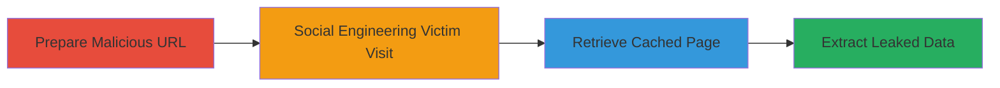

# Shopify Web Cache Deception to Leak Authenticated User Personal Information and CSRF Tokens

Multi-stage attack chain demonstrating a complete Web Cache Deception (WCD) workflow on Shopify's help subdomain, tricking Cloudflare CDN into caching dynamic 404 pages with authenticated user data as static CSS files, enabling unauthenticated retrieval of sensitive information like names, emails, profile pictures, and CSRF tokens through social engineering.

## Chain Metrics Dashboard

| Metric | Value |
|--------|-------|
| Chain Status | Unverified |
| Total Steps | 4 |
| Execution Time | ~5 minutes |
| Skill Level | Intermediate |
| Complexity | Medium |
| Impact Level | High |

## Attack Flow Visualization



## Prerequisites & Requirements

### Required Tools

- [[tools/curl]]

### Target Environment

- Web platform
- Services: Cloudflare CDN proxying Shopify help subdomain (help.shopify.com)
- No specific ports required; standard HTTPS (443)
- Network access: Public internet access to Shopify domains

### Initial Access Requirements

- No prior credentials needed for attacker
- Victim must be authenticated to Shopify
- Social engineering capability to trick victim into visiting URL (e.g., via email or chat)

## Detailed Attack Procedures

### Step 1: Prepare Malicious URL
procedure: [[procedures/Prepare-Malicious-URL-for-Web-Cache-Deception]]

**Objective**: Generate a random path with .css extension to confuse the cache into treating a dynamic 404 page as a static resource.

**Instructions**: Use a random string generator to create a unique path, then compose the URL targeting a Shopify help page like /es/manual/your-account/copyright-and-trademark/.

**Expected Output**: A URL such as https://help.shopify.com/es/manual/your-account/copyright-and-trademark/abcdefg.css ready for distribution.

**Success Indicators**:
- URL formed with random string and .css extension
- No errors in URL syntax

### Step 2: Social Engineering Victim Visit
procedure: [[procedures/Trick-Victim-Into-Visiting-Authenticated-URL]]

**Objective**: Trick the authenticated victim into loading the URL, triggering the server to generate and cache a 404 page with embedded user data.

**Instructions**: Send the malicious URL to the victim via phishing link or direct message, ensuring they are logged into Shopify. The victim opens it in their browser, causing the 404 response to be cached by Cloudflare as CSS.

**Expected Output**: Victim's browser loads a 404 page; cache now stores the response with user info.

**Success Indicators**:
- Victim confirms visit or page loads for them
- Subsequent unauthenticated requests (tested privately) return the cached content

### Step 3: Retrieve Cached Victim Page As Unauthenticated Attacker
procedure: [[procedures/Retrieve-Cached-Victim-Page-As-Unauthenticated-Attacker]]

**Objective**: Access the cached 404 page without authentication to obtain the leaked data.

**Instructions**: After victim visit, use [[commands/curl-fetch-cached-wcd-page]] to request the URL without auth headers or cookies.

```bash
curl https://help.shopify.com/es/manual/your-account/copyright-and-trademark/abcdefg.css
```

**Expected Output**: HTML response mimicking CSS but containing the full 404 page source with embedded user data.

**Success Indicators**:
- Response returns 200 OK with HTML content (not 404)
- Source code includes victim-specific elements like name and email

### Step 4: Extract Leaked User Data From Cached Response
procedure: [[procedures/Extract-Leaked-User-Data-From-Cached-Response]]

**Objective**: Parse the retrieved HTML to obtain personal information and CSRF tokens for further exploitation.

**Instructions**: Inspect the curl output or save to file and grep for user data elements, such as JSON blobs or meta tags containing name, email, profile picture URL, and CSRF token.

**Expected Output**: Extracted data: e.g., {"name": "Victim Name", "email": "victim@example.com", "csrf_token": "abc123"}.

**Success Indicators**:
- Valid user data parsed (non-placeholder values)
- CSRF token appears functional for potential follow-on attacks like request forgery

## Attack Chain Summary

### Key Achievements

1. Successful caching of authenticated dynamic content as static via path confusion
2. Leakage of sensitive user PII and security tokens without direct auth bypass
3. Demonstration of WCD impact on CDN-proxied web apps, enabling account reconnaissance or CSRF attacks

## Technique & Tactic Coverage

### MITRE ATT&CK Techniques

- [[T1566.002]] Spearphishing: Link (social engineering to visit URL)
- [[Exploit Public-Facing Application]] Exploit Public-Facing Application (WCD vulnerability in caching proxy)

### MITRE ATT&CK Tactics

- [[Initial Access]] Initial Access (via drive-by/tricked visit)
- [[Collection]] Collection (gathering user data and tokens)

---

*Last updated: 2023-10-01T00:00:00Z*
