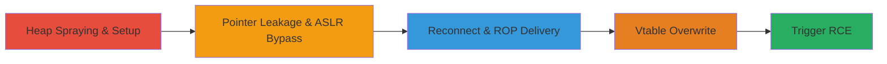

# Signedness Vulnerability in Source Engine ClassInfo Handler for CS:GO Remote Code Execution

Multi-stage attack chain exploiting a signedness issue in the CSVCMsg_ClassInfo protobuf message handler of the Source Engine, enabling remote code execution on clients like CS:GO and Dota 2. The bug allows negative class_id values to cause array index underflow, leading to out-of-bounds writes. Attackers craft malicious messages to spray the heap, leak pointers for ASLR bypass, deliver a ROP chain, overwrite a vtable pointer, and hijack execution flow, ultimately launching arbitrary code such as calc.exe. This can occur via direct server connection or Steam browser protocol exploitation.

## Chain Metrics Dashboard

| Metric | Value |
|--------|-------|
| Chain Status | Unverified |
| Total Steps | 10 |
| Execution Time | ~5-10 minutes |
| Skill Level | Advanced |
| Complexity | High |
| Impact Level | Critical |

## Attack Flow Visualization

## Prerequisites & Requirements

### Required Tools

- [[tools/CSGO-Malicious-Server-Simulator]]
- [[tools/Steam-Browser-Attack-HTML]]

### Target Environment

- Target OS/Platform: Windows (CS:GO client via Source Engine)
- Required services/ports: UDP/TCP ports for game server connection (default 27015), or Steam browser protocol
- Network access requirements: Ability to host a malicious server or deliver HTML via web

### Initial Access Requirements

- Credential requirements: None (exploits unauthenticated client connection)
- Network position: Attacker controls a malicious server; victim connects directly or via browser
- Prior access needed: Victim must run vulnerable Source Engine game (e.g., CS:GO pre-patch)

## Detailed Attack Procedures

### Step 1: Spray the Heap with Entities
procedure: [[procedures/Heap-Spraying-for-Predictable-Allocations]]

**Objective**: Allocate numerous entities to create predictable heap layout for subsequent manipulations.

**Instructions**: Using the malicious server simulator, send commands to spawn 500+ entities on the client heap.

**Expected Output**: Client allocates entities contiguously on the heap.

**Success Indicators**:
- Heap layout becomes predictable with entities side-by-side
- No client crash during allocation

### Step 2: Delete the Last 20 Entities
procedure: [[procedures/Heap-Spraying-for-Predictable-Allocations]]

**Objective**: Deallocate specific entities to leave dangling vtable pointers on the heap.

**Instructions**: Send deletion commands for the last 20 spawned entities.

**Expected Output**: Freed memory slots with residual vtable pointers.

**Success Indicators**:
- Entities removed without immediate client instability
- Heap contains exploitable pointers

### Step 3: Set a Cvar to Position a String
procedure: [[procedures/Cvar-Manipulation-for-Pointer-Positioning]]

**Objective**: Allocate a cvar string in the freed space to position a vtable pointer immediately after it.

**Instructions**: Set a console variable (cvar) to a string of calculated length to overlap with freed entity space.

**Expected Output**: Cvar string allocated adjacent to vtable pointer.

**Success Indicators**:
- Cvar set successfully
- String ends just before vtable pointer

### Step 4: Overwrite Null Terminator Using Vulnerability
procedure: [[procedures/Pointer-Leakage-via-ClassInfo-Underflow]]

**Objective**: Use the signedness bug to extend the cvar string and include the vtable pointer.

**Instructions**: Craft and send a CSVCMsg_ClassInfo protobuf message with a negative class_id to trigger underflow and write beyond array bounds, overwriting the null terminator.

**Expected Output**: Cvar string now includes the vtable pointer.

**Success Indicators**:
- Message processed without crash
- String length extended

### Step 5: Query the Cvar to Leak Pointer
procedure: [[procedures/Pointer-Leakage-via-ClassInfo-Underflow]]

**Objective**: Retrieve the extended string to leak the vtable pointer and calculate module base.

**Instructions**: Query the cvar value from the server side.

**Expected Output**: Returned string containing the leaked pointer; compute client_panorama.dll base.

**Success Indicators**:
- Pointer value obtained
- ASLR bypassed (base address calculated)

### Step 6: Queue Retry Command for Reconnection
procedure: [[procedures/ROP-Chain-Delivery-in-ShowMenu]]

**Objective**: Force client reconnection without breaking the session.

**Instructions**: Send a retry command to queue reconnection.

**Expected Output**: Client reconnects to the malicious server.

**Success Indicators**:
- Connection re-established
- No session termination

### Step 7: Deliver ROP Chain in ShowMenu Message
procedure: [[procedures/ROP-Chain-Delivery-in-ShowMenu]]

**Objective**: Store the ROP chain in a global buffer using the leaked addresses.

**Instructions**: Send a CCSUsrMsg_ShowMenu user message containing the ROP gadgets addressed relative to the leaked base.

**Expected Output**: ROP chain loaded in client_panorama.dll buffer.

**Success Indicators**:
- Message received and buffered
- Gadgets positioned correctly

### Step 8: Spray the Heap Again for Overwrite Setup
procedure: [[procedures/Heap-Spraying-for-Predictable-Allocations]]

**Objective**: Re-prepare the heap for controlled allocation during vtable overwrite.

**Instructions**: Repeat entity spraying similar to Step 1.

**Expected Output**: Predictable heap layout restored.

**Success Indicators**:
- Entities allocated contiguously
- Layout ready for overwrite

### Step 9: Overwrite Vtable Pointer Using Vulnerability
procedure: [[procedures/Vtable-Overwrite-for-Execution-Hijack]]

**Objective**: Use the underflow to overwrite an entity's vtable pointer with ROP chain address.

**Instructions**: Send another crafted CSVCMsg_ClassInfo with negative class_id to allocate after the last entity and overwrite the vtable.

**Expected Output**: Entity's vtable points to attacker-controlled ROP chain.

**Success Indicators**:
- Overwrite successful without immediate crash
- Vtable modified

### Step 10: Trigger Deallocation to Execute ROP
procedure: [[procedures/Vtable-Overwrite-for-Execution-Hijack]]

**Objective**: Cause client to deallocate entities, hijacking control flow to ROP chain.

**Instructions**: Break the connection, prompting entity deallocation.

**Expected Output**: Deallocation calls fake vtable, executes ROP, launches calc.exe.

**Success Indicators**:
- calc.exe launches on victim
- Arbitrary code executed

## Attack Chain Summary

### Key Achievements

1. Bypassed ASLR via heap-based pointer leakage using signedness underflow.
2. Delivered and positioned ROP chain for code execution.
3. Achieved full RCE on Source Engine clients remotely.

## Technique & Tactic Coverage

### MITRE ATT&CK Techniques

- [[T1203.001]] Exploitation for Client Execution
- [[Proc Memory]] Stored Application Data (cvar manipulation)
- [[DLL Search Order Hijacking]] Hijack Execution Flow: DLL Hijacking (vtable overwrite)

### MITRE ATT&CK Tactics

- [[Execution]] Execution
- [[Initial Access]] Initial Access

---
*Last updated: 2023-10-01T00:00:00Z*
