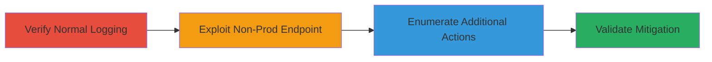

# Silent IAM Permission Enumeration via AWS SSM Non-Production Endpoints

Multi-stage attack chain demonstrating silent permission testing on AWS SSM using non-production endpoints that bypass CloudTrail logging, enabling adversaries with stolen IAM credentials to map privileges without detection.

## Chain Metrics Dashboard

| Metric | Value |
|--------|-------|
| Chain Status | Unverified |
| Total Steps | 4 |
| Execution Time | ~15-20 minutes |
| Skill Level | Intermediate |
| Complexity | Medium |
| Impact Level | High |

## Attack Flow Visualization



## Prerequisites & Requirements

### Required Tools

- [[tools/AWS-CLI]]
- [[tools/curl]]

### Target Environment

- AWS Cloud platform
- SSM service enabled
- CloudTrail configured for API logging
- IAM credentials with varying SSM permissions

### Initial Access Requirements

- Compromised IAM credentials (e.g., assumed roles like admin or noperm)
- AWS CLI configured with profiles
- Network access to AWS endpoints

## Detailed Attack Procedures

### Step 1: Verify Normal CloudTrail Logging
procedure: [[procedures/Demonstrate-Normal-CloudTrail-Logging-with-SSM-API]]

**Objective**: Establish baseline by executing an SSM API call on production endpoints to confirm standard CloudTrail logging occurs.

**Instructions**: Configure AWS CLI with a test profile, then execute [[commands/aws-ssm-describe-instance-properties-production]] to call the SSM DescribeInstanceProperties action in the us-west-2 region:

```bash
export AWS_PROFILE=admin
aws ssm describe-instance-properties --region us-west-2
```

Wait 5-10 minutes and check CloudTrail logs for the event. This generates a detectable log entry for comparison.

**Expected Output**: Successful API response with instance properties; CloudTrail log entry confirming the call.

**Success Indicators**:
- API call succeeds or fails based on permissions
- Log appears in CloudTrail event history

### Step 2: Exploit Non-Production Endpoint for Silent Call
procedure: [[procedures/Execute-SSM-API-on-Non-Production-Endpoint]]

**Objective**: Demonstrate lack of logging by calling the same SSM action on a non-production endpoint, allowing silent permission checks.

**Instructions**: Using the same profile, execute [[commands/aws-ssm-describe-instance-properties-nonprod]] with the --endpoint-url flag pointing to a non-production SSM endpoint (redacted as ██████):

```bash
aws ssm describe-instance-properties --region us-west-2 --endpoint-url ██████
```

Wait 5-10 minutes and verify no CloudTrail log. The response will indicate permissions (success or AccessDeniedException) without detection.

**Expected Output**: API response varying by privileges; no CloudTrail log entry.

**Success Indicators**:
- Response shows permission status
- Absence of log in CloudTrail confirms evasion

### Step 3: Enumerate Additional SSM Actions Silently
procedure: [[procedures/Test-Additional-SSM-Actions-for-Silent-Enumeration]]

**Objective**: Test multiple SSM actions on non-production endpoints to map broader IAM permissions without generating logs.

**Instructions**: Switch profiles as needed (e.g., admin vs. noperm) and execute commands like [[commands/aws-ssm-get-ops-summary-nonprod]] on various redacted non-production endpoints:

```bash
# Privileged test
export AWS_PROFILE=admin
aws ssm get-ops-summary --endpoint-url ███

# Unprivileged test
export AWS_PROFILE=noperm
aws ssm get-ops-summary --endpoint-url https://███
```

Compare responses: empty arrays for permitted actions, AccessDeniedException for denied. Repeat for actions like ListOpsItemEvents and ListCommands using [[commands/aws-ssm-list-ops-item-events-nonprod]] and [[commands/aws-ssm-list-commands-nonprod]]. No logs in CloudTrail.

**Expected Output**: Permission-specific responses (e.g., {"Entities": []} or AccessDeniedException); no logs.

**Success Indicators**:
- Differential responses enable permission mapping
- CloudTrail remains silent across tests

### Step 4: Validate Post-Mitigation Behavior
procedure: [[procedures/Verify-Post-Mitigation-Endpoint-Validation]]

**Objective**: Probe endpoints with curl to check if mitigations like endpoint validation prevent further enumeration.

**Instructions**: Use [[commands/curl-probe-invalid-endpoint]] to test a redacted endpoint:

```bash
curl █████
```

Then test with headers using [[commands/curl-post-with-header]]:

```bash
curl -X POST https://███ -H "████"
```

Observe exceptions: ValidationException for invalid endpoints, UnknownOperationException with headers. Compare to pre-mitigation SSM calls.

**Expected Output**: XML errors like <ValidationException><Message>400 ERROR: Invalid Endpoint</Message></ValidationException>.

**Success Indicators**:
- Exceptions confirm mitigation
- No data access or silent enumeration possible

## Attack Chain Summary

### Key Achievements

1. Confirmed normal logging baseline with production endpoints.
2. Exploited non-production endpoints for undetectable permission tests.
3. Enumerated multiple SSM actions across privilege levels.
4. Verified mitigation effectiveness via direct endpoint probing.

## Technique & Tactic Coverage

### MITRE ATT&CK Techniques

- [[T1087.004]] Cloud Account
- [[Disable or Modify Tools]] Disable or Modify Tools

### MITRE ATT&CK Tactics

- [[Discovery]] Discovery
- [[Defense Evasion]] Defense Evasion

---
*Last updated: 2023-10-01T00:00:00Z*
