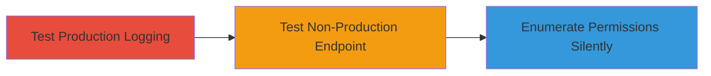

---
tags:
  - aws
  - cloudtrail
  - iam
  - logging
  - evasion
  - discovery
type: attack_chain
tools:
  - '[[tools/AWS-CLI]]'
tactics:
  - '[[Discovery]]'
  - '[[Defense Evasion]]'
verified: false
platforms:
  - AWS
submitted: true
complexity: medium
created_at: '2023-10-01T00:00:00Z'
procedures:
  - '[[procedures/Test-Production-Forecast-Endpoint-Logging]]'
  - '[[procedures/Test-Non-Production-Forecast-Endpoint-Logging]]'
  - '[[procedures/Enumerate-IAM-Permissions-Silently]]'
step_count: 3
techniques:
  - '[[Account Discovery]]'
  - '[[Impair Defenses]]'
updated_at: '2025-12-14T17:32:39.617Z'
description: >-
  Attack chain exploiting unlogged non-production API endpoints in AWS Forecast
  to silently test IAM permissions without CloudTrail detection.
skill_level: intermediate
impact_level: high
id: 967ec73e-6610-41cd-94df-566541c3bb02
validated: true
mitre_tactics:
  - '[[Discovery]]'
  - '[[Defense Evasion]]'
mitre_techniques:
  - '[[Account Discovery]]'
  - '[[Impair Defenses]]'
---
# Silent IAM Permission Enumeration via Non-Production AWS Forecast Endpoints

Multi-stage attack chain demonstrating how adversaries with compromised IAM credentials can silently enumerate permissions by exploiting unlogged non-production API endpoints in the AWS Forecast service, bypassing CloudTrail audit logging.

## Chain Metrics Dashboard

| Metric | Value |
|--------|-------|
| Chain Status | Unverified |
| Total Steps | 3 |
| Execution Time | ~15 minutes |
| Skill Level | Intermediate |
| Complexity | Medium |
| Impact Level | High |

## Attack Flow Visualization



## Prerequisites & Requirements

### Required Tools

- [[tools/AWS-CLI]]

### Target Environment

- AWS Cloud platform
- AWS Forecast service enabled
- CloudTrail configured for API logging

### Initial Access Requirements

- Compromised IAM credentials with potential access to Forecast operations
- AWS CLI configured with those credentials
- Network access to AWS endpoints

## Detailed Attack Procedures

### Step 1: Test Production Endpoint Logging
procedure: [[procedures/Test-Production-Forecast-Endpoint-Logging]]

**Objective**: Verify that standard production API calls to AWS Forecast are logged in CloudTrail, establishing a baseline for comparison.

**Instructions**: Use the AWS CLI to execute the list-datasets operation on the production endpoint in the us-west-2 region. Wait 5-10 minutes and check CloudTrail logs for the event.

Execute [[commands/aws-forecast-list-datasets-production]]:

```bash
aws forecast list-datasets --region us-west-2
```

After execution, query CloudTrail to confirm logging.

**Expected Output**: JSON list of datasets if permitted; CloudTrail event appears after 5-10 minutes showing the API call.

**Success Indicators**:
- API response received (success or AccessDenied based on permissions)
- CloudTrail log entry generated for the event

### Step 2: Test Non-Production Endpoint Logging
procedure: [[procedures/Test-Non-Production-Forecast-Endpoint-Logging]]

**Objective**: Demonstrate that non-production endpoints do not generate CloudTrail logs, allowing undetected API testing.

**Instructions**: Override the endpoint URL to a non-production one (redacted for security) and repeat the list-datasets operation. Wait 5-10 minutes or longer and check CloudTrail.

Execute [[commands/aws-forecast-list-datasets-nonprod]]:

```bash
aws forecast list-datasets --region us-west-2 --endpoint-url ███████
```

Monitor CloudTrail for absence of logs.

**Expected Output**: API response (success or failure based on IAM permissions); no CloudTrail log entry even after extended wait.

**Success Indicators**:
- API response processed normally
- No corresponding event in CloudTrail logs

### Step 3: Enumerate IAM Permissions Silently
procedure: [[procedures/Enumerate-IAM-Permissions-Silently]]

**Objective**: Use the unlogged endpoint to test multiple Forecast API operations and infer IAM permissions without detection.

**Instructions**: Iterate over various Forecast operations (e.g., create-dataset, describe-forecast) using the non-production endpoint. Analyze responses to map permissions.

For example, adapt [[commands/aws-forecast-list-datasets-nonprod]] for other operations like:

```bash
aws forecast create-dataset --region us-west-2 --endpoint-url ███████ --cli-input-json file://dataset.json
```

Compile results from successes/failures to enumerate access levels.

**Expected Output**: Permission grants/denials via API errors; zero CloudTrail events across tests.

**Success Indicators**:
- Permissions mapped without audit trail
- No alerts or logs triggered in CloudTrail

## Attack Chain Summary

### Key Achievements

1. Confirmed production logging baseline
2. Identified logging bypass via non-production endpoints
3. Enabled stealthy IAM permission discovery

## Technique & Tactic Coverage

### MITRE ATT&CK Techniques

- [[Account Discovery]]
- [[Impair Defenses]]

### MITRE ATT&CK Tactics

- [[Discovery]]
- [[Defense Evasion]]

---
*Last updated: 2023-10-01T00:00:00Z*
