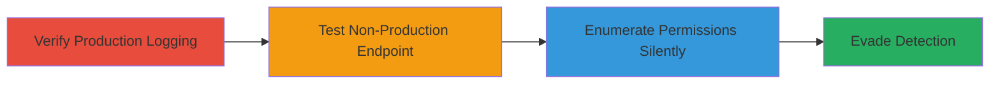

---
tags:
  - aws
  - iam
  - permission-enumeration
  - cloudtrail
  - bedrock-agent
type: attack_chain
tools:
  - '[[tools/AWS-CLI]]'
tactics:
  - '[[Discovery]]'
verified: false
platforms:
  - AWS
submitted: true
complexity: medium
created_at: '2023-10-01T00:00:00Z'
procedures:
  - '[[procedures/Verify-Production-Endpoint-Logging]]'
  - '[[procedures/Test-Non-Production-Endpoint-Silent-Calls]]'
  - '[[procedures/Enumerate-IAM-Permissions-via-Profile-Switching]]'
step_count: 3
techniques:
  - '[[Account Discovery]]'
  - '[[Valid Accounts]]'
updated_at: '2025-12-14T17:32:28.798Z'
description: >-
  Attack chain exploiting unlogged non-production AWS Bedrock-Agent API
  endpoints to silently enumerate IAM permissions without CloudTrail detection.
skill_level: intermediate
impact_level: high
id: 6b9b0d52-5bf9-49ee-b576-1231764e033d
validated: true
mitre_tactics:
  - '[[Discovery]]'
mitre_techniques:
  - '[[Account Discovery]]'
  - '[[Valid Accounts]]'
---
# Silent IAM Permission Enumeration via Non-Production Bedrock-Agent Endpoints

Multi-stage attack chain demonstrating how adversaries with compromised AWS IAM credentials can exploit non-production API endpoints for the Bedrock-Agent service to silently test and enumerate permissions, evading CloudTrail logging and detection.

## Chain Metrics Dashboard

| Metric | Value |
|--------|-------|
| Chain Status | Unverified |
| Total Steps | 3 |
| Execution Time | ~20 minutes |
| Skill Level | Intermediate |
| Complexity | Medium |
| Impact Level | High |

## Attack Flow Visualization



## Prerequisites & Requirements

### Required Tools

- [[tools/AWS-CLI]]

### Target Environment

- AWS Cloud platform
- Bedrock-Agent service enabled
- CloudTrail configured for logging production API calls
- Access to IAM profiles with varying permissions (e.g., admin and limited)

### Initial Access Requirements

- Compromised AWS IAM credentials
- AWS CLI configured with access keys
- Network access to AWS endpoints (no special ports required beyond standard HTTPS/443)

## Detailed Attack Procedures

### Step 1: Verify Production Endpoint Logging
procedure: [[procedures/Verify-Production-Endpoint-Logging]]

**Objective**: Confirm that standard production API calls to Bedrock-Agent generate CloudTrail logs, establishing a baseline for comparison.

**Instructions**: Use [[commands/aws-bedrock-agent-list-agents-production]] to execute a production API call and monitor CloudTrail.

```bash
aws bedrock-agent list-agents --region us-west-2
```

Wait 5-10 minutes and check CloudTrail for the log entry using AWS console or CLI.

**Expected Output**: JSON response listing agent summaries; CloudTrail event log appears after delay.

**Success Indicators**:
- API call succeeds or fails with logged event in CloudTrail
- Baseline logging behavior confirmed

### Step 2: Test Non-Production Endpoint Silent Calls
procedure: [[procedures/Test-Non-Production-Endpoint-Silent-Calls]]

**Objective**: Demonstrate that calls to non-production endpoints do not generate CloudTrail logs, enabling stealthy operations.

**Instructions**: Override the endpoint URL with a non-production one using [[commands/aws-bedrock-agent-list-agents-nonprod]].

```bash
aws bedrock-agent list-agents --region us-west-2 --endpoint-url [redacted]
```

Wait 5-10 minutes and verify no log in CloudTrail. Optionally test another operation like [[commands/aws-bedrock-agent-list-knowledge-bases-nonprod]].

```bash
aws bedrock-agent list-knowledge-bases --endpoint-url [redacted] --region us-west-2
```

**Expected Output**: JSON response (e.g., empty list) or error like InternalServerErrorException; no CloudTrail log.

**Success Indicators**:
- API call responds without logging
- Absence of CloudTrail event confirmed

### Step 3: Enumerate IAM Permissions via Profile Switching
procedure: [[procedures/Enumerate-IAM-Permissions-via-Profile-Switching]]

**Objective**: Silently test IAM permissions by switching profiles and observing responses on non-production endpoints.

**Instructions**: Switch to an admin profile using [[commands/export-aws-profile-admin]], then call the endpoint with [[commands/aws-bedrock-agent-list-agents-nonprod-admin]].

```bash
export AWS_PROFILE=admin
aws bedrock-agent list-agents --endpoint-url [redacted] --region us-west-2
```

Switch to a non-privileged profile with [[commands/export-aws-profile-noperm]] and repeat the call with [[commands/aws-bedrock-agent-list-agents-nonprod-noperm]].

```bash
export AWS_PROFILE=noperm
aws bedrock-agent list-agents --endpoint-url [redacted] --region us-west-2
```

Test additional endpoints like [[commands/aws-bedrock-agent-list-agents-nonprod-variant]].

**Expected Output**: Success with admin (empty JSON); AccessDeniedException with noperm; no logs.

**Success Indicators**:
- Permission success/failure inferred from responses
- No detection via CloudTrail

## Attack Chain Summary

### Key Achievements

1. Confirmed logging gap in non-production endpoints
2. Demonstrated silent API calls without detection
3. Enabled invisible IAM permission testing for credential validation

## Technique & Tactic Coverage

### MITRE ATT&CK Techniques

- [[Account Discovery]]
- [[Valid Accounts]]

### MITRE ATT&CK Tactics

- [[Discovery]]

---

*Last updated: 2023-10-01T00:00:00Z*
