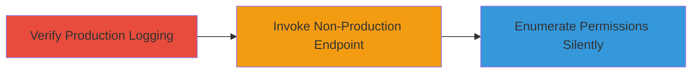

---
tags:
  - aws
  - iam
  - cloudtrail
  - permission-enumeration
  - logging-bypass
  - discovery
  - defense-evasion
type: attack_chain
tools:
  - '[[tools/AWS-CLI]]'
tactics:
  - '[[Discovery]]'
  - '[[Defense Evasion]]'
commands:
  - '[[commands/aws-docdb-elastic-list-cluster-snapshots-production]]'
  - '[[commands/aws-docdb-elastic-list-cluster-snapshots-non-production]]'
platforms:
  - AWS
  - Cloud
complexity: medium
procedures:
  - '[[procedures/Demonstrate-Production-Endpoint-Logging]]'
  - '[[procedures/Invoke-Non-Production-Endpoint]]'
  - '[[procedures/Analyze-API-Responses-for-Permission-Enumeration]]'
step_count: 3
techniques:
  - '[[T1087.004]]'
  - '[[Disable Cloud Logs]]'
description: >-
  Attack chain exploiting unlogged non-production API endpoints in AWS
  DocumentDB Elastic to silently test and enumerate IAM permissions without
  CloudTrail detection.
skill_level: intermediate
impact_level: high
id: 1bebd84e-a9a1-4351-8b2e-042649e48d35
created_at: '2025-12-14T17:32:29.160Z'
updated_at: '2025-12-14T17:32:29.160Z'
verified: false
validated: true
submitted: true
mitre_tactics:
  - '[[Discovery]]'
  - '[[Defense Evasion]]'
mitre_techniques:
  - '[[T1087.004]]'
  - '[[Disable Cloud Logs]]'
---
# Silent IAM Permission Enumeration via Non-Production DocumentDB Elastic Endpoints

## Overview

This attack chain demonstrates how adversaries with compromised IAM credentials can exploit non-production API endpoints for the AWS DocumentDB Elastic service to silently enumerate permissions. Unlike production endpoints, these non-production endpoints process API calls with standard IAM authorization but do not generate logs in CloudTrail, allowing undetected testing of various actions. The chain involves verifying normal logging on production endpoints, invoking calls on non-production ones, and analyzing responses to map permissions, enabling stealthy reconnaissance in AWS environments.

## Chain Metrics Dashboard

| Metric | Value |
|--------|-------|
| Chain Status | Unverified |
| Total Steps | 3 |
| Execution Time | ~15-20 minutes |
| Skill Level | Intermediate |
| Complexity | Medium |
| Impact Level | High |

## Attack Flow Visualization



## Prerequisites & Requirements

### Required Tools

- [[tools/AWS-CLI]]

### Target Environment

- AWS Cloud platform
- DocumentDB Elastic service enabled
- CloudTrail configured for API logging
- IAM credentials with potential access to DocumentDB Elastic actions

### Initial Access Requirements

- Compromised or test IAM credentials with AWS CLI access
- Network access to AWS endpoints (no special ports required beyond standard HTTPS/443)
- AWS CLI installed and configured with credentials

## Detailed Attack Procedures

### Step 1: Verify Production Endpoint Logging
procedure: [[procedures/Demonstrate-Production-Endpoint-Logging]]

**Objective**: Confirm that standard API calls to production endpoints are logged in CloudTrail, establishing a baseline for detection.

**Instructions**: Use the AWS CLI to execute a DocumentDB Elastic operation on the default production endpoint and monitor CloudTrail for logs.

Execute [[commands/aws-docdb-elastic-list-cluster-snapshots-production]]:

```bash
aws docdb-elastic list-cluster-snapshots
```

Wait 5-10 minutes and query CloudTrail logs (e.g., via AWS Console or CLI) to confirm the event is recorded under the docdb-elastic:ListClusterSnapshots action.

**Expected Output**: JSON response with cluster snapshot details (if permitted) or AccessDenied error; CloudTrail log entry appears showing the API call.

**Success Indicators**:
- API response received (success or failure based on permissions)
- CloudTrail log generated and visible after 5-10 minutes

### Step 2: Invoke Non-Production Endpoint
procedure: [[procedures/Invoke-Non-Production-Endpoint]]

**Objective**: Direct the same API call to a non-production endpoint to bypass CloudTrail logging while maintaining IAM authorization.

**Instructions**: Override the endpoint URL in the AWS CLI command to target the non-production endpoint and observe the lack of logging.

Execute [[commands/aws-docdb-elastic-list-cluster-snapshots-non-production]]:

```bash
aws docdb-elastic list-cluster-snapshots --endpoint-url ██████
```

Wait 5-10 minutes and check CloudTrail; no log should appear despite the response.

**Expected Output**: JSON response indicating success or failure based on IAM permissions; no corresponding CloudTrail event.

**Success Indicators**:
- API call processes normally (authorized or denied)
- No log entry in CloudTrail after waiting period

### Step 3: Enumerate Permissions Without Detection
procedure: [[procedures/Analyze-API-Responses-for-Permission-Enumeration]]

**Objective**: Systematically test multiple DocumentDB Elastic actions on the non-production endpoint to map IAM permissions stealthily.

**Instructions**: Repeat variations of the API call (e.g., list-clusters, create-cluster-snapshot) using the non-production endpoint, analyzing each response for permission grants without triggering logs.

For example, adapt the command for other actions:

```bash
aws docdb-elastic list-clusters --endpoint-url ██████
```

Document successes (e.g., full list returned) vs. failures (AccessDenied) to build a permission profile.

**Expected Output**: Responses revealing permission boundaries; persistent absence of CloudTrail logs across tests.

**Success Indicators**:
- Permission map constructed from multiple unlogged responses
- No detection via CloudTrail monitoring

## Attack Chain Summary

### Key Achievements

1. Confirmed logging gap in non-production endpoints
2. Demonstrated silent API invocation bypassing audit trails
3. Enabled undetected IAM permission reconnaissance for further exploitation

## Technique & Tactic Coverage

### MITRE ATT&CK Techniques

- [[T1087.004]]
- [[Disable Cloud Logs]]

### MITRE ATT&CK Tactics

- [[Discovery]]
- [[Defense Evasion]]

---
*Last updated: 2023-10-01*
