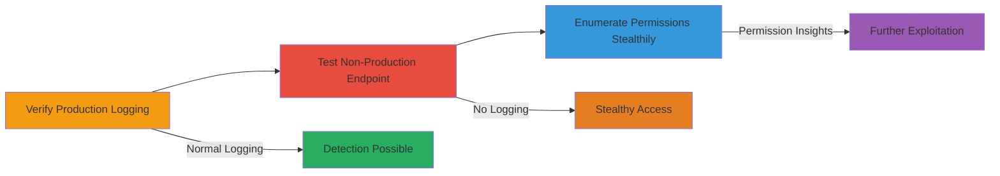

---
tags:
  - aws
  - elasticache
  - cloudtrail
  - iam
  - permission-enumeration
  - logging-bypass
  - discovery
  - defense-evasion
type: attack_chain
tools:
  - '[[tools/AWS-CLI]]'
tactics:
  - '[[Discovery]]'
  - '[[Defense Evasion]]'
verified: false
platforms:
  - AWS
submitted: true
complexity: medium
created_at: '2023-10-01T00:00:00Z'
procedures:
  - '[[procedures/Verify-Production-ElastiCache-Endpoint-Logging]]'
  - '[[procedures/Test-Non-Production-ElastiCache-Endpoint-No-Logging]]'
  - '[[procedures/Enumerate-IAM-Permissions-with-Non-Production-Endpoint]]'
step_count: 3
techniques:
  - '[[T1087.004]]'
  - '[[Disable Cloud Logs]]'
updated_at: '2025-12-14T17:32:28.940Z'
description: >-
  Attack chain exploiting a non-production AWS ElastiCache API endpoint that
  bypasses CloudTrail logging, enabling adversaries to enumerate IAM permissions
  stealthily without detection.
skill_level: intermediate
impact_level: high
id: a4fd6e32-3057-463a-bf26-0654e91041bd
validated: true
mitre_tactics:
  - '[[Discovery]]'
  - '[[Defense Evasion]]'
mitre_techniques:
  - '[[T1087.004]]'
  - '[[Disable Cloud Logs]]'
---
# Silent IAM Permission Enumeration via Non-Production ElastiCache Endpoint

Multi-stage attack chain demonstrating how adversaries with compromised IAM credentials can exploit a non-production AWS ElastiCache API endpoint to silently enumerate permissions without generating CloudTrail logs, evading detection while assessing access levels.

## Chain Metrics Dashboard

| Metric | Value |
|--------|-------|
| Chain Status | Unverified |
| Total Steps | 3 |
| Execution Time | ~15-20 minutes |
| Skill Level | Intermediate |
| Complexity | Medium |
| Impact Level | High |

## Attack Flow Visualization



## Prerequisites & Requirements

### Required Tools

- [[tools/AWS-CLI]]

### Target Environment

- AWS Cloud Platform
- ElastiCache service
- CloudTrail enabled for logging
- IAM roles/users with varying permissions

### Initial Access Requirements

- Compromised IAM credentials (user or role ARN)
- AWS CLI configured with access keys
- Network access to AWS endpoints
- Knowledge of non-production endpoint URL (redacted as ███████)

## Detailed Attack Procedures

### Step 1: Verify Production Endpoint Logging
procedure: [[procedures/Verify-Production-ElastiCache-Endpoint-Logging]]

**Objective**: Confirm that standard production ElastiCache API calls are logged in CloudTrail to establish a baseline for detection.

**Instructions**: Use the AWS CLI to execute a standard ElastiCache API call and monitor CloudTrail for the log entry.

Execute [[commands/aws-elasticache-describe-users]] to describe users:

```bash
aws elasticache describe-users
```

Wait 5-10 minutes and check CloudTrail logs for the event.

**Expected Output**: JSON response with user details; CloudTrail log entry appears showing the API call.

**Success Indicators**:
- API call succeeds or fails based on permissions
- Log entry generated in CloudTrail within 5-10 minutes

### Step 2: Test Non-Production Endpoint for No Logging
procedure: [[procedures/Test-Non-Production-ElastiCache-Endpoint-No-Logging]]

**Objective**: Demonstrate that the non-production endpoint processes API calls without logging to CloudTrail, while still enforcing IAM permissions.

**Instructions**: Repeat the production API call but override the endpoint URL to the non-production one.

Execute [[commands/aws-elasticache-describe-users-nonprod]] with the custom endpoint:

```bash
aws elasticache describe-users --endpoint-url ███████
```

Wait 5-10 minutes and verify no log in CloudTrail.

**Expected Output**: JSON response (success or AccessDenied) based on IAM; no CloudTrail log.

**Success Indicators**:
- API responds normally with permission checks
- No corresponding event in CloudTrail logs

### Step 3: Enumerate IAM Permissions with Non-Production Endpoint
procedure: [[procedures/Enumerate-IAM-Permissions-with-Non-Production-Endpoint]]

**Objective**: Use the non-logged endpoint to test permissions across different IAM profiles, revealing access levels without detection.

**Instructions**: Switch profiles and execute API calls on the non-production endpoint.

First, set the admin profile with [[commands/export-aws-profile-admin]]:

```bash
export AWS_PROFILE=admin
```

Then run [[commands/aws-elasticache-describe-cache-subnet-groups-admin]]:

```bash
aws elasticache describe-cache-subnet-groups --endpoint-url ████████
```

Switch to non-privileged profile with [[commands/export-aws-profile-noperm]]:

```bash
export AWS_PROFILE=noperm
```

Run [[commands/aws-elasticache-describe-cache-subnet-groups-noperm]]:

```bash
aws elasticache describe-cache-subnet-groups --endpoint-url ███
```

Wait and confirm no logs in CloudTrail.

**Expected Output**: Success with empty list for admin; AccessDenied for noperm; no CloudTrail logs.

**Success Indicators**:
- Permission-based responses (success/failure)
- No logs generated, enabling stealthy enumeration

## Attack Chain Summary

### Key Achievements

1. Baseline verification of production logging
2. Exploitation of non-production endpoint for log evasion
3. Silent discovery of IAM permissions across profiles

## Technique & Tactic Coverage

### MITRE ATT&CK Techniques

- [[T1087.004]] Cloud Account
- [[Disable Cloud Logs]] Disable or Modify Tools

### MITRE ATT&CK Tactics

- [[Discovery]] Discovery
- [[Defense Evasion]] Defense Evasion

---
*Last updated: 2023-10-01T00:00:00Z*
