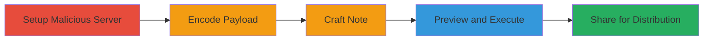

# Simplenote Electron RCE via XSS in Markdown Parser

Multi-stage attack chain demonstrating exploitation of an XSS vulnerability in the Simplenote Electron client's Markdown parser to inject malicious HTML, load external JavaScript, and achieve remote code execution (RCE) with current user privileges. The attack leverages Simplenote's sharing features for distribution to targeted users.

## Chain Metrics Dashboard

| Metric | Value |
|--------|-------|
| Chain Status | Unverified |
| Total Steps | 5 |
| Execution Time | ~2 minutes |
| Skill Level | Intermediate |
| Complexity | Medium |
| Impact Level | High |

## Attack Flow Visualization

## Prerequisites & Requirements

### Required Tools

- [[tools/JavaScript-Eval-Encoder]]
- [[tools/Process-Monitor-ProcMon]]

### Target Environment

- Simplenote Electron client on Windows or Linux
- Access to a remote web server for hosting JS
- Simplenote account for note creation and sharing

### Initial Access Requirements

- Valid Simplenote account
- Network access to host external JS
- Target users must open and preview shared note

## Detailed Attack Procedures

### Step 1: Setup Malicious Server
procedure: [[procedures/Set-Up-Malicious-JavaScript-Server]]

**Objective**: Host the external JavaScript file that will execute RCE on the victim's machine.

**Instructions**: Deploy a web server and place the malicious JS file (e.g., hackerone-electron.js) containing code to spawn processes using Electron's Node.js APIs.

**Expected Output**: Server accessible at http://yourserver.com/hackerone-electron.js.

**Success Indicators**:
- JS file loads successfully in browser
- No server errors

### Step 2: Encode Payload
procedure: [[procedures/Encode-JavaScript-Payload-for-XSS-Injection]]

**Objective**: Obfuscate the JavaScript that dynamically loads the external script to bypass basic filtering.

**Instructions**: Use the encoder to convert the payload into String.fromCharCode format for injection into the img onerror handler.

**Expected Output**: Encoded string ready for note insertion.

**Success Indicators**:
- Encoded payload decodes correctly via eval
- No syntax errors in output

### Step 3: Craft Malicious Note
procedure: [[procedures/Craft-Malicious-Markdown-Note-in-Simplenote]]

**Objective**: Create a Markdown note with injected HTML that triggers XSS on preview.

**Instructions**: In Simplenote, create a new note and paste the crafted content including the obfuscated img tag.

**Expected Output**: Note saved without errors.

**Success Indicators**:
- Note previews without immediate crashes
- HTML renders in edit mode

### Step 4: Trigger Execution
procedure: [[procedures/Trigger-XSS-by-Previewing-Note]]

**Objective**: Execute the injected JavaScript to load external script and spawn processes.

**Instructions**: Switch to preview mode in Simplenote to render Markdown and trigger onerror.

**Expected Output**: External JS loads, process spawns (e.g., netplwiz on Windows).

**Success Indicators**:
- Process launches (verify with [[tools/Process-Monitor-ProcMon]])
- No browser-like errors

### Step 5: Distribute Note
procedure: [[procedures/Distribute-Malicious-Note-via-Sharing]]

**Objective**: Share the note with targets to enable widespread RCE.

**Instructions**: Use Simplenote's tag system to share with email addresses of targets.

**Expected Output**: Targets receive and can preview the note.

**Success Indicators**:
- Share confirmation
- Targets report execution

## Attack Chain Summary

### Key Achievements

1. Exploited XSS to include external JS in Electron renderer
2. Achieved RCE spawning arbitrary processes with user privileges
3. Enabled distribution via Simplenote sharing for targeted attacks

## Technique & Tactic Coverage

### MITRE ATT&CK Techniques

- [[Exploitation for Client Execution]] Exploitation for Client Execution
- [[JavaScript]] JavaScript

### MITRE ATT&CK Tactics

- [[Initial Access]] Initial Access
- [[Execution]] Execution

---

*Last updated: 2024-01-01T00:00:00Z*
