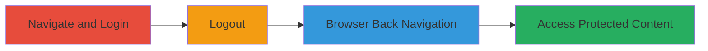

# Simplenote Information Disclosure via Incomplete Session Invalidation on Logout

Multi-stage attack chain demonstrating a complete attack workflow for exploiting a session management flaw in the Simplenote web application.

## Chain Metrics Dashboard

| Metric | Value |
|--------|-------|
| Chain Status | Unverified |
| Total Steps | 4 |
| Execution Time | ~2 minutes |
| Skill Level | Beginner |
| Complexity | Low |
| Impact Level | Medium |

## Attack Flow Visualization

## Prerequisites & Requirements

### Required Tools

- [[tools/Google-Chrome]]

### Target Environment

- Web platform
- Access to https://app.simplenote.com/
- Valid user credentials for Simplenote

### Initial Access Requirements

- Internet connectivity
- Legitimate account credentials
- No special network position required; public-facing web app

## Detailed Attack Procedures

### Step 1: Navigate to the Simplenote Application

procedure: [[procedures/Reproduce-Simplenote-Logout-Session-Flaw]]

**Objective**: Access the login page of the target application to initiate the authenticated session.

**Instructions**: Open [[tools/Google-Chrome]] and navigate to the Simplenote web application.

**Expected Output**: The login page loads at https://app.simplenote.com/.

**Success Indicators**:
- Login page is visible and functional
- No errors in page loading

### Step 2: Log In to the Application

procedure: [[procedures/Reproduce-Simplenote-Logout-Session-Flaw]]

**Objective**: Authenticate to establish an active session with access to protected notes.

**Instructions**: Enter valid credentials (username and password) on the login form and submit to gain access to the dashboard.

**Expected Output**: User is redirected to the authenticated dashboard where notes are visible and editable.

**Success Indicators**:
- Successful login without errors
- Access to user-specific notes and data

### Step 3: Log Out of the Application

procedure: [[procedures/Reproduce-Simplenote-Logout-Session-Flaw]]

**Objective**: Attempt to terminate the session by initiating logout.

**Instructions**: Locate and click the logout button in the application interface to end the session.

**Expected Output**: The user is redirected to the login page or a post-logout state, appearing as if the session is terminated.

**Success Indicators**:
- UI changes to indicate logout (e.g., redirect to login)
- No immediate access to notes

### Step 4: Press the Browser Back Button to Restore the Session

procedure: [[procedures/Reproduce-Simplenote-Logout-Session-Flaw]]

**Objective**: Exploit the incomplete session invalidation to regain access to protected content without re-authentication.

**Instructions**: After logout, use the browser's back navigation button to return to the previously viewed authenticated page.

**Expected Output**: The authenticated dashboard reloads, displaying sensitive notes and user data as if still logged in.

**Success Indicators**:
- Protected content is accessible without prompting for credentials
- Session appears active despite logout

## Attack Chain Summary

### Key Achievements

1. Successful authentication to the Simplenote application
2. Demonstration of flawed logout mechanism failing to invalidate browser session
3. Unauthorized access to sensitive notes post-logout via simple browser navigation
4. Exposure of potential for attackers to view user data if device is shared or unattended

## Technique & Tactic Coverage

### MITRE ATT&CK Techniques

- [[Exploit Public-Facing Application]]
- [[Valid Accounts]]

### MITRE ATT&CK Tactics

- [[Collection]]
- [[Persistence]]

---
*Last updated: 2023-10-01T00:00:00Z*
