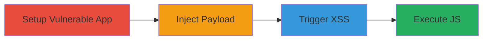

# Single-Click XSS in Rails Redirect via Control Character Injection

Multi-stage attack chain demonstrating exploitation of a Ruby on Rails vulnerability where the redirect_to function mishandles control characters in user-supplied URLs, stripping the Location header and injecting a javascript: URI into a fallback HTML redirect page, enabling reflected XSS upon user interaction.

## Chain Metrics Dashboard

| Metric | Value |
|--------|-------|
| Chain Status | Unverified |
| Total Steps | 3 |
| Execution Time | ~5 minutes |
| Skill Level | Intermediate |
| Complexity | Medium |
| Impact Level | High |

## Attack Flow Visualization



## Prerequisites & Requirements

### Required Tools

- None (uses built-in Rails development tools and curl for requests)

### Target Environment

- Ruby on Rails 7.0.4.3 or vulnerable version
- Rack middleware enforcing RFC7230 compliance
- Puma server on port 3000
- Local development setup with database (though not strictly needed for this exploit)

### Initial Access Requirements

- Access to deploy or modify a Rails application (for setup)
- Network access to the vulnerable endpoint (e.g., localhost:3000)
- No prior credentials needed; exploits public-facing redirect

## Detailed Attack Procedures

### Step 1: Setup Vulnerable Rails Application
procedure: [[procedures/Setup-Vulnerable-Rails-Application]]

**Objective**: Create a vulnerable Rails controller that uses redirect_to on user input with allow_other_host: true, exposing the redirect functionality.

**Instructions**: Generate a new Rails app if needed, then add a vulnerable route and controller action. Start the server with `rails server`.

**Expected Output**: Server running on http://localhost:3000, with /vuln endpoint accessible.

**Success Indicators**:
- Rails server logs show app startup without errors
- GET /vuln returns a 302 redirect for clean inputs

### Step 2: Inject JavaScript URI with Control Character
procedure: [[procedures/Inject-JavaScript-URI-with-Control-Character]]

**Objective**: Send a crafted request to the vulnerable endpoint using a javascript: URI appended with a control character (e.g., %08 backspace) to trigger Location header stripping by Rack linters.

**Instructions**: Use [[commands/rails-redirect-xss-poc]] to send the malicious GET request:

```bash
curl -v "http://localhost:3000/vuln?redirect_url=javascript:alert(document.cookie)%08"
```

**Expected Output**: HTTP 302 response without Location header, body containing fallback HTML with injected href: `<html><body>You are being <a href="javascript:alert(document.cookie) ">redirected</a>.</body></html>`.

**Success Indicators**:
- No Location header in response (visible in curl -v output)
- HTML body includes the javascript: URI in the <a> tag

### Step 3: Trigger XSS via Link Click
procedure: [[procedures/Trigger-XSS-via-Link-Click]]

**Objective**: Interact with the fallback HTML page by clicking the injected link, executing the JavaScript payload in the user's browser context.

**Instructions**: Load the response HTML in a browser (e.g., save from curl output and open, or use a proxy to intercept). Click the "redirected" link to trigger the alert.

**Expected Output**: Browser executes `alert(document.cookie)`, displaying a popup with cookie data.

**Success Indicators**:
- JavaScript alert fires
- Potential cookie theft or arbitrary JS execution confirmed

## Attack Chain Summary

### Key Achievements

1. Bypassed Rails redirect protection using control characters to strip Location header
2. Injected javascript: URI into fallback HTML, creating a clickable XSS vector
3. Achieved reflected single-click XSS, enabling session hijacking or data exfiltration

## Technique & Tactic Coverage

### MITRE ATT&CK Techniques

- [[Exploit Public-Facing Application]] Exploit Public-Facing Application
- [[JavaScript]] JavaScript

### MITRE ATT&CK Tactics

- [[Initial Access]] Initial Access
- [[Execution]] Execution

---
*Last updated: 2024-10-01T00:00:00Z*
