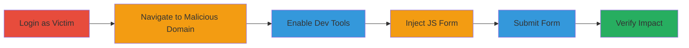

# Site-Wide CSRF Exploitation on CS Money via Safari Referer Bypass

Multi-stage attack chain demonstrating a CSRF vulnerability on new.cs.money and cs.money domains, exploiting a flawed regex in Referer header validation that allows special characters like '{' or '}' in subdomains (e.g., new.cs.money{.nnez.me}), combined with Safari's unique CORS behavior. This enables attackers to host malicious pages that bypass checks and perform authenticated actions on behalf of victims, such as changing emails.

## Chain Metrics Dashboard

| Metric | Value |
|--------|-------|
| Chain Status | Unverified |
| Total Steps | 6 |
| Execution Time | ~5 minutes |
| Skill Level | Intermediate |
| Complexity | Medium |
| Impact Level | High |

## Attack Flow Visualization



## Prerequisites & Requirements

### Required Tools

- [[tools/Safari-Browser]]
- [[tools/Safari-JavaScript-Console]]

### Target Environment

- Web platform (new.cs.money and cs.money)
- Safari on macOS with developer tools enabled
- Attacker control over a subdomain like nnez.me to register new.cs.money{.nnez.me}

### Initial Access Requirements

- Victim must be authenticated via Steam login on CS Money
- Network access to the malicious subdomain
- No prior access needed beyond tricking victim to visit the page

## Detailed Attack Procedures

### Step 1: Victim Authentication
procedure: [[procedures/Login-to-CS-Money-as-Victim-in-Safari]]

**Objective**: Establish an authenticated session on the target site using the victim's credentials.

**Instructions**: Open Safari and navigate to new.cs.money, then log in with a Steam account to create an active session.

**Expected Output**: Successful login, with user profile accessible.

**Success Indicators**:
- User redirected to dashboard or personal info page
- Cookies set for authenticated session

### Step 2: Access Malicious Page
procedure: [[procedures/Navigate-to-Malicious-Subdomain-in-Safari]]

**Objective**: Load the attacker-controlled page that mimics a valid Referer to bypass validation.

**Instructions**: In a new Safari tab, navigate to the malicious subdomain like new.cs.money{.nnez.me}, which the attacker has registered and hosts the exploit page.

**Expected Output**: Page loads without errors in Safari, unlike in other browsers.

**Success Indicators**:
- Malicious page renders successfully
- No CORS blocking observed

### Step 3: Prepare Development Environment
procedure: [[procedures/Enable-Safari-Developer-Tools]]

**Objective**: Access tools needed to inject and execute JavaScript for the CSRF payload.

**Instructions**: Enable the Develop menu in Safari preferences (Preferences > Advanced > Show Develop menu), then select Develop > Show Web Inspector to open dev tools and the JavaScript console.

**Expected Output**: Inspector panel opens with console tab active.

**Success Indicators**:
- Console ready for JS input
- No errors in inspector

### Step 4: Inject CSRF Payload
procedure: [[procedures/Inject-Malicious-CSRF-Form-via-JavaScript]]

**Objective**: Dynamically create and append a form that submits to the target endpoint, forging a valid Referer.

**Instructions**: In the JavaScript console, execute the payload using [[commands/create-csrf-form-injection]] to build and append the form to the page body.

```javascript
var FormEl = `<form action="https://new.cs.money/change_email" method="POST"><input type="hidden" name="email" value="nnez+attacker@wearehackerone.com" /><button type="submit" style="font-size:28pt;z-index:99999">Submit</button></form>`; var Div = document.createElement('div'); Div.innerHTML = FormEl; document.body.appendChild(Div);
```

**Expected Output**: A visible submit button appears on the page.

**Success Indicators**:
- Form element added to DOM
- Button clickable without JS errors

### Step 5: Trigger the Attack
procedure: [[procedures/Submit-CSRF-Form-to-Change-Email]]

**Objective**: Submit the forged request to perform the unauthorized action.

**Instructions**: Click the appended submit button to send the POST request to /change_email with the attacker's email.

**Expected Output**: Form submits silently, request sent with bypassed Referer.

**Success Indicators**:
- No client-side errors
- Network tab shows POST to target endpoint

### Step 6: Confirm Exploitation
procedure: [[procedures/Verify-Account-Modification-on-CS-Money]]

**Objective**: Validate that the attack succeeded by checking the victim's account.

**Instructions**: Return to the original tab, navigate to https://new.cs.money/th/csgo/personal-info, and inspect the email field.

**Expected Output**: Email updated to attacker's value (e.g., nnez+attacker@wearehackerone.com).

**Success Indicators**:
- Email changed without user interaction
- Account details reflect modification

## Attack Chain Summary

### Key Achievements

1. Bypassed Referer validation using Safari's handling of special characters in domains.
2. Performed authenticated CSRF to modify victim account.
3. Demonstrated site-wide impact on all POST endpoints lacking proper protections.

## Technique & Tactic Coverage

### MITRE ATT&CK Techniques

- [[Exploit Public-Facing Application]] Exploit Public-Facing Application
- [[JavaScript]] JavaScript

### MITRE ATT&CK Tactics

- [[Initial Access]] Initial Access

---

*Last updated: 2023-10-01T00:00:00Z*
