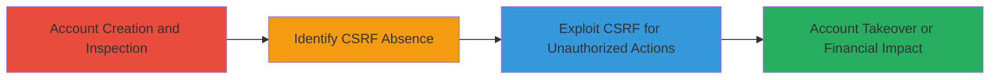

# Site-wide CSRF Exploitation Leading to Account Takeover in Atavist Magazine

Multi-stage attack chain demonstrating a complete attack workflow exploiting the lack of CSRF protections in Atavist Magazine's account management endpoints.

## Chain Metrics Dashboard

| Metric | Value |
|--------|-------|
| Chain Status | Unverified |
| Total Steps | 3 |
| Execution Time | ~10 minutes |
| Skill Level | Intermediate |
| Complexity | Medium |
| Impact Level | High |

## Attack Flow Visualization

## Prerequisites & Requirements

### Required Tools

- Browser Developer Tools (e.g., Chrome DevTools)
- [[tools/curl]]

### Target Environment

- Web platform
- PHP-based application (Atavist Magazine)
- Required services/ports: HTTP/HTTPS on port 80/443
- Network access requirements: Internet access to the target site

### Initial Access Requirements

- No prior credentials needed for discovery, but an authenticated session cookie is required for exploitation
- Attacker must be able to craft and deliver malicious requests (e.g., via phishing or malicious site)
- Victim must be authenticated to the target

## Detailed Attack Procedures

### Step 1: Account Creation and Inspection
procedure: [[procedures/Create-Account-and-Inspect-Settings]]

**Objective**: Gain access to the application and examine account settings to identify sensitive endpoints.

**Instructions**: Register a new account on Atavist Magazine and navigate to account settings. Use browser developer tools to inspect the page and network requests for actions like changing email, deleting credit cards, and cancelling subscriptions.

**Expected Output**: Access to account dashboard with visible forms for sensitive actions; network tab showing POST requests to endpoints.

**Success Indicators**:
- Successful account creation
- Identification of account settings interface

### Step 2: Identify CSRF Absence in Endpoints
procedure: [[procedures/Identify-CSRF-Absence-in-Endpoints]]

**Objective**: Analyze requests to confirm the lack of anti-CSRF protections on sensitive POST endpoints.

**Instructions**: Perform actions in the account settings while monitoring network traffic. Check for CSRF tokens in request headers or forms. Note the use of sequential user IDs in parameters.

**Expected Output**: POST requests to endpoints like /cms/ajax/change_email.php or /cms/ajax/delete_credit_card.php without CSRF tokens.

**Success Indicators**:
- Requests lack CSRF tokens or synchronizer patterns
- Endpoints rely solely on session cookies and user IDs for authentication

### Step 3: Demonstrate CSRF Exploitation
procedure: [[procedures/Demonstrate-CSRF-Exploitation]]

**Objective**: Forge malicious requests to perform unauthorized actions on a victim's behalf, leading to account takeover or financial disruption.

**Instructions**: Craft a malicious HTML page with forms that submit POST requests to the vulnerable endpoints using the victim's session. For example, use curl to simulate: change email to attacker-controlled address, delete credit cards, or cancel subscription.

**Expected Output**: Successful unauthorized actions, such as email updated or credit card removed, confirmed via account inspection or server responses.

**Success Indicators**:
- Victim's email changed without their knowledge
- Credit card deleted, impacting payments
- Subscription 'cancelled' via misleading email only

## Attack Chain Summary

### Key Achievements

1. Discovered site-wide CSRF vulnerability due to missing tokens on account settings.
2. Demonstrated potential for account takeover via email changes using sequential user IDs.
3. Highlighted financial and deception risks from credit card deletions and fake subscription cancellations.

## Technique & Tactic Coverage

### MITRE ATT&CK Techniques

- [[Exploit Public-Facing Application]]

### MITRE ATT&CK Tactics

- [[Initial Access]]

---

*Last updated: 2023-10-01T00:00:00Z*
