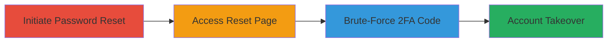

# Slack 2FA Brute-Force Bypass via Unrestricted Password Reset

Multi-stage attack chain demonstrating a complete attack workflow exploiting the absence of rate limiting on 2FA code entry during Slack's password reset process, allowing an attacker with email access to brute-force the 6-digit code and achieve full account takeover.

## Chain Metrics Dashboard

| Metric | Value |
|--------|-------|
| Chain Status | Unverified |
| Total Steps | 3 |
| Execution Time | ~5 minutes |
| Skill Level | Intermediate |
| Complexity | Medium |
| Impact Level | High |

## Attack Flow Visualization

## Prerequisites & Requirements

### Required Tools

- None (manual browser-based execution)

### Target Environment

- Slack web application
- Access to victim's registered email account
- No special services or ports required beyond standard web access

### Initial Access Requirements

- Compromised email credentials for the target Slack user
- Network access to Slack's web interface (https://slack.com)
- No prior Slack account access needed

## Detailed Attack Procedures

### Step 1: Initiate Password Reset
procedure: [[procedures/Initiate-Slack-Password-Reset]]

**Objective**: Trigger the password reset process to send a reset link to the victim's email.

**Instructions**: Navigate to Slack's login page and request a password reset for the target account, providing the victim's email address. This sends a reset email containing a unique link or token.

**Expected Output**: Receipt of a password reset email in the compromised email inbox, including a clickable link to the reset page.

**Success Indicators**:
- Email received with reset link
- No errors during reset initiation

### Step 2: Access Password Reset Page
procedure: [[procedures/Access-Slack-Password-Reset-Page]]

**Objective**: Open the password reset interface using the email link, preparing for 2FA entry.

**Instructions**: Click the link from the reset email to load Slack's password reset page, which prompts for a new password and the 2FA code from the authenticator app.

**Expected Output**: Browser loads the reset form with fields for new password and 2FA code input.

**Success Indicators**:
- Reset page loads without expiration or errors
- 2FA code input field is visible and functional

### Step 3: Brute-Force 2FA Code
procedure: [[procedures/Brute-Force-Slack-2FA-Code]]

**Objective**: Exploit the lack of rate limiting by repeatedly guessing the 6-digit 2FA code to complete the password reset.

**Instructions**: On the reset page, manually enter incorrect 6-digit codes (e.g., starting from 000000) up to 20 or more times. Due to no lockout, continue until the correct code is guessed or tested, then set a new password.

**Expected Output**: After entering the correct code, the password reset succeeds, allowing login with the new credentials.

**Success Indicators**:
- Multiple failed attempts without lockout or CAPTCHA
- Successful password change upon correct code entry
- Full account access confirmed via login

## Attack Chain Summary

### Key Achievements

1. Bypassed 2FA protection through unlimited brute-force attempts on the password reset flow.
2. Demonstrated feasibility of account takeover with only email compromise.
3. Highlighted severe impact on Slack's authentication security model.

## Technique & Tactic Coverage

### MITRE ATT&CK Techniques

- [[Brute Force]] Brute Force
- [[Valid Accounts]] Valid Accounts

### MITRE ATT&CK Tactics

- [[Initial Access]] Initial Access
- [[Credential Access]] Credential Access

---
*Last updated: 2023-10-01T00:00:00Z*
