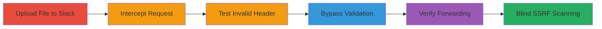

# Slack Blind SSRF via X-Forwarded-Host Manipulation for AWS Internal Port Scanning

Multi-stage attack chain demonstrating a complete blind SSRF workflow on Slack's file hosting service to perform internal network reconnaissance on AWS infrastructure.

## Chain Metrics Dashboard

| Metric | Value |
|--------|-------|
| Chain Status | Unverified |
| Total Steps | 6 |
| Execution Time | ~15 minutes |
| Skill Level | Intermediate |
| Complexity | Medium |
| Impact Level | High |

## Attack Flow Visualization

## Prerequisites & Requirements

### Required Tools

- [[tools/Burp-Suite]]

### Target Environment

- Web platform with access to Slack
- AWS-hosted services (e.g., internal metadata endpoints like 169.254.169.254)
- Required services/ports: HTTP/HTTPS on ports 80, 443; internal ports for scanning (e.g., 1111)
- Network access requirements: Internet access to files.slack.com; controlled domain for verification

### Initial Access Requirements

- Valid Slack account for file upload
- No special credentials needed beyond standard user access
- Prior access: Ability to upload files to a Slack workspace

## Detailed Attack Procedures

### Step 1: Upload File and Obtain Direct URL
procedure: [[procedures/Upload-File-to-Slack-and-Obtain-Direct-URL]]

**Objective**: Gain access to a direct file URL on files.slack.com to serve as the base for request manipulation.

**Instructions**: Log in to Slack, upload a test file (e.g., a PNG image), and use the 'Open original' option to retrieve the direct URL, such as https://files.slack.com/files-pri/TNXC4JD70-FPSL307RB/test.png.

**Expected Output**: A valid direct URL pointing to the uploaded file on files.slack.com.

**Success Indicators**:
- File upload succeeds
- Direct URL is accessible and returns the file content

### Step 2: Intercept the Request
procedure: [[procedures/Intercept-Request-with-Burp-Suite]]

**Objective**: Capture the HTTP request to the file URL for modification and testing.

**Instructions**: Configure your browser to proxy traffic through Burp Suite, navigate to the direct URL, intercept the request, forward it to the Repeater tab, and send it to verify a successful response (e.g., 200 OK with file content).

**Expected Output**: Intercepted request in Burp Repeater with a successful response.

**Success Indicators**:
- Request is captured without errors
- Response confirms file retrieval

### Step 3: Test Invalid Host Header
procedure: [[procedures/Test-X-Forwarded-Host-with-Invalid-Domain]]

**Objective**: Confirm that the server enforces host validation by testing an invalid X-Forwarded-Host.

**Instructions**: In Burp Repeater, add the header `X-Forwarded-Host: xxx.com` to the request and send it.

**Expected Output**: Server returns a 500 Internal Server Error due to host mismatch.

**Success Indicators**:
- Error response indicates validation is active
- No successful forwarding occurs

### Step 4: Bypass Host Validation
procedure: [[procedures/Bypass-Host-Validation-with-At-Append]]

**Objective**: Exploit the validation flaw by appending '@' to the hostname in the header to redirect to a controlled domain.

**Instructions**: Modify the header to `X-Forwarded-Host: files.slack.com@your-controlled-domain.com` and send the request.

**Expected Output**: Server responds with a 302 redirect to your domain, e.g., http://your-controlled-domain.com/files-pri/...

**Success Indicators**:
- Redirect occurs to the attacker-controlled domain
- No 500 error; validation bypassed

### Step 5: Verify Backend Forwarding
procedure: [[procedures/Verify-Request-Forwarding-to-Controlled-Domain]]

**Objective**: Confirm that the request originates from Slack's backend (AWS) rather than the frontend.

**Instructions**: Monitor your controlled domain's server logs for incoming requests during the bypass step.

**Expected Output**: Logs show requests from amazonaws.com IP addresses, not CloudFront.

**Success Indicators**:
- Requests confirmed from internal AWS sources
- Origin IP matches AWS backend patterns

### Step 6: Perform Blind SSRF Port Scanning
procedure: [[procedures/Exploit-Blind-SSRF-for-Port-Scanning]]

**Objective**: Use the SSRF to scan internal ports via timing differences for reconnaissance.

**Instructions**: Update the header to `X-Forwarded-Host: files.slack.com@169.254.169.254:PORT`, vary PORT (e.g., 80, 443, 1111), measure response times (>5s for closed, <3s for open).

**Expected Output**: Timing variations indicating open/closed ports on internal endpoints.

**Success Indicators**:
- Consistent delays for closed ports
- Faster responses for open ports, revealing infrastructure details

## Attack Chain Summary

### Key Achievements

1. Bypassed host validation on files.slack.com using X-Forwarded-Host manipulation
2. Confirmed backend request forwarding from AWS infrastructure
3. Enabled blind SSRF for internal port scanning, disclosing metadata like open ports on 169.254.169.254

## Technique & Tactic Coverage

### MITRE ATT&CK Techniques

- [[Exploit Public-Facing Application]] Exploit Public-Facing Application
- [[Network Service Scanning]] Network Service Scanning

### MITRE ATT&CK Tactics

- [[Initial Access]] Initial Access
- [[Reconnaissance]] Reconnaissance

---
*Last updated: 2023-10-01T00:00:00Z*
