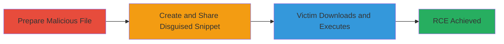

---
tags:
  - slack
  - rce
  - file-upload
  - unrestricted-upload
  - social-engineering
type: attack_chain
tools: []
tactics:
  - '[[Execution]]'
commands: []
platforms:
  - Web
  - Desktop
complexity: low
procedures:
  - '[[procedures/Trick-Slack-Snippet-Filetype-for-Malicious-Upload]]'
step_count: 1
techniques:
  - '[[Malicious File]]'
  - '[[Remote File Copy]]'
description: >-
  Exploiting Slack's Create Snippet feature to display incorrect filetypes,
  allowing attackers to disguise malicious executables as benign files like CSV
  and trick victims into remote code execution.
skill_level: intermediate
impact_level: high
id: a240fea4-25c2-44bc-abf9-d146251f6e84
created_at: '2025-12-14T17:24:08.206Z'
updated_at: '2025-12-14T17:24:08.206Z'
verified: false
validated: true
submitted: true
mitre_tactics:
  - '[[Execution]]'
mitre_techniques:
  - '[[Malicious File]]'
  - '[[Remote File Copy]]'
---
# Slack Create Snippet Filetype Misrepresentation Leading to RCE

Multi-stage attack chain demonstrating a complete attack workflow exploiting a vulnerability in Slack's snippet creation to enable unrestricted upload of dangerous files.

## Chain Metrics Dashboard

| Metric | Value |
|--------|-------|
| Chain Status | Unverified |
| Total Steps | 1 |
| Execution Time | ~5 minutes |
| Skill Level | Intermediate |
| Complexity | Low |
| Impact Level | High |

## Attack Flow Visualization

## Prerequisites & Requirements

### Required Tools

- None (uses native Slack interface)

### Target Environment

- Slack workspace (Web or Desktop app)
- No specific ports or services required beyond standard Slack access
- Network access: Internal workspace connectivity

### Initial Access Requirements

- Attacker must have a valid Slack account in the target workspace
- No prior elevated access needed
- Victim must be a workspace member who interacts with shared snippets

## Detailed Attack Procedures

### Step 1: Create and Share Malicious Snippet
procedure: [[procedures/Trick-Slack-Snippet-Filetype-for-Malicious-Upload]]

**Objective**: Manipulate Slack's Create Snippet feature to upload a malicious executable disguised as a benign CSV file, tricking the victim into downloading and executing it for RCE.

**Instructions**: Prepare a malicious executable (e.g., a trojanized .exe file). In the Slack interface (web or desktop), initiate snippet creation by selecting text or file content. Choose a benign syntax highlighting option like "CSV" or "Plain Text" in the snippet editor, even though the content is executable. Use a misleading filename such as "data.csv" while embedding or referencing the executable payload. Save and share the snippet in a channel or direct message to the target user. The vulnerability causes the filetype to display incorrectly as CSV, bypassing user suspicion.

**Expected Output**: Snippet appears in Slack as a harmless CSV file snippet, with download option presenting it as benign.

**Success Indicators**:
- Snippet created and shared without upload rejection
- Filetype displays as CSV in the Slack UI
- Victim interacts with and downloads the snippet

## Attack Chain Summary

### Key Achievements

1. Successful upload of unrestricted dangerous file via snippet feature
2. Misrepresentation of executable as benign filetype to evade detection
3. Achievement of RCE on victim's machine through user execution

## Technique & Tactic Coverage

### MITRE ATT&CK Techniques

- [[Malicious File]]
- [[Remote File Copy]]

### MITRE ATT&CK Tactics

- [[Execution]]

---
*Last updated: 2023-10-01T00:00:00Z*
